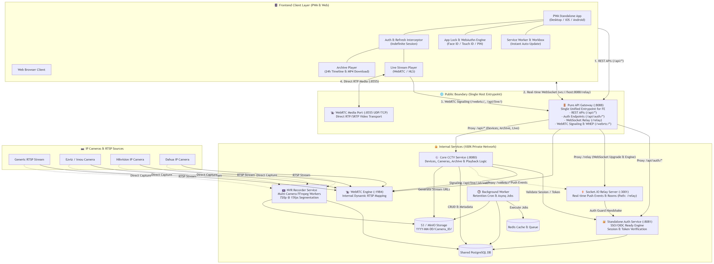

# HubSight - Smart Surveillance & Playback Platform

A modern, robust, and full-featured camera recording and playback surveillance system built with **Go**, **Ent ORM**, **NestJS (Socket.IO Relay)**, **React (Vite + TypeScript)**, **webrtc-service (go2rtc)**, **FFmpeg**, and **PostgreSQL**.

---

## 🏛️ System Architecture: Single Unified API Gateway Entrypoint

The frontend client communicates **exclusively** with the **API Gateway (`api-gateway :8088`)**. All REST APIs, Auth flows, Relay (WebSocket) real-time events, and WebRTC signaling are transparently routed through the gateway:



---

## 🌐 Microservices & Network Topology

| Service Name | Role | Public Host Port | Internal Address | Description |
| :--- | :--- | :--- | :--- | :--- |
| **`api-gateway`** | **Single Unified API Gateway** | **`:8088`** | `http://api-gateway:8080` | **Sole Public HTTP & WebSocket Entrypoint**. Serves the **React SPA Frontend** and proxies REST APIs (`/api/*`), Auth (`/api/auth/*`), WebSocket Relay (`/relay`), and WebRTC signaling (`/webrtc/*`). |
| **`core-service`** | **Core CCTV Business Logic** | *None* | `http://core-service:8080` | **Private Internal Microservice** handling devices, camera CRUD, RTSP URL generation, archive playback timeline, and WebRTC signaling. |
| **`relay-service`** | **Socket.IO Relay Server** | *None* | `http://relay-service:3001` | **Private Internal Service** for real-time notifications and rooms, routed through Gateway `:8088/relay`. Uses RabbitMQ for internal events. |
| **`mq-service`** | **Message Broker** | *None* | `amqp://mq-service:5672` | **Private Internal Broker**. Used for async pub/sub events from Core, NVR, Auth services to Relay service. |
| **`auth-service`** | **Auth & SSO Engine** | *None* | `http://auth-service:8081` | **Private Internal Microservice** for SSO/OIDC auth, session verification, and token rotation. |
| **`webrtc-service`** | **WebRTC Media Engine** | **`:8555`** | `http://webrtc-service:1984` | Port `:8555` UDP/TCP transmits direct WebRTC video RTP media. All signaling APIs are routed via Gateway `:8088/webrtc`. |
| **`nvr-service`** | **NVR Recording Engine** | *None* | *Background Worker* | **Private Internal Worker** for FFmpeg chunking and S3 archiving. |
| **`bgrd-service`** | **Background Job Worker** | *None* | *Background Worker* | **Private Internal Worker** handling periodic tasks like 3-day retention cron via `asynq`. |
| **`redis-service`** | **Redis Queue** | *None* | `redis://redis-service:6379` | **Private Internal Cache** used by `asynq` for job queues. |
| **`vision-service`**| **AI Vision Engine (YOLO)**| *None* | *Background Worker* | **Private Internal Service** for AI real-time person detection. Uses OpenCV and Ultralytics YOLO, and publishes bounding box coordinates to RabbitMQ. |

---

## Key Features

### 1. Single-Entry API Gateway (`api-gateway`)
- **Single Origin For All Protocols**: Frontend only targets **`http://localhost:8088`** for REST, Auth, and WebSockets (`ws://`/`wss://`).
- **Pure Path Names**:
  - `/api/auth/*` ➔ `http://auth-service:8081` (rewrites to `/auth/*`)
  - `/relay` & `/relay/*` ➔ `http://relay-service:3001` (WebSocket upgrades on path `/relay`)
  - `/webrtc/*` ➔ `http://webrtc-service:1984/*` (WebRTC signaling & WHEP streams)
  - `/api/*` (devices, archive, live, recorder) ➔ `http://core-service:8080`
- **Complete Internal Isolation**: `core-service`, `auth-service`, `relay-service`, and `nvr-service` have zero host port exposure.

### 2. AI Person Detection & Real-time Tracking (Phase 1)
- **YOLOv11 Inference**: The `vision-service` reads RTSP camera streams and detects people in real-time using CPU-optimized `yolo11n`.
- **Live Bounding Boxes**: The AI engine continuously publishes bounding box coordinates (normalized 0-1) to RabbitMQ.
- **Socket.IO Relaying**: The NestJS `relay-service` forwards AI events (`vision.person.update`) directly to the React frontend, allowing the `<LivePlayer>` to render moving red tracking rectangles dynamically over the WebRTC stream via HTML5 Canvas.

### 3. Client Connection Examples

#### Frontend Socket.IO Connection:
```typescript
import { io } from 'socket.io-client';

const socket = io('http://localhost:8088', {
  path: '/relay',
  withCredentials: true,
  transports: ['websocket', 'polling'],
});
```

#### Frontend WebRTC Live Video:
```typescript
const response = await fetch('http://localhost:8088/api/live/5/webrtc', {
  method: 'POST',
  body: peerConnection.localDescription?.sdp,
  headers: { 'Content-Type': 'application/sdp' },
  credentials: 'include',
});
```

---

## Getting Started

### 1. Quick Start with Docker Compose

```bash
# Clone repository and start all microservices
git clone https://github.com/your-repo/cctv.git
cd cctv

docker compose up -d --build
```

Access points:
- **Unified API Gateway & Web App**: `http://localhost:8088` (Serves the Frontend UI and proxies all REST APIs, Auth, WebSocket `/relay` & WebRTC signaling `/webrtc/*`)
- **WebRTC Stream Media**: `http://localhost:8555` (RTP media transport)

---

### 2. Seeding Accounts & RBAC Setup

```bash
cd backend
go run cmd/seed/main.go
```

Generates `users_credentials.csv` with credentials for configured accounts.

---

## 📄 License

This project is open-source and available under the [MIT License](LICENSE).
