# 🎥 CCTV Surveillance & Playback Platform

A modern, robust, and full-featured CCTV recording and playback surveillance system built with **Go**, **Ent ORM**, **React (Vite + TypeScript)**, **MediaMTX**, **FFmpeg**, and **PostgreSQL**.

---

## 🌟 Key Features

### 1. 🔐 Role-Based Access Control (RBAC)

- **Admin**: Full access to all features (Camera & Device Management, NVR Monitor, Playback, and Archive Downloads).
- **Viewer**: View-only access dedicated to Live streaming and Historical Playback with Archive downloads. Restricted from device modifications and recorder internals.
- **User Profiles & Role Badges**: Display Vietnamese Full Names with distinctive Red (**Admin**) and Blue (**Viewer**) visual badges.

### 2. ⚡ PWA Indefinite Sessions & Auto Refresh Token

- **Seamless PWA Mode**: When installed as a Progressive Web App (Desktop, Android, or iOS standalone), users enjoy **indefinite sessions**.
- **Silent Refresh Interceptor**: Axios interceptor silently exchanges rotating refresh tokens upon `401 Unauthorized` responses without interrupting the live or playback video stream.
- **Standard Browser Security**: Regular browser tabs maintain standard 7-day session expiration.

### 3. 🛡️ PWA App Lock with WebAuthn Biometrics & Password Fallback

- **Background Auto-Lock**: Automatically locks the application screen when the PWA is minimized or placed in the background, keeping the playback session alive.
- **Biometric Unlock (WebAuthn / Passkeys)**: One-tap unlock using native device biometrics (**Face ID / Touch ID** on iOS/macOS, **Fingerprint / Face Unlock** on Android, or **Windows Hello / PIN**).
- **Traditional Password Fallback**: Enter account password to unlock if biometrics is disabled or fails.
- **Customizable Security Settings**:
  - Toggle *Lock on Background* ON/OFF.
  - Toggle *Biometric Unlock* ON/OFF.
  - Configurable Lock Timeouts: *Immediately*, *1 Minute*, or *5 Minutes*.

### 4. 📥 Direct Archive Video Download

- Direct one-click `.mp4` recording file downloads directly from the **Playback** screen (accessible by both Admin and Viewer roles).
- Convenient download buttons located in both the Top Bar and the Bottom Video Control Bar.

### 5. 📹 Live Streaming & Smart RTSP Management

- **Low-Latency Live Streaming**: Powered by MediaMTX with WebRTC / HLS streaming.
- **Brand Presets & Custom URL Builder**: Supports Dahua, Hikvision, Ezviz, Imou, TP-Link, and Generic RTSP stream paths.
- **Colorful Brand Badges**: Vibrant, distinct visual tags for each camera brand.

### 6. 📼 Automated Recording & NVR Engine

- **Automated FFmpeg Worker**: Spawns independent recording workers per camera, chunking footage into MP4/TS segments seamlessly.
- **Timeline Seeking**: Interactive YouTube-style 24-hour playback timeline with visual recording blocks and multi-speed playback (0.5x – 4.0x).

---

## 🏗️ System Architecture

The following diagram illustrates the high-level architecture and data flows across the system components:

```mermaid
flowchart TB
    %% ==========================================
    %% 1. CLIENT LAYER
    %% ==========================================
    subgraph ClientLayer ["📱 Frontend Client Layer (PWA & Web)"]
        direction TB
        PWA["PWA Standalone App\n(Desktop / iOS / Android)"]
        Browser["Web Browser Client"]
        SW["Service Worker & Workbox\n(Instant Auto-Update)"]
        AuthApp["Auth & Refresh Interceptor\n(Indefinite Session)"]
        LockEngine["App Lock & WebAuthn Engine\n(Face ID / Touch ID / PIN)"]
        LiveView["Live Stream Player\n(WebRTC / HLS)"]
        PlaybackView["Archive Player\n(24h Timeline & MP4 Download)"]
        
        PWA --- SW
        PWA --- LockEngine
        PWA --- AuthApp
        AuthApp --- LiveView
        AuthApp --- PlaybackView
    end

    %% ==========================================
    %% 2. BACKEND API & AUTH LAYER
    %% ==========================================
    subgraph BackendAPI ["⚙️ Backend API Server (Golang & Gin)"]
        direction TB
        Router["Gin HTTP Router & Middleware\n(:8088)"]
        RBAC["RBAC & Role Guard\n(Admin vs Viewer)"]
        AuthSvc["Auth & Session Service\n(Login / Refresh / Verify)"]
        DeviceSvc["Device & Camera Manager\n(CRUD & RTSP Builder)"]
        ArchiveSvc["Recording & Stream Handler\n(Archive / Download API)"]
        EntORM["Ent ORM Layer\n(PostgreSQL Client)"]

        Router --> RBAC
        RBAC --> AuthSvc
        RBAC --> DeviceSvc
        RBAC --> ArchiveSvc
        AuthSvc --> EntORM
        DeviceSvc --> EntORM
        ArchiveSvc --> EntORM
    end

    %% ==========================================
    %% 3. MEDIA STREAMING & RECORDING LAYER
    %% ==========================================
    subgraph MediaLayer ["📹 Media Streaming & NVR Recording"]
        direction TB
        MediaMTX["MediaMTX / go2rtc\n(WebRTC :8555 / RTSP :8554 / API :1984)"]
        RecorderWorker["NVR Recorder Service\n(Golang Multi-Camera Worker)"]
        FFmpeg["FFmpeg Subprocesses\n(H.264 / MP4 Segmentation)"]

        RecorderWorker --> FFmpeg
    end

    %% ==========================================
    %% 4. STORAGE & DATABASE LAYER
    %% ==========================================
    subgraph StorageLayer ["💾 Storage & Persistence Layer"]
        direction TB
        Postgres[("PostgreSQL Database\n- Users & RBAC\n- Sessions & Refresh Tokens\n- Devices & RTSP Configs\n- Recording Metadata")]
        S3Storage[("S3 / Local Storage\n- MP4 Video Chunks\n- 24h Recording Archives")]
    end

    %% ==========================================
    %% 5. CAMERA HARDWARE
    %% ==========================================
    subgraph CameraLayer ["📷 IP Cameras & RTSP Sources"]
        direction TB
        CamDahua["Dahua IP Camera"]
        CamHik["Hikvision IP Camera"]
        CamEzviz["Ezviz / Imou Camera"]
        CamGeneric["Generic RTSP Stream"]
    end

    %% ==========================================
    %% CONNECTIONS & FLOWS
    %% ==========================================
    %% Cameras to Media & Recorder
    CamDahua -->|RTSP Stream| MediaMTX
    CamHik -->|RTSP Stream| MediaMTX
    CamEzviz -->|RTSP Stream| MediaMTX
    CamGeneric -->|RTSP Stream| MediaMTX

    CamDahua -.->|Direct RTSP Capture| FFmpeg
    CamHik -.->|Direct RTSP Capture| FFmpeg
    CamEzviz -.->|Direct RTSP Capture| FFmpeg
    CamGeneric -.->|Direct RTSP Capture| FFmpeg

    %% Recorder to Storage & DB
    FFmpeg -->|Store MP4 Segments| S3Storage
    RecorderWorker -->|Save Metadata| Postgres

    %% Client to Backend & Media
    ClientLayer -->|REST API / HTTPS :8088| Router
    LiveView -->|Low-Latency WebRTC :8555 / WSS| MediaMTX
    PlaybackView -->|Stream & Download MP4| ArchiveSvc
    ArchiveSvc -->|Read Video File| S3Storage

    %% Backend to Database
    EntORM -->|SQL Queries & Auto Migration| Postgres
```



---

## 🛠️ Technology Stack

| Layer | Technologies |
| :--- | :--- |
| **Backend API** | Go 1.23+, Gin Web Framework, Ent ORM, bcrypt, WebAuthn standard |
| **NVR & Streaming** | Go Recorder Worker, MediaMTX (WebRTC/RTSP/HLS), FFmpeg, S3 Storage |
| **Frontend App** | React 19, Vite, TypeScript, Tailwind CSS, Lucide Icons, `vite-plugin-pwa` |
| **Database** | PostgreSQL with Ent ORM migration |
| **Infrastructure** | Docker & Docker Compose (`api`, `recorder`, `mediamtx`, `frontend`) |

---

## 🚀 Getting Started

### Prerequisites

- Docker & Docker Compose
- Node.js (v20+) & pnpm (for local frontend development)
- Go (1.23+) (for local backend development)

### 1. Quick Start with Docker Compose

```bash
# Clone the repository
git clone https://github.com/your-repo/cctv.git
cd cctv

# Build and start all services
docker compose up -d --build
```

Services will be accessible at:

- **Web Application (Frontend)**: `http://localhost:5173` (or production port)
- **Backend API**: `http://localhost:8088`
- **MediaMTX Streaming**: `http://localhost:8889` (WebRTC / HLS)

---

### 2. Seeding Accounts & RBAC Setup

To seed default Admin and Viewer accounts with random 6-character passwords and export credentials to CSV:

```bash
cd backend
go run cmd/seed/main.go
```
This generates `users_credentials.csv` containing login details for all configured viewers and administrators.

---

### 3. Running Locally for Development

#### Backend API:

```bash
cd backend
go run cmd/api/main.go
```

#### NVR Recorder

```bash
cd backend
go run cmd/recorder/main.go
```

#### Frontend

```bash
cd frontend
pnpm install
pnpm dev
```

---

## 📱 Progressive Web App (PWA) Setup

1. Open the web application in Chrome, Edge, or Safari on your phone or computer.
2. Click **Install App** / **Add to Home Screen**.
3. Launch the installed PWA:
   - Sessions will persist indefinitely via background Refresh Tokens.
   - Open **Sidebar > Security & App Lock** to enable **Face ID / Fingerprint** unlock.

---

## 📄 License

This project is open-source and available under the [MIT License](LICENSE).
