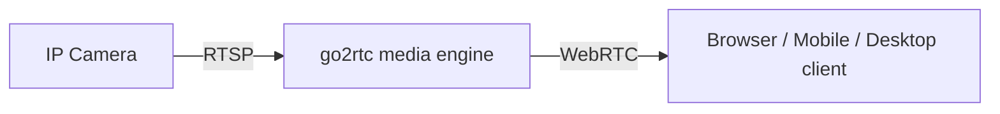
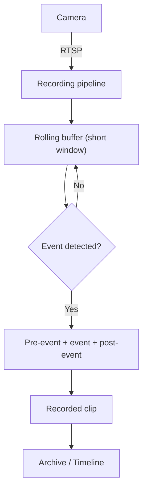
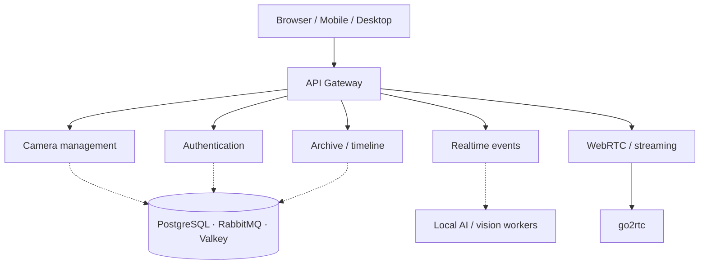

# HubSight

> Open-source CCTV that stays fast, private, and efficient.

HubSight is a self-hosted CCTV/NVR platform for IP cameras. It combines low-latency WebRTC live viewing, efficient event-based recording, camera management, archive playback, and a local computer-vision pipeline into one system you run on your own hardware.

## Why HubSight

Most self-hosted NVR software forces a trade-off: either it records everything continuously (burning disk and CPU) or it locks you into a specific camera vendor. HubSight is built around a different set of defaults:

- **Vendor-agnostic** — works with any RTSP/ONVIF camera, not a proprietary ecosystem.
- **Live stays live** — WebRTC end-to-end, not polling MJPEG or HLS with multi-second lag.
- **Recording is event-driven** — the system keeps a short rolling buffer and only persists clips around actual events, avoiding decode/re-encode of the source stream whenever possible.
- **Detection runs locally** — no footage leaves your network for analysis.
- **Modest hardware is enough** — designed to run on a small ARM64/x86 box, not a GPU server.

## Features

- Low-latency LIVE viewing over WebRTC
- Vendor-agnostic RTSP / ONVIF camera support
- Event-based recording with stream copy (no unnecessary transcoding)
- Local AI/CV pipeline for event detection
- Timeline and archive playback built around events
- Runs on modest, low-resource self-hosted deployments
- Self-hosted, passkey-capable authentication — your data stays yours

---

## Screenshots

_Screenshots are not yet included in this repository. This section will be updated with the LIVE view, timeline/archive, camera management, and event detail screens as they become available._

| LIVE View | Timeline / Archive | Camera Management | Event Detail |
| :---: | :---: | :---: | :---: |
| _coming soon_ | _coming soon_ | _coming soon_ | _coming soon_ |

---

## How LIVE viewing works



Camera streams are pulled once over RTSP and re-published over WebRTC. Multiple viewers of the same camera share the underlying connection instead of each opening a new stream to the camera, keeping bandwidth and camera load predictable as viewer count grows.

## How recording works (event-based NVR)



Instead of writing every frame to long-term storage, HubSight keeps a short rolling buffer in memory. When the vision pipeline flags an event, the surrounding pre- and post-event window is stitched into a single clip and persisted. Where the source stream allows it, this uses **stream copy** (near-zero CPU — no decode/re-encode) rather than full transcoding.

This is a design choice to reduce disk and CPU usage; actual savings depend on scene activity and camera settings, and are not currently backed by published benchmarks.

---

## Architecture



Everything a client talks to goes through a single **API Gateway** — one integration surface for camera management, auth, archive/timeline, realtime events, and WebRTC signaling. Behind the gateway, responsibilities are split into independent backend services, backed by PostgreSQL, RabbitMQ, and Valkey (Redis-compatible) for state, messaging, and job queues; the media layer (go2rtc + FFmpeg) and the local vision workers run as separate processes from the request-handling services.

<details>
<summary>Service-level reference (for contributors)</summary>

| Service | Responsibility |
| :--- | :--- |
| API Gateway | Public entrypoint — REST, auth, WebSocket relay, WebRTC signaling |
| Core service | Camera CRUD, notification inbox, archive timeline, app configuration |
| Auth service | SSO/OIDC, session/token handling, WebAuthn/Passkeys |
| Connection pool monitor | Manages active RTSP/WebRTC stream connections and viewer sharing |
| Relay service | Realtime notifications and live event broadcasting over Socket.IO |
| Camera discovery | Scans the local network for RTSP/ONVIF cameras |
| Vision service | Detection and recognition pipeline (see [AI / Vision](#ai--vision)) |
| Recorder (NVR) service | Rolling buffer management and event clip stitching |
| Push service | Offline push notifications (FCM / Web Push) |
| Background jobs | Scheduled/maintenance tasks (e.g. retention) |
| Media engine (go2rtc) | RTSP ingestion and WebRTC re-publishing |

This table reflects internal service boundaries and may change as the project evolves — treat the diagram above as the stable contract.

</details>

---

## Technology stack

### Backend
- Go
- Ent (ORM)
- PostgreSQL + pgvector

### Realtime / messaging
- RabbitMQ
- Valkey (Redis-compatible)
- Socket.IO

### Media
- go2rtc
- FFmpeg
- WebRTC

### Frontend
- React
- Vite
- TypeScript

### AI / Vision
- YOLO (Ultralytics)
- InsightFace

### Auth & notifications
- WebAuthn / Passkeys
- Firebase Cloud Messaging / Web Push

---

## AI / Vision

Detection runs locally, close to the camera stream, and feeds directly into the recording and notification pipeline described above:

- Person and object detection, including danger classes (smoke, fire, weapon)
- Fall/collapse detection from posture over a short time window
- Face recognition to distinguish known individuals from strangers, used to reduce notification noise (not exposed as a general surveillance feature)

AI is a capability of the recording and alerting pipeline, not a separate product — detections are what decide *when* an event clip is recorded and *which* notifications get sent.

---

## Device enrollment

Mobile and desktop clients are enrolled through an encrypted configuration container rather than manual endpoint/credential entry: an admin generates a short-lived, presigned QR code; scanning it and entering a PIN decrypts the client's connection details, credentials, and (optionally) push configuration in one step. Full format details are in [`docs/APP_CONFIG_SPECIFICATION.md`](docs/APP_CONFIG_SPECIFICATION.md).

---

## Quick Start

### Prerequisites

| Requirement | Notes |
| :--- | :--- |
| Docker & Docker Compose | Primary supported deployment path |
| Go, Node.js (`pnpm`), Python | Only needed for local, non-Docker development |
| RTSP/ONVIF camera(s) | For live viewing and recording to work end to end |

### Run with Docker Compose

```bash
git clone <repository-url>
cd hubsight
docker compose up -d --build
```

- Web app & API: `http://localhost:8088`
- WebRTC media (UDP/TCP): `:8555`

### Local dependency setup (optional, for development outside Docker)

```bash
# Windows PowerShell
.\scripts\install_deps.ps1

# Linux / macOS
./scripts/install_deps.sh
```

### Seed accounts

```bash
cd services/seed
go run .
```

This writes `users_credentials.csv` with initial login credentials — treat it as a secret and remove it once you've logged in.

> Verify these commands and ports against `docker-compose.yml` and the scripts in this repository before relying on them — this README should be updated if either changes.

---

## Status

HubSight is under active development. Core CCTV streaming, recording, archive, and service infrastructure are being built toward a stable self-hosted release. Expect some areas to be incomplete or to change between versions; it is not yet positioned as a production-hardened release.

---

## Roadmap

- Broader camera compatibility and multi-camera scaling
- Richer archive management (retention policies, export)
- Audio alerts / speaker integration
- Smart-home and IoT integration
- Expanded event-detection coverage
- A more complete mobile experience
- Simpler deployment for non-technical users

---

## Documentation

| Document | Description |
| :--- | :--- |
| [`docs/APP_CONFIG_SPECIFICATION.md`](docs/APP_CONFIG_SPECIFICATION.md) | Encrypted device-enrollment container format and client integration guide |
| [`docs/FACE_RECOGNITION_INSIGHTFACE_PLAN_REVISED.md`](docs/FACE_RECOGNITION_INSIGHTFACE_PLAN_REVISED.md) | Face recognition architecture and pipeline |
| [`docs/HIGH_ANGLE_VISION_STRATEGY.md`](docs/HIGH_ANGLE_VISION_STRATEGY.md) | Detection strategy for high-mounted camera angles |
| [`AGENTS.md`](AGENTS.md) | Architecture rules and constraints for contributors (human or AI) |

---

## Contributing

Issues and pull requests are welcome. Please read [`AGENTS.md`](AGENTS.md) first — it documents the architectural boundaries (e.g. what belongs in the gateway vs. a backend service) that contributions are expected to respect. For non-trivial changes, open an issue to discuss the approach before submitting a PR.

## Issues & Discussions

Use GitHub Issues for bugs and feature requests, and Discussions (where enabled) for questions.

## License

Licensed under the [MIT License](LICENSE).