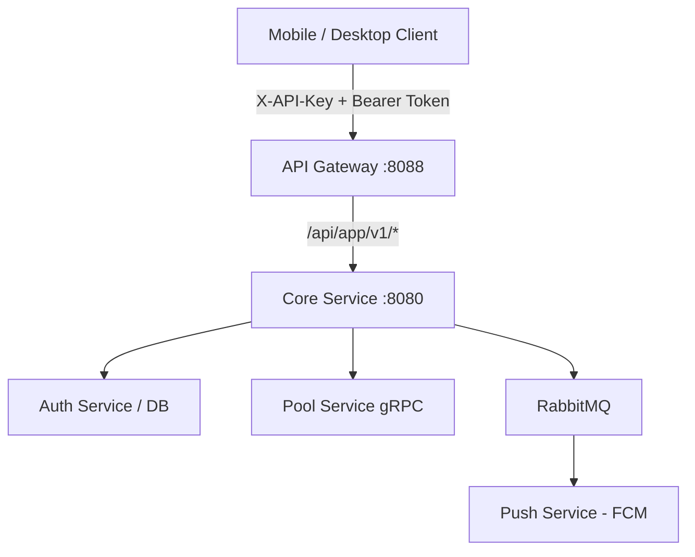

# HubSight CCTV - Mobile & Desktop App API Specification (v1)

Tài liệu đặc tả kỹ thuật toàn diện cho các nhà phát triển ứng dụng di động (Flutter, React Native, iOS Swift, Android Kotlin) và máy tính (Go, Electron, Tauri, C#/.NET) tích hợp với nền tảng **HubSight CCTV**.

---

## 1. Tổng quan Kiến trúc & Nguyên tắc Thiết kế

Tất cả các API dành riêng cho ứng dụng di động và máy tính được gom nhóm dưới tiền tố:
```
/api/app/v1/*
```
Mọi lưu lượng mạng từ ứng dụng bên ngoài **bắt buộc** phải đi qua **API Gateway Entrypoint** (mặc định cổng `:8088` hoặc tên miền chuẩn `https://cctv.quoctran.space`).



### 1.1. Yêu cầu Bắt buộc về API Key (`X-API-Key`)
Mọi request đến `/api/app/v1/*` **bắt buộc** phải kèm header xác thực Client:
- **`X-API-Key`**: Mã bí mật client (được cấu hình và giải mã tự động từ container `.hscfg`).
- *(Tương thích ngược)*: Có thể sử dụng `X-HubSight-App-Key`, `X-Client-ID` hoặc query param `?api_key=...`.
- Nếu thiếu key: Hệ thống trả về `HTTP 401 Unauthorized` (`APP_KEY_REQUIRED`).
- Nếu key không tồn tại hoặc bị vô hiệu hóa trong bảng `api_clients`: Hệ thống trả về `HTTP 403 Forbidden` (`INVALID_APP_KEY`).

### 1.2. Admin Kill-Switch (HTTP 503 Service Unavailable)
Quản trị viên có toàn quyền kích hoạt công tắc khẩn cấp (Kill-Switch) từ giao diện Web UI (`AppConfigs.tsx` hoặc `PUT /api/settings`):
- Khi tắt (`app_api_enabled = false`), toàn bộ API app ngay lập tức phản hồi:
  - **HTTP Status**: `503 Service Unavailable`
  - **Header**: `Retry-After: 300` (đề nghị client thử lại sau 5 phút)
  - **Payload Thân thiện**:
    ```json
    {
      "status": "error",
      "code": "APP_API_DISABLED",
      "maintenance": true,
      "message": "Dịch vụ kết nối ứng dụng di động & máy tính hiện đang tạm dừng để bảo trì hệ thống. Vui lòng liên hệ Quản trị viên hoặc sử dụng giao diện web.",
      "message_en": "HubSight mobile & desktop app access is temporarily disabled by administrator. Please access via the web portal."
    }
    ```

---

## 2. Bảng Tổng hợp Endpoint

| Nhóm chức năng | Phương thức & Tuyến đường | Yêu cầu Bearer Token | Mô tả tóm tắt |
| :--- | :--- | :---: | :--- |
| **Hệ thống** | `GET /api/app/v1/system/status` | Không | Kiểm tra readiness, version v1 và feature flags |
| **Xác thực** | `POST /api/app/v1/auth/login` | Không | Đăng nhập Username/Password, hỗ trợ cấp session hoặc 2FA challenge |
| | `POST /api/app/v1/auth/2fa/verify` | Không | Xác thực mã TOTP 6 số hoặc Recovery Code dự phòng |
| | `POST /api/app/v1/auth/refresh` | Không | Cấp mới access token từ refresh token |
| | `POST /api/app/v1/auth/change-password`| Có | Đổi mật khẩu định kỳ hoặc mật khẩu lần đầu (`must_change_password`) |
| | `POST /api/app/v1/auth/logout` | Có | Đăng xuất phiên làm việc hiện tại |
| **Profile** | `GET /api/app/v1/profile` | Có | Xem thông tin người dùng, vai trò & danh sách quyền chi tiết |
| | `PATCH /api/app/v1/profile` | Có | Cập nhật tên, múi giờ, ngôn ngữ (vi/en), theme, tùy chọn push |
| | `GET /api/app/v1/profile/sessions` | Có | Liệt kê tất cả các phiên đăng nhập từ các thiết bị khác |
| | `DELETE /api/app/v1/profile/sessions/:id`| Có | Đăng xuất/thu hồi phiên đăng nhập từ xa |
| **Camera Live**| `GET /api/app/v1/cameras` | Có | Liệt kê danh sách camera kèm trạng thái hoạt động & luồng stream |
| | `GET /api/app/v1/cameras/:id` | Có | Chi tiết cấu hình & thông số 1 camera |
| | `POST /api/app/v1/cameras/:id/live/webrtc` | Có | Trao đổi SDP Offer/Answer WebRTC xem trực tiếp |
| | `POST /api/app/v1/cameras/:id/live/heartbeat`| Có | Giữ phiên xem stream trực tiếp (chu kỳ 30s) |
| | `POST /api/app/v1/cameras/:id/live/release` | Có | Đóng phiên xem stream giải phóng tài nguyên go2rtc |
| **Multi-View** | `POST /api/app/v1/cameras/live/batch-webrtc` | Có | **[Độc quyền App]** Đàm phán SDP song song xem nhiều camera cùng lúc |
| | `POST /api/app/v1/cameras/live/batch-heartbeat`| Có | **[Tối ưu pin/mạng]** Gửi 1 request heartbeat cho tất cả camera đang xem |
| | `POST /api/app/v1/cameras/live/batch-release` | Có | Giải phóng đồng loạt tất cả các luồng khi thoát màn hình multi-view |
| **Archive** | `GET /api/app/v1/cameras/:id/archive/calendar` | Có | Lấy danh sách các ngày có video lưu trữ (dạng `YYYY-MM-DD`) |
| | `GET /api/app/v1/cameras/:id/archive/timeline` | Có | Lấy danh sách các đoạn video (segments) kèm cờ AI Event |
| | `GET /api/app/v1/archive/:recording_id/play` | Có | Lấy URL phát video MP4 (hỗ trợ HTTP Range request và 302 Redirect) |
| | `GET /api/app/v1/archive/:recording_id/thumbnail`| Có | Lấy ảnh đại diện (thumbnail) của đoạn video |
| **Thông báo** | `POST /api/app/v1/notifications/push-token` | Có | Đăng ký FCM Device Token để nhận thông báo đẩy Firebase |
| | `DELETE /api/app/v1/notifications/push-token`| Có | Hủy đăng ký FCM Device Token (khi đăng xuất tài khoản) |
| | `GET /api/app/v1/notifications/unread-count` | Có | Lấy số lượng thông báo chưa đọc siêu nhẹ (dùng cập nhật App Badge) |
| | `GET /api/app/v1/notifications` | Có | Lấy danh sách thông báo phân trang, lọc theo danh mục |
| | `PATCH /api/app/v1/notifications/:id/read` | Có | Đánh dấu đã đọc 1 thông báo |
| | `POST /api/app/v1/notifications/read-all` | Có | Đánh dấu tất cả thông báo là đã đọc |
| | `DELETE /api/app/v1/notifications/:id` | Có | Xóa 1 thông báo |

---

## 3. Chi tiết API & Data Contracts

### 3.1. Trạng thái Hệ thống & Readiness
#### `GET /api/app/v1/system/status`
Headers:
```http
X-API-Key: hs_mob_client_default
```
Response `200 OK`:
```json
{
  "status": "ok",
  "app_api_version": "v1",
  "app_api_enabled": true,
  "features": {
    "live_streaming": true,
    "multi_view_batch": true,
    "archive_playback": true,
    "fcm_push": true,
    "two_factor_auth": true
  },
  "server_time": "2026-09-09T04:14:47.919Z"
}
```

---

### 3.2. Xác thực Đăng nhập & 2FA
#### `POST /api/app/v1/auth/login`
Headers: `X-API-Key`
Request Body:
```json
{
  "username": "admin",
  "password": "SecurePassword123!",
  "device_name": "iPhone 15 Pro",
  "platform": "mobile_ios",
  "device_id": "device_uuid_abcd_1234"
}
```

Response Trường hợp 1: Đăng nhập thành công trực tiếp (`200 OK`):
```json
{
  "status": "ok",
  "token": "hs_tok_eyJhbGciOi...",
  "refresh_token": "hs_ref_a91b2c...",
  "must_change_password": false,
  "user": {
    "id": "usr_9918231",
    "username": "admin",
    "full_name": "Quản trị viên",
    "role": "admin",
    "locale": "vi",
    "timezone": "Asia/Ho_Chi_Minh",
    "permissions": ["*"]
  }
}
```

Response Trường hợp 2: Yêu cầu xác thực hai bước 2FA (`200 OK` kèm `requires_2fa: true`):
```json
{
  "status": "ok",
  "requires_2fa": true,
  "pre_auth_token": "pre_auth_tok_81726354"
}
```

#### `POST /api/app/v1/auth/2fa/verify`
Headers: `X-API-Key`
Request Body:
```json
{
  "pre_auth_token": "pre_auth_tok_81726354",
  "totp_code": "582910",
  "recovery_code": ""
}
```

---

### 3.3. Live Streaming & Multi-View Song song

#### `POST /api/app/v1/cameras/:id/live/webrtc` (Đơn luồng)
Headers: `X-API-Key`, `Authorization: Bearer <token>`, `Content-Type: text/plain` (hoặc JSON)
Request Body:
```
v=0
o=- 0 0 IN IP4 127.0.0.1
s=HubSight WebRTC Session
...
```
Response `200 OK`: Trả về chuỗi `SDP Answer` sẵn sàng nạp vào `setRemoteDescription` của WebRTC PeerConnection.

#### `POST /api/app/v1/cameras/live/batch-webrtc` (Multi-View Song song)
Được tối ưu riêng cho ứng dụng di động khi mở giao diện lưới 4/9/16 camera. Client gửi danh sách camera ID và SDP Offer tương ứng; Server thực hiện đàm phán gRPC song song và trả về toàn bộ kết quả trong 1 lượt mạng duy nhất:
Request Body:
```json
{
  "requests": [
    { "camera_id": "cam_front_door", "sdp_offer": "v=0\r\no=..." },
    { "camera_id": "cam_backyard", "sdp_offer": "v=0\r\no=..." }
  ]
}
```
Response `200 OK`:
```json
{
  "results": [
    {
      "camera_id": "cam_front_door",
      "success": true,
      "sdp_answer": "v=0\r\no=...",
      "stream_name": "cam_front_door_client_0",
      "conn_index": 2
    },
    {
      "camera_id": "cam_backyard",
      "success": true,
      "sdp_answer": "v=0\r\no=...",
      "stream_name": "cam_backyard_client_0",
      "conn_index": 2
    }
  ]
}
```

#### `POST /api/app/v1/cameras/live/batch-heartbeat`
Giữ kết nối cho danh sách camera đang hiển thị trên màn hình:
```json
{
  "camera_ids": ["cam_front_door", "cam_backyard"]
}
```
Response: `{"status": "ok"}`

---

### 3.4. Video Lưu trữ & NVR Playback

#### `GET /api/app/v1/cameras/:id/archive/calendar?month=2026-09`
Response `200 OK`:
```json
{
  "days": ["2026-09-01", "2026-09-02", "2026-09-07", "2026-09-08", "2026-09-09"]
}
```

#### `GET /api/app/v1/cameras/:id/archive/timeline?date=2026-09-09`
Response `200 OK`:
```json
{
  "camera_id": "cam_front_door",
  "date": "2026-09-09",
  "segments": [
    {
      "id": "rec_01J8G92",
      "start_at": "2026-09-09T08:00:00Z",
      "end_at": "2026-09-09T08:05:00Z",
      "duration_seconds": 300,
      "size_bytes": 15428900,
      "has_event": true,
      "event_type": "person"
    }
  ]
}
```

#### `GET /api/app/v1/archive/:recording_id/play`
Response `200 OK`:
```json
{
  "recording_id": "rec_01J8G92",
  "play_url": "https://dl.learncurv.space/bucket-faces-cctv/recordings/cam_front_door/2026-09-09/08-00-00.mp4?X-Amz-Expires=7200...",
  "expires_in_seconds": 7200
}
```
*(Nếu client kèm header `Accept: video/mp4` hoặc query `?redirect=true`, server tự động phản hồi `302 Found` chuyển hướng trực tiếp tới URL video).*

---

### 3.5. Đăng ký & Quản lý Thông báo Đẩy (FCM Push)

#### `POST /api/app/v1/notifications/push-token`
Request Body:
```json
{
  "token": "eXamPle_fcm_token_device_abcdef123456",
  "platform": "mobile_android",
  "device_name": "Galaxy S24 Ultra"
}
```
Response `200 OK`:
```json
{
  "status": "ok",
  "message": "FCM device token registered successfully."
}
```

#### `GET /api/app/v1/notifications/unread-count`
Response siêu nhẹ để hiển thị số badge trên icon ứng dụng:
```json
{
  "unread_count": 4
}
```

---

## 4. Hướng dẫn Tích hợp Mẫu (Flutter / Dart)

```dart
import 'dart:convert';
import 'package:http/http.dart' as http;

class HubSightApiClient {
  final String baseUrl; // e.g. 'https://cctv.quoctran.space'
  final String apiKey;  // e.g. 'hs_mob_client_default'
  String? bearerToken;

  HubSightApiClient({required this.baseUrl, required this.apiKey});

  Map<String, String> get _headers => {
    'Content-Type': 'application/json',
    'X-API-Key': apiKey,
    if (bearerToken != null) 'Authorization': 'Bearer $bearerToken',
  };

  // 1. Kiểm tra trạng thái hệ thống và Kill-Switch
  Future<bool> checkSystemReadiness() async {
    final res = await http.get(
      Uri.parse('$baseUrl/api/app/v1/system/status'),
      headers: _headers,
    );

    if (res.statusCode == 503) {
      final body = jsonDecode(res.body);
      throw Exception(body['message'] ?? 'Hệ thống đang bảo trì');
    }
    return res.statusCode == 200;
  }

  // 2. Đăng nhập
  Future<Map<String, dynamic>> login(String username, String password) async {
    final res = await http.post(
      Uri.parse('$baseUrl/api/app/v1/auth/login'),
      headers: _headers,
      body: jsonEncode({
        'username': username,
        'password': password,
        'device_name': 'Mobile Client',
        'platform': 'flutter',
      }),
    );

    final data = jsonDecode(res.body);
    if (res.statusCode == 200 && data['token'] != null) {
      bearerToken = data['token'];
    }
    return data;
  }

  // 3. Đăng ký FCM Token khi mở app
  Future<void> registerFcmToken(String fcmToken) async {
    await http.post(
      Uri.parse('$baseUrl/api/app/v1/notifications/push-token'),
      headers: _headers,
      body: jsonEncode({
        'token': fcmToken,
        'platform': 'mobile_flutter',
      }),
    );
  }
}
```
