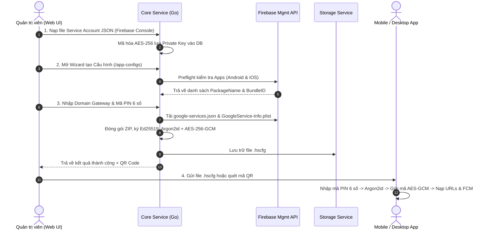

# HubSight CCTV - Đặc tả Kỹ thuật & Hướng dẫn Tích hợp Cấu hình Ứng dụng (.hscfg)

Tài liệu này đóng vai trò là tài liệu đặc tả kỹ thuật (Technical Specification) và hướng dẫn tích hợp chi tiết (Client Integration Guide) dành cho các AI Agent, kỹ sư backend, kỹ sư mobile (Flutter / React Native / Native iOS & Android) và kỹ sư desktop app (Tauri / Electron / Go / C#).

---

## 1. Tổng quan & Bài toán Thiết kế

### 1.1. Bối cảnh & Mục tiêu
Trong hệ sinh thái **HubSight Surveillance & Playback Platform**, người dùng cuối (End-Users) sử dụng ứng dụng di động (Mobile App) hoặc ứng dụng máy tính (Desktop App) để giám sát camera trực tiếp, xem lại dữ liệu NVR và nhận thông báo đẩy thời gian thực (FCM Push Notifications).

Trước đây, việc thiết lập ứng dụng đòi hỏi người dùng phải nhập thủ công nhiều thông số phức tạp:
- Địa chỉ API Gateway URL, WebRTC URL, WebSocket Relay URL.
- Khóa định danh thiết bị (`client_id`) và mã xác thực (`client_secret`).
- Cấu hình Firebase Cloud Messaging (`google-services.json` cho Android và `GoogleService-Info.plist` cho iOS).
- Chứng chỉ CA nội bộ (`ca_cert.pem`) nếu hệ thống triển khai mạng riêng (On-Premise / Private CA).

### 1.2. Giải pháp: Container Cấu hình Bảo mật Đa tầng (.hscfg)
HubSight triển khai định dạng tệp container bảo mật độc quyền **`.hscfg` (HubSight Configuration)**:
1. **Một lần thiết lập (Zero-Configuration)**: Quản trị viên (Admin) chỉ cần tạo cấu hình trên HubSight Web UI, tải về tệp `.hscfg` hoặc cấp mã QR nạp nhanh.
2. **Bảo mật đa tầng bằng PIN 6 số**:
   - Tệp `.hscfg` được mã hóa đối xứng **AES-256-GCM**.
   - Khóa giải mã được dẫn xuất từ **mã PIN 6 số** do Admin chọn thông qua thuật toán băm tốn bộ nhớ kháng tấn công phần cứng GPU/ASIC: **Argon2id** (64MB RAM, 4 rounds).
   - Tệp được ký số bằng **Ed25519** nhằm đảm bảo không thể bị chỉnh sửa hay can thiệp (Anti-Tampering).
3. **Lưu trữ & Tải an toàn**: File được lưu trữ trên Object Storage nội bộ và chỉ có thể tải về thông qua **Presigned URL** có hiệu lực giới hạn thời gian (24 giờ cho QR Code, 15 phút cho Admin download).
4. **Kiến trúc Gateway Hợp nhất (Unified Gateway)**: Mọi endpoint REST API, WebSocket Relay đều đi qua Nginx Reverse Proxy & API Gateway (cổng chuẩn 80/443 hoặc 8088 local). **Ngoại lệ duy nhất là WebRTC** truyền dữ liệu media RTP/ICE trực tiếp qua cổng `:8555`.

---

## 2. Cấu trúc Định dạng Tệp Container `.hscfg`

### 2.1. Cấu trúc Nhị phân (Binary Layout)

Tệp `.hscfg` được cấu tạo từ 4 phần liên tiếp:

```text
+-----------------------+--------------------+---------------------+-----------------------------------------+
| Magic Header (6 bytes)| Salt (16 bytes)    | Nonce (12 bytes)    | Ciphertext + GCM Auth Tag (Variable)    |
| 'H' 'S' 'C' 'F' 'G' 0x01 | Cryptographic Salt | AES-GCM IV / Nonce  | Encrypted ZIP archive + 16-byte GCM Tag |
+-----------------------+--------------------+---------------------+-----------------------------------------+
```

| Trường | Kích thước | Mô tả |
| :--- | :--- | :--- |
| **Magic Header** | 6 bytes | Cố định: Chuỗi ASCII `HSCFG` kèm byte phiên bản `0x01` (`[0x48, 0x53, 0x43, 0x46, 0x47, 0x01]`). |
| **Argon2id Salt** | 16 bytes | 16 byte ngẫu nhiên mã hóa học (`crypto/rand`). Dùng làm Salt cho Argon2id. |
| **GCM Nonce** | 12 bytes | 12 byte ngẫu nhiên chuẩn của AES-GCM (Initialization Vector). |
| **Ciphertext + Tag** | N + 16 bytes | Dữ liệu nén ZIP đã được mã hóa bằng AES-256-GCM. 16 byte cuối cùng là Authentication Tag. |

### 2.2. Dữ liệu Xác thực Bổ sung (AAD - Additional Authenticated Data)
Khi thực hiện mã hóa và giải mã AES-256-GCM, tham số AAD bắt buộc phải truyền vào chính là **Magic Header (6 bytes)**:
```text
AAD = []byte("HSCFG\x01")
```
Nếu kẻ tấn công chỉnh sửa header hoặc thay đổi phiên bản tệp, việc giải mã AES-GCM sẽ lập tức báo lỗi xác thực (`authentication failed / integrity check failure`).

### 2.3. Tham số Thuật toán Mật mã học (Cryptographic Parameters)

| Thành phần | Thuật toán | Thông số kỹ thuật |
| :--- | :--- | :--- |
| **Key Derivation (KDF)** | Argon2id | - Thời gian (`time / iterations`): `4`<br>- Bộ nhớ (`memory`): `64 * 1024` KiB (64 MiB)<br>- Luồng song song (`parallelism / threads`): `2`<br>- Độ dài khóa đầu ra (`keyLength`): `32 bytes` (256-bit) |
| **Payload Encryption** | AES-256-GCM | - Khóa: 256-bit (từ Argon2id)<br>- Nonce: 12 bytes<br>- Tag: 16 bytes (128-bit MAC)<br>- AAD: `HSCFG\x01` |
| **Digital Signature** | Ed25519 | - Cặp khóa Ed25519 (Public key 32 bytes, Private key 64 bytes) được sinh ra tự động trong mỗi phiên tạo cấu hình.<br>- Private key ký trực tiếp lên dữ liệu thô (ZIP archive payload) trước khi mã hóa.<br>- Public key và chữ ký (Signature) được nhúng trong `metadata.yml`. |

---

## 3. Nội dung bên trong Payload Giải mã (ZIP Archive)

Sau khi giải mã AES-256-GCM thành công, dữ liệu nhận được là một tệp lưu trữ chuẩn **ZIP Archive** chứa các tệp cấu hình sau:

```text
decrypted_payload.zip/
├── metadata.yml              # Thông tin nguồn gốc, ngày tạo, chữ ký số Ed25519
├── urls.yml                  # Toàn bộ Base URLs kết nối hệ thống HubSight
├── key.yml                   # Khóa định danh Client & quyền hạn xác thực API
├── google-services.json      # (Tùy chọn) Cấu hình Firebase FCM cho Android
├── GoogleService-Info.plist  # (Tùy chọn) Cấu hình Firebase FCM cho iOS
└── ca_cert.pem               # (Tùy chọn) Chứng chỉ CA gốc nếu dùng chứng chỉ riêng
```

### 3.1. `metadata.yml`
```yaml
format_version: "1.0"
config_id: "cfg_c1234567890abcdefgh"
name: "Production HQ Mobile & Desktop"
description: "Cấu hình chuẩn cho nhân viên an ninh tòa nhà"
created_by: "admin"
created_at_utc: "2026-09-08T08:30:00Z"
generator: "HubSight Core Packaging Engine"
ed25519_public_key: "0123456789abcdef0123456789abcdef0123456789abcdef0123456789abcdef"
signature: "abcdef0123456789abcdef0123456789abcdef0123456789abcdef0123456789abcdef0123456789abcdef0123456789abcdef0123456789abcdef0123456789"
```

### 3.2. `urls.yml`
> [!IMPORTANT]
> **Quy tắc Gateway Hợp nhất (Unified Gateway)**:
> Mọi traffic API và WebSocket đều đi qua Gateway chính (cổng 80/443 hoặc 8088 local), tuyệt đối không nối trực tiếp cổng nội bộ của các microservice (`8080`, `3001`, `1984`).
> Riêng WebRTC media streaming truyền RTP/ICE qua cổng `:8555`.

```yaml
gateway_url: "https://cctv.yourdomain.com"
api_base_url: "https://cctv.yourdomain.com/api"
relay_ws_url: "wss://cctv.yourdomain.com/relay"
webrtc_base_url: "https://cctv.yourdomain.com:8555"
```

### 3.3. `key.yml`
```yaml
client_id: "client_pub_9876543210"
client_secret: "sec_secretkey_sample_token"
client_name: "Mobile Patrol App"
allowed_scopes:
  - "cameras:view"
  - "playback:view"
  - "notifications:receive"
```

### 3.4. `google-services.json` & `GoogleService-Info.plist`
- Được hệ thống tự động tải trực tiếp từ **Google Firebase Management API** (`https://firebase.googleapis.com/v1beta1/...`) dựa trên Service Account JSON mà Admin đã nạp vào hệ thống.
- Chứa API Key, Project ID, Storage Bucket, Messaging Sender ID phục vụ khởi tạo SDK Firebase trên ứng dụng Android / iOS.

---

## 4. Kiến trúc Backend & Dòng chảy Xử lý (Flows)



### 4.1. Cấu trúc Package Backend
- [`services/shared/pkg/appconfig/crypto.go`](file:///d:/cctv/services/shared/pkg/appconfig/crypto.go): Hàm `DeriveKey(pin, salt)`, `EncryptContainer(...)`, `DecryptContainer(...)`.
- [`services/shared/pkg/appconfig/packager.go`](file:///d:/cctv/services/shared/pkg/appconfig/packager.go): Hàm `BuildAppConfigPayload(...)` đóng gói tệp ZIP và ký số Ed25519.
- [`services/shared/pkg/google/firebase_management.go`](file:///d:/cctv/services/shared/pkg/google/firebase_management.go): Tự động xin OAuth2 Bearer Token từ Service Account và gọi API Firebase Management lấy danh sách app và tệp cấu hình Android/iOS.
- [`services/shared/pkg/api/app_config.go`](file:///d:/cctv/services/shared/pkg/api/app_config.go): REST Handlers cho `/api/app-configs/*`.
- [`services/shared/pkg/models/app_config.go`](file:///d:/cctv/services/shared/pkg/models/app_config.go): GORM Model `AppConfig`.

### 4.2. Danh mục API Endpoints

| Phương thức | Endpoint | Mô tả | Quyền RBAC |
| :--- | :--- | :--- | :--- |
| `GET` | `/api/app-configs` | Danh sách các cấu hình đã tạo | `app_configs:manage` |
| `POST` | `/api/app-configs/generate` | Tạo mới, đóng gói và mã hóa `.hscfg` | `app_configs:manage` |
| `GET` | `/api/app-configs/:id/download` | Tải về file `.hscfg` nhị phân | `app_configs:manage` |
| `GET` | `/api/app-configs/:id/qr` | Sinh mã QR kèm Presigned Download URL (24h) | `app_configs:manage` |
| `DELETE` | `/api/app-configs/:id` | Xóa cấu hình và tệp lưu trữ | `app_configs:manage` |
| `GET` | `/api/google-service-accounts/:id/preflight-apps` | Kiểm tra trạng thái Android/iOS trên Firebase | `google_service_accounts:manage` |

---

## 5. Hướng dẫn Tích hợp trên Client (Mobile & Desktop Apps)

### 5.1. Dữ liệu Payload từ Mã QR (QR Code Payload)
Khi người dùng chọn phương thức "Quét mã QR", dữ liệu đọc được từ QR Code là một chuỗi JSON:
```json
{
  "v": 1,
  "config_id": "cfg_c1234567890abcdefgh",
  "name": "Production HQ",
  "download_url": "https://cctv.yourdomain.com/api/storage/presigned/...",
  "sha256": "8a3f...b12c"
}
```
Ứng dụng thực hiện:
1. Gửi HTTP GET đến `download_url` để tải toàn bộ mảng byte nhị phân của tệp `.hscfg`.
2. Kiểm tra mã băm SHA256 của tệp tải về có trùng khớp với trường `sha256` trong mã QR không.

---

### 5.2. Thuật toán Giải mã Tệp `.hscfg` (Pseudo-code)

```python
# 1. Kiểm tra Magic Header
header = file_bytes[0:6]
if header != b"HSCFG\x01":
    raise Exception("Tệp không đúng định dạng .hscfg hợp lệ của HubSight!")

# 2. Tách các phân đoạn nhị phân
salt = file_bytes[6:22]        # 16 bytes
nonce = file_bytes[22:34]      # 12 bytes
ciphertext_and_tag = file_bytes[34:] # Phần còn lại

# 3. Dẫn xuất khóa 256-bit từ PIN 6 số bằng Argon2id
aes_key = argon2id_kdf(
    password=pin_string.encode('utf-8'),
    salt=salt,
    time_cost=4,
    memory_cost=65536, # 64 MB
    parallelism=2,
    key_length=32
)

# 4. Giải mã AES-256-GCM với AAD
aad = b"HSCFG\x01"
zip_payload_bytes = aes_gcm_decrypt(
    key=aes_key,
    nonce=nonce,
    ciphertext_and_tag=ciphertext_and_tag,
    aad=aad
)

# 5. Mở và giải nén tệp ZIP trong RAM (In-Memory)
zip_archive = ZipFile(io.BytesIO(zip_payload_bytes))
urls_content = zip_archive.read("urls.yml")
key_content = zip_archive.read("key.yml")
metadata_content = zip_archive.read("metadata.yml")

# 6. Kiểm tra chữ ký Ed25519 (Tùy chọn khuyến nghị)
verify_ed25519_signature(
    public_key=metadata.ed25519_public_key,
    signature=metadata.signature,
    data=zip_payload_bytes
)
```

---

### 5.3. Hướng dẫn Triển khai trên Flutter (Dart)

Flutter là giải pháp phổ biến nhất cho ứng dụng Mobile HubSight.

#### Bước 1: Thêm dependencies vào `pubspec.yaml`
```yaml
dependencies:
  flutter:
    sdk: flutter
  cryptography: ^2.7.0     # Hỗ trợ Argon2id, AES-GCM, Ed25519 chuẩn WebAssembly / FFI
  archive: ^3.6.1          # Giải nén ZIP trong bộ nhớ
  yaml: ^3.1.2             # Đọc file YAML
  flutter_secure_storage: ^9.2.2 # Lưu trữ khóa an toàn vào iOS Keychain / Android Keystore
  firebase_core: ^3.0.0    # Khởi tạo Firebase động
```

#### Bước 2: Mã nguồn Giải mã (`hscfg_decoder.dart`)
```dart
import 'dart:typed_data';
import 'package:cryptography/cryptography.dart';
import 'package:archive/archive.dart';
import 'package:yaml/yaml.dart';

class HscfgDecryptedResult {
  final Map<String, dynamic> urls;
  final Map<String, dynamic> key;
  final Map<String, dynamic> metadata;
  final String? googleServicesJson;
  final String? googleServiceInfoPlist;
  final String? caCertPem;

  HscfgDecryptedResult({
    required this.urls,
    required this.key,
    required this.metadata,
    this.googleServicesJson,
    this.googleServiceInfoPlist,
    this.caCertPem,
  });
}

class HscfgDecoder {
  static const List<int> magicHeader = [0x48, 0x53, 0x43, 0x46, 0x47, 0x01]; // HSCFG\x01

  static Future<HscfgDecryptedResult> decrypt({
    required Uint8List fileBytes,
    required String pin6Digits,
  }) async {
    // 1. Kiểm tra kích thước tối thiểu và Magic Header
    if (fileBytes.length < 34 + 16) {
      throw Exception('Tệp cấu hình .hscfg bị hỏng hoặc kích thước quá nhỏ.');
    }

    for (int i = 0; i < 6; i++) {
      if (fileBytes[i] != magicHeader[i]) {
        throw Exception('Định dạng tệp không hợp lệ (Sai Magic Header).');
      }
    }

    // 2. Trích xuất Salt, Nonce và Ciphertext
    final salt = fileBytes.sublist(6, 22);
    final nonce = fileBytes.sublist(22, 34);
    final ciphertextWithTag = fileBytes.sublist(34);

    // 3. Dẫn xuất khóa với Argon2id
    final kdf = Argon2id(
      parallelism: 2,
      memory: 65536, // 64 MB
      iterations: 4,
      hashLength: 32,
    );

    final secretKey = await kdf.deriveKey(
      secretKey: SecretKey(Uint8List.fromList(pin6Digits.codeUnits)),
      nonce: salt,
    );

    // 4. Giải mã AES-256-GCM với AAD
    final aesGcm = AesGcm.with256Bits();
    
    // Tách 16-byte MAC Tag ở cuối dữ liệu
    final cipherLen = ciphertextWithTag.length - 16;
    final cipherText = ciphertextWithTag.sublist(0, cipherLen);
    final macTag = ciphertextWithTag.sublist(cipherLen);

    final secretBox = SecretBox(
      cipherText,
      nonce: nonce,
      mac: Mac(macTag),
    );

    final decryptedZipBytes = await aesGcm.decrypt(
      secretBox,
      secretKey: secretKey,
      aad: magicHeader,
    );

    // 5. Giải nén ZIP Archive từ bộ nhớ
    final archive = ZipDecoder().decodeBytes(decryptedZipBytes);
    
    String? urlsYaml;
    String? keyYaml;
    String? metadataYaml;
    String? googleServices;
    String? googleServiceInfo;
    String? caCert;

    for (final file in archive) {
      if (file.isFile) {
        final content = String.fromCharCodes(file.content as List<int>);
        switch (file.name) {
          case 'urls.yml':
            urlsYaml = content;
            break;
          case 'key.yml':
            keyYaml = content;
            break;
          case 'metadata.yml':
            metadataYaml = content;
            break;
          case 'google-services.json':
            googleServices = content;
            break;
          case 'GoogleService-Info.plist':
            googleServiceInfo = content;
            break;
          case 'ca_cert.pem':
            caCert = content;
            break;
        }
      }
    }

    if (urlsYaml == null || keyYaml == null) {
      throw Exception('Tệp cấu hình thiếu urls.yml hoặc key.yml bắt buộc.');
    }

    return HscfgDecryptedResult(
      urls: Map<String, dynamic>.from(loadYaml(urlsYaml) as Map),
      key: Map<String, dynamic>.from(loadYaml(keyYaml) as Map),
      metadata: metadataYaml != null ? Map<String, dynamic>.from(loadYaml(metadataYaml) as Map) : {},
      googleServicesJson: googleServices,
      googleServiceInfoPlist: googleServiceInfo,
      caCertPem: caCert,
    );
  }
}
```

#### Bước 3: Khởi tạo Firebase động từ file giải mã
Đối với Flutter, sau khi giải mã nhận được `googleServicesJson` hoặc `googleServiceInfoPlist`, bạn có thể khởi tạo Firebase mà không cần biên dịch cứng tệp JSON/plist vào asset:

```dart
import 'dart:convert';
import 'dart:io';
import 'package:firebase_core/firebase_core.dart';

Future<void> initFirebaseFromConfig(HscfgDecryptedResult config) async {
  if (Platform.isAndroid && config.googleServicesJson != null) {
    final parsed = jsonDecode(config.googleServicesJson!);
    final client = parsed['client'][0];
    final projectInfo = parsed['project_info'];

    final options = FirebaseOptions(
      apiKey: client['api_key'][0]['current_key'],
      appId: client['client_info']['mobilesdk_app_id'],
      messagingSenderId: projectInfo['project_number'],
      projectId: projectInfo['project_id'],
      storageBucket: projectInfo['storage_bucket'],
    );

    await Firebase.initializeApp(options: options);
  } else if (Platform.isIOS && config.googleServiceInfoPlist != null) {
    // Tương tự, parse plist trích xuất API_KEY, GOOGLE_APP_ID, GCM_SENDER_ID, PROJECT_ID
  }
}
```

---

### 5.4. Hướng dẫn Triển khai trên React Native / TypeScript

Sử dụng thư viện mã hóa native `react-native-quick-crypto` và `@types/react-native-zip-archive`:

```typescript
import QuickCrypto from 'react-native-quick-crypto';
import { unzip } from 'react-native-zip-archive';

export async function decryptHscfg(fileBuffer: Buffer, pin: string) {
  const magic = fileBuffer.subarray(0, 6).toString('utf-8');
  if (magic !== 'HSCFG\x01') {
    throw new Error('Tệp không đúng định dạng .hscfg');
  }

  const salt = fileBuffer.subarray(6, 22);
  const nonce = fileBuffer.subarray(22, 34);
  const ciphertextAndTag = fileBuffer.subarray(34);
  const authTag = ciphertextAndTag.subarray(ciphertextAndTag.length - 16);
  const ciphertext = ciphertextAndTag.subarray(0, ciphertextAndTag.length - 16);

  // Dẫn xuất khóa với Argon2id (Có thể sử dụng native module react-native-argon2)
  const key = await deriveArgon2id(pin, salt, {
    iterations: 4,
    memory: 65536,
    parallelism: 2,
    keyLength: 32,
  });

  const decipher = QuickCrypto.createDecipheriv('aes-256-gcm', key, nonce);
  decipher.setAAD(Buffer.from('HSCFG\x01', 'utf-8'));
  decipher.setAuthTag(authTag);

  const decryptedZip = Buffer.concat([decipher.update(ciphertext), decipher.final()]);
  return decryptedZip;
}
```

---

### 5.5. Hướng dẫn Triển khai trên Desktop App (Go / Tauri / Electron)

Nếu xây dựng ứng dụng Desktop bằng Go (hoặc backend sidecar Tauri/Wails), chỉ cần sử dụng trực tiếp package chuẩn của HubSight:

```go
package main

import (
	"fmt"
	"os"

	"cctv/shared/pkg/appconfig"
)

func main() {
	hscfgBytes, err := os.ReadFile("hubsight_profile.hscfg")
	if err != nil {
		panic(err)
	}

	pin := "123456"
	payload, err := appconfig.DecryptContainer(hscfgBytes, pin)
	if err != nil {
		fmt.Printf("Giải mã thất bại: %v\n", err)
		return
	}

	fmt.Printf("Giải mã thành công! Gateway URL: %s\n", payload.URLs.GatewayURL)
	fmt.Printf("API Base URL: %s\n", payload.URLs.APIBaseURL)
	fmt.Printf("Client ID: %s\n", payload.Key.ClientID)
}
```

---

## 6. Nguyên tắc An toàn & Best Practices

1. **Không lưu trữ mã PIN**: Ứng dụng client chỉ giữ mã PIN trong bộ nhớ tạm (RAM) lúc giải mã, sau đó xóa sạch (`zeroize`) vùng nhớ.
2. **Bảo vệ Client Credentials**: Sau khi giải nén, các giá trị `client_id` và `client_secret` phải được lưu vào vùng lưu trữ an toàn cấp hệ điều hành (**iOS Keychain**, **Android Keystore**, **Windows Credential Manager**, **macOS Keychain**).
3. **Không ghi file nhạy cảm ra bộ nhớ ngoài (External Storage)**: Các tệp `key.yml`, `google-services.json` chỉ được giải nén trong bộ nhớ RAM hoặc sandbox riêng biệt của ứng dụng (`ApplicationSupportDirectory`).
4. **Phòng chống tấn công brute-force PIN**: Ứng dụng client cần giới hạn số lần nhập mã PIN sai (ví dụ: khóa tạm 30 giây sau 5 lần nhập sai). Do thuật toán Argon2id tốn 64MB RAM và 4 rounds (mất khoảng 100ms - 250ms trên CPU di động), việc vét cạn offline không thể thực hiện tức thời trên thiết bị.
