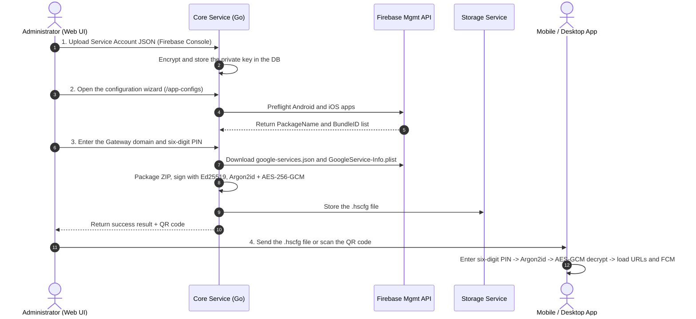

# HubSight CCTV - Technical Specification & Integration Guide for Application Configuration (.hscfg)

This document is the technical specification and detailed client integration guide for AI agents, backend engineers, mobile engineers (Flutter/React Native/native iOS & Android), and desktop-app engineers (Tauri/Electron/Go/C#).

---

## 1. Overview and design problem

### 1.1. Context and goals
In the **HubSight Surveillance & Playback Platform** ecosystem, end users use mobile or desktop applications to monitor live cameras, review NVR data, and receive realtime FCM push notifications.

Previously, application setup required users to enter many complex values manually:
- API Gateway URL, WebRTC URL, and WebSocket Relay URL.
- Device identity key (`client_id`) and credential (`client_secret`).
- Firebase Cloud Messaging configuration (`google-services.json` for Android and `GoogleService-Info.plist` for iOS).
- Internal CA certificate (`ca_cert.pem`) for private-network deployments (on-premise/private CA).

### 1.2. Solution: multi-layer secure configuration container (.hscfg)
HubSight provides the proprietary **`.hscfg` (HubSight Configuration)** secure container format:
1. **One-time setup (Zero-Configuration)**: An administrator creates the configuration in the HubSight Web UI, downloads the `.hscfg` file, or provides a quick-load QR code.
2. **Multi-layer security with a six-digit PIN**:
   - The `.hscfg` file is symmetrically encrypted with **AES-256-GCM**.
   - The decryption key is derived from the **six-digit PIN** selected by the administrator using the memory-hard GPU/ASIC-resistant **Argon2id** algorithm (64MB RAM, 4 rounds).
   - The file is digitally signed with **Ed25519** to prevent tampering.
3. **Secure storage and download**: The file is stored in internal Object Storage and is downloadable only through a time-limited **Presigned URL** (24 hours for a QR code, 15 minutes for an admin download).
4. **Unified Gateway architecture**: All REST API and WebSocket Relay endpoints pass through the Nginx reverse proxy and API Gateway (standard port 80/443 or local 8088). **The only exception is WebRTC**, which sends RTP/ICE media directly through `:8555`.

---

## 2. `.hscfg` container format

### 2.1. Binary layout

The `.hscfg` file consists of four consecutive parts:

```text
+-----------------------+--------------------+---------------------+-----------------------------------------+
| Magic Header (6 bytes)| Salt (16 bytes)    | Nonce (12 bytes)    | Ciphertext + GCM Auth Tag (Variable)    |
| 'H' 'S' 'C' 'F' 'G' 0x01 | Cryptographic Salt | AES-GCM IV / Nonce  | Encrypted ZIP archive + 16-byte GCM Tag |
+-----------------------+--------------------+---------------------+-----------------------------------------+
```

| Field | Size | Description |
| :--- | :--- | :--- |
| **Magic Header** | 6 bytes | Fixed ASCII `HSCFG` plus version byte `0x01` (`[0x48, 0x53, 0x43, 0x46, 0x47, 0x01]`). |
| **Argon2id Salt** | 16 bytes | 16 cryptographically random bytes (`crypto/rand`) used as the Argon2id salt. |
| **GCM Nonce** | 12 bytes | 12 cryptographically random AES-GCM bytes (initialization vector). |
| **Ciphertext + Tag** | N + 16 bytes | ZIP data encrypted with AES-256-GCM. The final 16 bytes are the authentication tag. |

### 2.2. Additional authenticated data (AAD)
When encrypting and decrypting with AES-256-GCM, the required AAD is the **Magic Header (6 bytes)**:
```text
AAD = []byte("HSCFG\x01")
```
If an attacker changes the header or file version, AES-GCM decryption immediately reports an authentication error (`authentication failed / integrity check failure`).

### 2.3. Cryptographic parameters

| Component | Algorithm | Technical parameters |
| :--- | :--- | :--- |
| **Key Derivation (KDF)** | Argon2id | - Time (`time / iterations`): `4`<br>- Memory (`memory`): `64 * 1024` KiB (64 MiB)<br>- Parallelism (`parallelism / threads`): `2`<br>- Output key length (`keyLength`): `32 bytes` (256-bit) |
| **Payload Encryption** | AES-256-GCM | - Key: 256-bit (from Argon2id)<br>- Nonce: 12 bytes<br>- Tag: 16 bytes (128-bit MAC)<br>- AAD: `HSCFG\x01` |
| **Digital Signature** | Ed25519 | - Ed25519 key pair (32-byte public key, 64-byte private key) generated for each configuration-generation session.<br>- The private key signs the raw ZIP archive payload before encryption.<br>- The public key and signature are embedded in `metadata.yml`. |

### 2.4. Dedicated Admin API/SDK configuration variant

Admin desktop clients use an isolated `.hscfg` variant and must not consume a mobile/app configuration package.

| Property | Legacy App profile | Admin API/SDK profile |
| :--- | :--- | :--- |
| Container magic | `HSCFG\x01` | `HSCFG\x02` |
| Format version | `1.0` | `2.0` |
| Metadata profile | `app` | `admin_api` |
| API namespace | `/api/*` or `/api/app/v1/*` | `/api/admin/v1/*` |
| Realtime namespace | `/relay` | `/relay/admin/v1` |
| Authentication | App client contract | Bearer JWT + `X-API-Key` |
| Client platform/audience | Mobile/Web/Desktop App | `admin_desktop` / `admin_api` |
| FCM files | Optional | Forbidden and never packaged |

The Admin package uses the same Argon2id, AES-256-GCM, AAD, and Ed25519 integrity model, but its binary header is different so legacy mobile/app decoders reject it before decryption. Its ZIP payload may contain only:

```text
metadata.yml
urls.yml
key.yml
ca_cert.pem                 # Optional
```

`metadata.yml` must include `profile: admin_api`, `version: "2.0"`, `api_namespace: /api/admin/v1`, `realtime_namespace: /relay/admin/v1`, and `fcm_enabled: false`. `key.yml` must identify the `admin_desktop` platform, the `admin_api` audience, and `bearer_jwt_plus_api_key` authentication mode. It must not contain `google-services.json` or `GoogleService-Info.plist`.

---

## 3. Decrypted payload contents (ZIP archive)

After successful AES-256-GCM decryption, the result is a standard **ZIP archive** containing these configuration files:

```text
decrypted_payload.zip/
├── metadata.yml              # Origin, creation date, and Ed25519 signature
├── urls.yml                  # All base URLs for HubSight connections
├── key.yml                   # Client identity key and API authorization scopes
├── google-services.json      # (Optional) Firebase FCM configuration for Android
├── GoogleService-Info.plist  # (Optional) Firebase FCM configuration for iOS
└── ca_cert.pem               # (Optional) Root CA certificate for private certificates
```

### 3.1. `metadata.yml`
```yaml
format_version: "1.0"
config_id: "cfg_c1234567890abcdefgh"
name: "Production HQ Mobile & Desktop"
description: "Standard configuration for building security staff"
created_by: "admin"
created_at_utc: "2026-09-08T08:30:00Z"
generator: "HubSight Core Packaging Engine"
ed25519_public_key: "0123456789abcdef0123456789abcdef0123456789abcdef0123456789abcdef"
signature: "abcdef0123456789abcdef0123456789abcdef0123456789abcdef0123456789abcdef0123456789abcdef0123456789abcdef0123456789abcdef0123456789"
```

### 3.2. `urls.yml`
> [!IMPORTANT]
> **Unified Gateway rule**:
> All API and WebSocket traffic goes through the primary Gateway (port 80/443 or local 8088); never connect directly to internal microservice ports (`8080`, `3001`, `1984`).
> WebRTC media streaming alone sends RTP/ICE through `:8555`.

```yaml
gateway_url: "https://cctv.yourdomain.com"
api_base_url: "https://cctv.yourdomain.com/api"
relay_ws_url: "wss://cctv.yourdomain.com/relay"
webrtc_base_url: "https://cctv.yourdomain.com:8555"
```

### 3.3. `key.yml`
```yaml
client_id: "client_pub_9876543210"
client_secret: "sec_secretkey_sample_token"
client_name: "Mobile Patrol App"
allowed_scopes:
  - "cameras:view"
  - "playback:view"
  - "notifications:receive"
```

### 3.4. `google-services.json` & `GoogleService-Info.plist`
- Automatically downloaded by the system from the **Google Firebase Management API** (`https://firebase.googleapis.com/v1beta1/...`) using the Service Account JSON uploaded by the administrator.
- Contains the API key, Project ID, Storage Bucket, and Messaging Sender ID used to initialize the Firebase SDK on Android/iOS.

---

## 4. Backend architecture and processing flow



### 4.1. Backend package structure
- [`services/shared/pkg/appconfig/crypto.go`](file:///d:/cctv/services/shared/pkg/appconfig/crypto.go): `DeriveKey(pin, salt)`, `EncryptContainer(...)`, and `DecryptContainer(...)`.
- [`services/shared/pkg/appconfig/packager.go`](file:///d:/cctv/services/shared/pkg/appconfig/packager.go): `BuildAppConfigPayload(...)` packages the ZIP and signs it with Ed25519.
- [`services/shared/pkg/google/firebase_management.go`](file:///d:/cctv/services/shared/pkg/google/firebase_management.go): Obtains an OAuth2 Bearer Token from the Service Account and calls Firebase Management for app lists and Android/iOS configuration files.
- [`services/shared/pkg/api/app_config.go`](file:///d:/cctv/services/shared/pkg/api/app_config.go): REST handlers for `/api/app-configs/*`.
- [`services/shared/pkg/models/app_config.go`](file:///d:/cctv/services/shared/pkg/models/app_config.go): `AppConfig` GORM model.

### 4.2. API endpoint catalog

| Method | Endpoint | Description | RBAC permission |
| :--- | :--- | :--- | :--- |
| `GET` | `/api/app-configs` | List generated configurations | `app_configs:manage` |
| `POST` | `/api/app-configs/generate` | Create, package, and encrypt `.hscfg` | `app_configs:manage` |
| `GET` | `/api/app-configs/:id/download` | Download the binary `.hscfg` file | `app_configs:manage` |
| `GET` | `/api/app-configs/:id/qr` | Generate a QR code with a 24-hour presigned download URL | `app_configs:manage` |
| `DELETE` | `/api/app-configs/:id` | Delete the configuration and stored file | `app_configs:manage` |
| `GET` | `/api/google-service-accounts/:id/preflight-apps` | Check Android/iOS status in Firebase | `google_service_accounts:manage` |

### 4.3. Admin API/SDK configuration endpoints

Admin packages are generated through a separate namespace and are restricted by the Admin API authentication and RBAC middleware. These endpoints never accept or fetch FCM configuration:

| Method | Endpoint | Description | RBAC permission |
| :--- | :--- | :--- | :--- |
| `GET` | `/api/admin/v1/app-configs` | List Admin API/SDK `.hscfg` v2 profiles | `app_configs:manage` |
| `POST` | `/api/admin/v1/app-configs` | Generate an Admin-only `.hscfg` v2 profile | `app_configs:manage` |
| `GET` | `/api/admin/v1/app-configs/:config_id` | Get Admin profile metadata | `app_configs:manage` |
| `POST` | `/api/admin/v1/app-configs/:config_id/download-url` | Create a short-lived download URL | `app_configs:manage` |
| `GET` | `/api/admin/v1/app-configs/:config_id/qr` | Generate an Admin profile QR payload | `app_configs:manage` |
| `DELETE` | `/api/admin/v1/app-configs/:config_id` | Delete an Admin profile with exact-name confirmation | `app_configs:manage` |

---

## 5. Client integration guide (mobile and desktop apps)

### 5.1. QR code payload
When the user selects "Scan QR code", the QR code contains this JSON string:
```json
{
  "v": 1,
  "config_id": "cfg_c1234567890abcdefgh",
  "name": "Production HQ",
  "download_url": "https://cctv.yourdomain.com/api/storage/presigned/...",
  "sha256": "8a3f...b12c"
}
```
The application:
1. Sends an HTTP GET to `download_url` to download the complete binary byte array of the `.hscfg` file.
2. Checks that the SHA256 hash of the downloaded file matches the QR code's `sha256` field.

---

### 5.2. `.hscfg` decryption algorithm (pseudocode)

```python
# 1. Verify the Magic Header
header = file_bytes[0:6]
if header != b"HSCFG\x01":
    raise Exception("File is not a valid HubSight .hscfg format!")

# 2. Split the binary sections
salt = file_bytes[6:22]        # 16 bytes
nonce = file_bytes[22:34]      # 12 bytes
ciphertext_and_tag = file_bytes[34:] # Remaining bytes

# 3. Derive the 256-bit key from the six-digit PIN with Argon2id
aes_key = argon2id_kdf(
    password=pin_string.encode('utf-8'),
    salt=salt,
    time_cost=4,
    memory_cost=65536, # 64 MB
    parallelism=2,
    key_length=32
)

# 4. Decrypt AES-256-GCM with AAD
aad = b"HSCFG\x01"
zip_payload_bytes = aes_gcm_decrypt(
    key=aes_key,
    nonce=nonce,
    ciphertext_and_tag=ciphertext_and_tag,
    aad=aad
)

# 5. Open and extract the ZIP archive in memory
zip_archive = ZipFile(io.BytesIO(zip_payload_bytes))
urls_content = zip_archive.read("urls.yml")
key_content = zip_archive.read("key.yml")
metadata_content = zip_archive.read("metadata.yml")

# 6. Verify the Ed25519 signature (recommended option)
verify_ed25519_signature(
    public_key=metadata.ed25519_public_key,
    signature=metadata.signature,
    data=zip_payload_bytes
)
```

---

### 5.3. Flutter implementation guide (Dart)

Flutter is the most common solution for the HubSight mobile application.

#### Step 1: Add dependencies to `pubspec.yaml`
```yaml
dependencies:
  flutter:
    sdk: flutter
  cryptography: ^2.7.0     # Argon2id, AES-GCM, and Ed25519 through WebAssembly/FFI
  archive: ^3.6.1          # Extract ZIP in memory
  yaml: ^3.1.2             # Read YAML files
  flutter_secure_storage: ^9.2.2 # Secure key storage in iOS Keychain / Android Keystore
  firebase_core: ^3.0.0    # Dynamic Firebase initialization
```

#### Step 2: Decryption source (`hscfg_decoder.dart`)
```dart
import 'dart:typed_data';
import 'package:cryptography/cryptography.dart';
import 'package:archive/archive.dart';
import 'package:yaml/yaml.dart';

class HscfgDecryptedResult {
  final Map<String, dynamic> urls;
  final Map<String, dynamic> key;
  final Map<String, dynamic> metadata;
  final String? googleServicesJson;
  final String? googleServiceInfoPlist;
  final String? caCertPem;

  HscfgDecryptedResult({
    required this.urls,
    required this.key,
    required this.metadata,
    this.googleServicesJson,
    this.googleServiceInfoPlist,
    this.caCertPem,
  });
}

class HscfgDecoder {
  static const List<int> magicHeader = [0x48, 0x53, 0x43, 0x46, 0x47, 0x01]; // HSCFG\x01

  static Future<HscfgDecryptedResult> decrypt({
    required Uint8List fileBytes,
    required String pin6Digits,
  }) async {
    // 1. Check minimum size and Magic Header
    if (fileBytes.length < 34 + 16) {
      throw Exception('The .hscfg configuration file is corrupt or too small.');
    }

    for (int i = 0; i < 6; i++) {
      if (fileBytes[i] != magicHeader[i]) {
        throw Exception('Invalid file format (incorrect Magic Header).');
      }
    }

    // 2. Extract Salt, Nonce, and Ciphertext
    final salt = fileBytes.sublist(6, 22);
    final nonce = fileBytes.sublist(22, 34);
    final ciphertextWithTag = fileBytes.sublist(34);

    // 3. Derive the key with Argon2id
    final kdf = Argon2id(
      parallelism: 2,
      memory: 65536, // 64 MB
      iterations: 4,
      hashLength: 32,
    );

    final secretKey = await kdf.deriveKey(
      secretKey: SecretKey(Uint8List.fromList(pin6Digits.codeUnits)),
      nonce: salt,
    );

    // 4. Decrypt AES-256-GCM with AAD
    final aesGcm = AesGcm.with256Bits();
    
    // Separate the 16-byte MAC tag at the end of the data
    final cipherLen = ciphertextWithTag.length - 16;
    final cipherText = ciphertextWithTag.sublist(0, cipherLen);
    final macTag = ciphertextWithTag.sublist(cipherLen);

    final secretBox = SecretBox(
      cipherText,
      nonce: nonce,
      mac: Mac(macTag),
    );

    final decryptedZipBytes = await aesGcm.decrypt(
      secretBox,
      secretKey: secretKey,
      aad: magicHeader,
    );

    // 5. Extract the ZIP archive from memory
    final archive = ZipDecoder().decodeBytes(decryptedZipBytes);
    
    String? urlsYaml;
    String? keyYaml;
    String? metadataYaml;
    String? googleServices;
    String? googleServiceInfo;
    String? caCert;

    for (final file in archive) {
      if (file.isFile) {
        final content = String.fromCharCodes(file.content as List<int>);
        switch (file.name) {
          case 'urls.yml':
            urlsYaml = content;
            break;
          case 'key.yml':
            keyYaml = content;
            break;
          case 'metadata.yml':
            metadataYaml = content;
            break;
          case 'google-services.json':
            googleServices = content;
            break;
          case 'GoogleService-Info.plist':
            googleServiceInfo = content;
            break;
          case 'ca_cert.pem':
            caCert = content;
            break;
        }
      }
    }

    if (urlsYaml == null || keyYaml == null) {
      throw Exception('The configuration file is missing required urls.yml or key.yml.');
    }

    return HscfgDecryptedResult(
      urls: Map<String, dynamic>.from(loadYaml(urlsYaml) as Map),
      key: Map<String, dynamic>.from(loadYaml(keyYaml) as Map),
      metadata: metadataYaml != null ? Map<String, dynamic>.from(loadYaml(metadataYaml) as Map) : {},
      googleServicesJson: googleServices,
      googleServiceInfoPlist: googleServiceInfo,
      caCertPem: caCert,
    );
  }
}
```

#### Step 3: Dynamically initialize Firebase from the decrypted file
After decryption, Flutter can initialize Firebase from `googleServicesJson` or `googleServiceInfoPlist` without compiling the JSON/plist into an asset:

```dart
import 'dart:convert';
import 'dart:io';
import 'package:firebase_core/firebase_core.dart';

Future<void> initFirebaseFromConfig(HscfgDecryptedResult config) async {
  if (Platform.isAndroid && config.googleServicesJson != null) {
    final parsed = jsonDecode(config.googleServicesJson!);
    final client = parsed['client'][0];
    final projectInfo = parsed['project_info'];

    final options = FirebaseOptions(
      apiKey: client['api_key'][0]['current_key'],
      appId: client['client_info']['mobilesdk_app_id'],
      messagingSenderId: projectInfo['project_number'],
      projectId: projectInfo['project_id'],
      storageBucket: projectInfo['storage_bucket'],
    );

    await Firebase.initializeApp(options: options);
  } else if (Platform.isIOS && config.googleServiceInfoPlist != null) {
    // Similarly, parse the plist and extract API_KEY, GOOGLE_APP_ID, GCM_SENDER_ID, PROJECT_ID
  }
}
```

---

### 5.4. React Native/TypeScript implementation guide

Use the native crypto library `react-native-quick-crypto` and `@types/react-native-zip-archive`:

```typescript
import QuickCrypto from 'react-native-quick-crypto';
import { unzip } from 'react-native-zip-archive';

export async function decryptHscfg(fileBuffer: Buffer, pin: string) {
  const magic = fileBuffer.subarray(0, 6).toString('utf-8');
  if (magic !== 'HSCFG\x01') {
    throw new Error('File is not a valid .hscfg format');
  }

  const salt = fileBuffer.subarray(6, 22);
  const nonce = fileBuffer.subarray(22, 34);
  const ciphertextAndTag = fileBuffer.subarray(34);
  const authTag = ciphertextAndTag.subarray(ciphertextAndTag.length - 16);
  const ciphertext = ciphertextAndTag.subarray(0, ciphertextAndTag.length - 16);

  // Derive the key with Argon2id (the native react-native-argon2 module may be used)
  const key = await deriveArgon2id(pin, salt, {
    iterations: 4,
    memory: 65536,
    parallelism: 2,
    keyLength: 32,
  });

  const decipher = QuickCrypto.createDecipheriv('aes-256-gcm', key, nonce);
  decipher.setAAD(Buffer.from('HSCFG\x01', 'utf-8'));
  decipher.setAuthTag(authTag);

  const decryptedZip = Buffer.concat([decipher.update(ciphertext), decipher.final()]);
  return decryptedZip;
}
```

---

### 5.5. Desktop app implementation guide (Go/Tauri/Electron)

For a Go desktop application (or a Tauri/Wails backend sidecar), use the standard HubSight package directly:

```go
package main

import (
	"fmt"
	"os"

	"cctv/shared/pkg/appconfig"
)

func main() {
	hscfgBytes, err := os.ReadFile("hubsight_profile.hscfg")
	if err != nil {
		panic(err)
	}

	pin := "123456"
	payload, err := appconfig.DecryptContainer(hscfgBytes, pin)
	if err != nil {
		fmt.Printf("Decryption failed: %v\n", err)
		return
	}

	fmt.Printf("Decryption succeeded! Gateway URL: %s\n", payload.URLs.GatewayURL)
	fmt.Printf("API Base URL: %s\n", payload.URLs.APIBaseURL)
	fmt.Printf("Client ID: %s\n", payload.Key.ClientID)
}
```

---

### 5.6. Send login device information (device info and fingerprint)

When a mobile/desktop application logs a user in (`POST /api/auth/login` or `POST /api/auth/2fa/verify`), it must include device information (`device_info`) in the JSON payload and the corresponding `X-Device-*` headers so the system can record detailed login-session history.

#### Example request:
```http
POST /api/auth/login HTTP/1.1
Host: gateway.hubsight.internal
Content-Type: application/json
X-Client-ID: cli_1234567890
X-Device-Fingerprint: 3b1a8d0ef9...
X-Device-Label: Apple iPhone 15 Pro (iOS 17.5.1) • App v1.2.0
X-Client-Type: mobile_ios

{
  "username": "user1",
  "password": "SecretPassword123!",
  "device_info": {
    "fingerprint": "3b1a8d0ef9...",
    "device_label": "Apple iPhone 15 Pro (iOS 17.5.1) • App v1.2.0",
    "client_type": "mobile_ios",
    "platform": "iOS",
    "os_version": "17.5.1",
    "model": "iPhone 15 Pro",
    "manufacturer": "Apple",
    "app_version": "1.2.0",
    "screen_resolution": "1179x2556",
    "language": "vi-VN",
    "timezone": "Asia/Ho_Chi_Minh",
    "latitude": 10.7769,
    "longitude": 106.7009,
    "accuracy": 25
  }
}
```

Coordinates are optional and should be sent only after the user grants Location permission. If permission is denied or GPS is unavailable, the backend falls back to IP geolocation for an approximate location; login must continue normally.

See the detailed field specification and Flutter example in [`docs/SECURITY_FOR_LOGIN.md`](./SECURITY_FOR_LOGIN.md#44-client-device-metadata-contract).

---

## 6. Security principles and best practices

1. **Do not store the PIN**: The client holds the PIN only temporarily in RAM during decryption, then zeroizes the memory.
2. **Protect client credentials**: After extraction, store `client_id` and `client_secret` in OS-level secure storage (**iOS Keychain**, **Android Keystore**, **Windows Credential Manager**, **macOS Keychain**).
3. **Do not write sensitive files to external storage**: Extract `key.yml` and `google-services.json` only in RAM or the application's isolated sandbox (`ApplicationSupportDirectory`).
4. **Prevent PIN brute force**: Limit incorrect PIN attempts (for example, lock temporarily for 30 seconds after five failures). Argon2id uses 64MB RAM and four rounds (about 100–250ms on a mobile CPU), so immediate offline brute force is impractical on the device.
