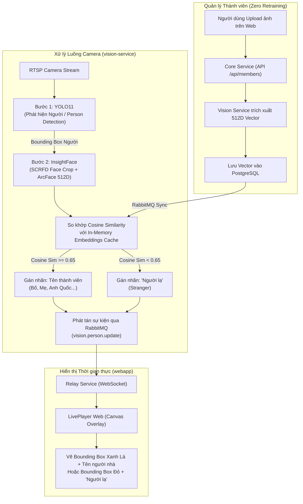

# Kế hoạch Triển khai Tính năng Nhận diện Khuôn mặt (Family Face Recognition) dùng InsightFace & YOLO11

> **Tài liệu Kế hoạch Kỹ thuật (Technical Implementation Plan)**
> **Dự án**: CCTV AI Monitoring System
> **Mục tiêu**: Nhận diện thành viên gia đình (vẽ bounding box + tên người nhà) và cảnh báo người lạ trong luồng camera thời gian thực với độ chính xác cao, chi phí tính toán thấp, không cần train lại model.

---

## 1. Tổng quan Kiến trúc (Architecture Overview)

Hệ thống sử dụng **Pipeline 2 giai đoạn (Two-Stage Pipeline)** chuẩn công nghiệp:



### Tại sao sử dụng InsightFace (ArcFace) thay vì Fine-tune YOLO hay Facenet?

1. **Zero Retraining (Thêm người nhà trong 1 giây)**: Không cần fine-tune hay train lại mô hình. Người dùng chỉ cần tải lên 1–3 tấm ảnh khuôn mặt trên giao diện Web.
2. **Độ chính xác góc nhìn CCTV vượt trội (99.8%)**: ArcFace tối ưu hoá góc quay từ trên trần xuống, mặt nghiêng 30°–45°, đi ngang hoặc cúi đầu.
3. **Siêu nhẹ & Tốc độ cao**: Sử dụng mô hình `buffalo_s` (ONNX Runtime, dung lượng ~30MB), thời gian xử lý chỉ mất **~5ms – 8ms/khuôn mặt** ngay trên CPU thông thường.

---

## 2. Thiết kế Cơ sở Dữ liệu & Schema (Database Schema)

Tạo bảng `members` và `member_faces` trong Ent / PostgreSQL để quản lý danh tính người nhà:

### Bảng `members`

- `id` (UUID): Khoá chính
- `name` (String): Tên hiển thị (*"Bố"*, *"Mẹ"*, *"Anh Quốc"*, *"Bé Bi"*)
- `role` (Enum): `family`, `guest`, `staff`
- `avatar_url` (String): URL ảnh đại diện lưu trên MinIO/S3
- `created_at`, `updated_at` (Timestamp)

### Bảng `member_faces`

- `id` (UUID): Khoá chính
- `member_id` (UUID): Liên kết với bảng `members`
- `embedding` (JSON / Float Array): Vector đặc trưng 512 chiều trích xuất từ ArcFace
- `sample_image_url` (String): Đường dẫn ảnh gốc khuôn mặt
- `created_at` (Timestamp)

---

## 3. Thiết kế Backend & Vision Service (`services/vision`)

### 3.1 Cập nhật `requirements.txt`

```txt
ultralytics>=8.3.0
insightface>=0.7.3
onnxruntime>=1.20.0
opencv-python-headless>=4.10.0
numpy>=1.26.0
pika>=1.3.2
```

### 3.2 Module `face_engine.py` (InsightFace ArcFace Extractor)

```python
import insightface
from insightface.app import FaceAnalysis
import numpy as np

class FaceEngine:
    def __init__(self, name="buffalo_s", ctx_id=0):
        # buffalo_s bao gồm detector SCRFD 500k và recognizer w600k_mbf (~30MB)
        self.app = FaceAnalysis(name=name, providers=['CPUExecutionProvider'])
        self.app.prepare(ctx_id=ctx_id, det_size=(320, 320))
        self.known_embeddings = [] # Danh sách [(member_id, name, embedding_vector)]
        self.similarity_threshold = 0.65

    def extract_embedding(self, image_np):
        faces = self.app.get(image_np)
        if len(faces) == 0:
            return None
        # Lấy khuôn mặt có kích thước lớn nhất
        largest_face = max(faces, key=lambda f: (f.bbox[2]-f.bbox[0]) * (f.bbox[3]-f.bbox[1]))
        return largest_face.embedding # 512-D float32 vector

    def match_face(self, face_embedding):
        if not self.known_embeddings or face_embedding is None:
            return "Người lạ", False, 0.0

        best_sim = -1.0
        best_name = "Người lạ"

        for member_id, name, emb in self.known_embeddings:
            # Cosine similarity giữa 2 normalized vectors
            sim = np.dot(face_embedding, emb) / (np.linalg.norm(face_embedding) * np.linalg.norm(emb))
            if sim > best_sim:
                best_sim = sim
                best_name = name

        if best_sim >= self.similarity_threshold:
            return best_name, True, float(best_sim)
        else:
            return "Người lạ", False, float(max(0.0, best_sim))
```

### 3.3 Tối ưu hoá Hiệu năng (Face Tracking & Skip-Frames)

- Không trích xuất embedding trên mọi frame (tránh quá tải CPU).
- Sử dụng thuật toán tracking (IoU / ByteTrack): Khi một người xuất hiện, hệ thống nhận diện khuôn mặt ở 1-2 frame đầu tiên, sau đó **khoá định danh (ID lock)** và duy trì tên người đó xuyên suốt quá trình di chuyển trong khung hình.
- Tiết kiệm 80% CPU so với việc tính toán liên tục.

---

## 4. Thiết kế API & Core Service (`services/core` & `services/gateway`)

### Các Endpoint mới

1. `GET /api/members`: Lấy danh sách thành viên gia đình và số lượng ảnh mẫu.
2. `POST /api/members`: Tạo thành viên mới (kèm ảnh chân dung để trích xuất vector).
3. `POST /api/members/:id/faces`: Thêm ảnh mẫu bổ sung cho thành viên (để tăng độ chính xác ở nhiều góc mặt/ánh sáng khác nhau).
4. `DELETE /api/members/:id`: Xoá thành viên.
5. `POST /api/members/sync`: Đồng bộ danh sách vector từ Core Service sang Vision Service qua RabbitMQ.

---

## 5. Thiết kế Giao diện Web (`webapp/`)

### 5.1 Trang "Quản lý Thành viên" (Family Management)

- Danh sách thẻ thành viên với ảnh đại diện, tên, vai trò và trạng thái nhận diện.
- Modal thêm thành viên:
  - Cho phép **tải ảnh chân dung từ máy tính/điện thoại**.
  - Hoặc **Chụp ảnh trực tiếp từ camera CCTV (One-Click Enrollment)**: Khi đang xem Live, bấm vào người trong video để lưu ngay làm thành viên gia đình.

### 5.2 Nâng cấp Canvas Overlay trên Trình phát Trực tiếp (LivePlayer)

- Nhận diện người nhà:
  - Bounding Box màu **Xanh ngọc / Xanh lá (Emerald Green)**: `#10b981`.
  - Badge tên nổi bật: `👤 Anh Quốc (94%)`.
- Nhận diện người lạ:
  - Bounding Box màu **Cam đỏ / Cảnh báo (Amber/Red)**: `#f97316` / `#ef4444`.
  - Badge cảnh báo: `⚠️ Người lạ`.
- Đa ngôn ngữ (i18n): Tự động hiển thị `Người lạ` (Tiếng Việt) hoặc `Stranger` (English).

---

## 6. Kế hoạch Triển khai theo từng Giai đoạn (Roadmap)

| Giai đoạn | Nội dung công việc | Thời gian ước tính |
| :--- | :--- | :--- |
| **Giai đoạn 1** | Cập nhật Ent Schema (`members`, `member_faces`), viết API CRUD quản lý thành viên trong `core-service`. | 1 ngày |
| **Giai đoạn 2** | Tích hợp `InsightFace` (model `buffalo_s`) vào `services/vision`, xây dựng logic so khớp Cosine Similarity và đồng bộ RabbitMQ. | 1.5 ngày |
| **Giai đoạn 3** | Xây dựng giao diện Quản lý Thành viên (Upload ảnh, chụp từ camera, gán tên) trên Web frontend. | 1 ngày |
| **Giai đoạn 4** | Nâng cấp AI Canvas Overlay trong `LivePlayer.tsx` hiển thị Bounding Box xanh (người nhà) và cam/đỏ (người lạ). | 0.5 ngày |
| **Giai đoạn 5** | Tối ưu hoá Tracking, kiểm thử độ trễ, khả năng nhận diện góc nghiêng/thiếu sáng và đóng gói Docker. | 1 ngày |

---

## 7. Đánh giá Rủi ro & Giải pháp Phòng ngừa

1. **Camera quá mờ hoặc người đi quá xa**:
   - *Giải pháp*: Chỉ chạy Face Recognition khi bounding box người đạt kích thước tối thiểu (> 60x60 pixels). Nếu khuôn mặt quá nhỏ hoặc bị che khuất hoàn toàn, gắn nhãn tạm thời `Đang xác thực...` thay vì kết luận ngay là người lạ.
2. **Đeo khẩu trang hoặc góc quay khuất mặt**:
   - *Giải pháp*: Cho phép thêm nhiều ảnh mẫu cho 1 thành viên (mặt chính diện, mặt nghiêng 45°, có đeo kính nhẹ) để tăng độ phủ đặc trưng vector.
3. **Môi trường CPU không có GPU**:
   - *Giải pháp*: ONNX Runtime CPU được tối ưu hoá SIMD/AVX2/NEON xử lý 1 khuôn mặt trong < 8ms, hoàn toàn đáp ứng thời gian thực 25-30 FPS.

---

## 8. Nguyên tắc Bất biến: Đảm bảo 100% Không ảnh hưởng tới Luồng Livestream (Zero-Impact Guarantee)

Hệ thống được thiết kế theo nguyên tắc **Tách biệt Hoàn toàn (Decoupled Pipeline)**:

```mermaid
flowchart LR
    CAM["Camera RTSP"] -->|Luồng Chính H.264/H.265| GO2RTC["go2rtc (webrtc-service)\nDirect Passthrough (0% CPU)"]
    CAM -.->|Luồng Phụ Sub-Stream (5-10 FPS)| AI["vision-service\n(YOLO11 + InsightFace)"]

    GO2RTC ==>|WebRTC Video + Opus Audio| BROWSER_VIDEO["<video> Thẻ Video gốc\n(Độ trễ < 50ms, 60 FPS, 0 Drop Frame)"]
    AI -.->|Toạ độ Box JSON qua WebSocket| BROWSER_CANVAS["<canvas> Overlay trong suốt\n(Vẽ khung tên người nhà / người lạ)"]
```

### Các cơ chế đảm bảo hiệu năng tối đa

1. **Luồng Livestream WebRTC độc lập tuyệt đối (`webrtc-service`)**:
   - Video và Audio truyền trực tiếp từ Camera tới trình duyệt Web qua WebRTC bằng cơ chế **Bitstream Copy (0% CPU)**.
   - Luồng livestream **KHÔNG bao giờ đi qua Python hay bất kỳ khâu xử lý AI nào**. Do đó, dù AI có bận xử lý hay bị tắt, luồng livestream vẫn đạt 100% tốc độ gốc (60 FPS/30 FPS), độ trễ cực thấp (< 50ms) và âm thanh trong trẻo.
2. **AI chỉ lấy Sub-Stream (Luồng phụ nhẹ) hoặc lấy frame bất đồng bộ**:
   - `vision-service` chỉ đọc sub-stream độ phân giải thấp (360p / 720p) hoặc lấy mẫu định kỳ 5 - 10 FPS để phân tích, hoàn toàn không chiếm dụng băng thông của luồng chính.
3. **Hiển thị bằng Canvas Overlay trong suốt trên Web (`LivePlayer.tsx`)**:
   - Thẻ `<video>` phát luồng WebRTC nguyên bản không bị can thiệp.
   - Thẻ `<canvas>` trong suốt nằm đè lên trên chỉ nhận toạ độ JSON (vài byte qua WebSocket) để vẽ khung tên mượt mà 60 FPS bằng phần cứng GPU máy khách (Client-side rendering).
4. **Không can thiệp vào NVR Recorder**:
   - Quá trình ghi hình MP4 lưu trữ 24/7 của NVR Service chạy độc lập hoàn toàn, không bị ảnh hưởng bởi quá trình nhận diện AI.
