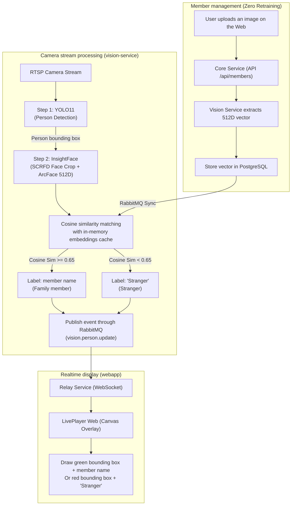

# InsightFace & YOLO11 Family Face Recognition Implementation Plan

> **Technical Implementation Plan**
> **Project**: CCTV AI Monitoring System
> **Goal**: Recognize family members (draw a bounding box and family-member name) and alert on strangers in realtime camera streams with high accuracy and low compute cost, without retraining the model.

---

## 1. Architecture overview

The system uses an industrial-grade **two-stage pipeline**:



### Why use InsightFace (ArcFace) instead of fine-tuning YOLO or FaceNet?

1. **Zero retraining (add a family member in one second)**: No fine-tuning or model retraining is required. The user uploads only 1–3 face images through the Web interface.
2. **Excellent CCTV pose accuracy (99.8%)**: ArcFace is optimized for top-down views, 30°–45° profile faces, side views, and lowered heads.
3. **Very light and fast**: The `buffalo_s` model (ONNX Runtime, ~30MB) processes a face in only **~5ms–8ms** on ordinary CPUs.

---

## 2. Database schema

Create `members` and `member_faces` tables in Ent/PostgreSQL to manage member identities:

### `members` table

- `id` (UUID): Primary key
- `name` (String): Display name (*"Parent 1"*, *"Parent 2"*, *"Family Member"*)
- `role` (Enum): `family`, `guest`, `staff`
- `avatar_url` (String): Avatar URL stored in MinIO/S3
- `created_at`, `updated_at` (Timestamp)

### `member_faces` table

- `id` (UUID): Primary key
- `member_id` (UUID): Link to the `members` table
- `embedding` (JSON / Float Array): 512-dimensional feature vector extracted by ArcFace
- `sample_image_url` (String): Original face-image path
- `created_at` (Timestamp)

---

## 3. Backend and Vision Service design (`services/vision`)

### 3.1 Update `requirements.txt`

```txt
ultralytics>=8.3.0
insightface>=0.7.3
onnxruntime>=1.20.0
opencv-python-headless>=4.10.0
numpy>=1.26.0
pika>=1.3.2
```

### 3.2 Module `face_engine.py` (InsightFace ArcFace Extractor)

```python
import insightface
from insightface.app import FaceAnalysis
import numpy as np

class FaceEngine:
    def __init__(self, name="buffalo_s", ctx_id=0):
        # buffalo_s includes the SCRFD 500k detector and w600k_mbf recognizer (~30MB)
        self.app = FaceAnalysis(name=name, providers=['CPUExecutionProvider'])
        self.app.prepare(ctx_id=ctx_id, det_size=(320, 320))
        self.known_embeddings = [] # List of (member_id, name, embedding_vector)
        self.similarity_threshold = 0.65

    def extract_embedding(self, image_np):
        faces = self.app.get(image_np)
        if len(faces) == 0:
            return None
        # Select the largest face
        largest_face = max(faces, key=lambda f: (f.bbox[2]-f.bbox[0]) * (f.bbox[3]-f.bbox[1]))
        return largest_face.embedding # 512-D float32 vector

    def match_face(self, face_embedding):
        if not self.known_embeddings or face_embedding is None:
            return "Stranger", False, 0.0

        best_sim = -1.0
        best_name = "Stranger"

        for member_id, name, emb in self.known_embeddings:
            # Cosine similarity between two normalized vectors
            sim = np.dot(face_embedding, emb) / (np.linalg.norm(face_embedding) * np.linalg.norm(emb))
            if sim > best_sim:
                best_sim = sim
                best_name = name

        if best_sim >= self.similarity_threshold:
            return best_name, True, float(best_sim)
        else:
            return "Stranger", False, float(max(0.0, best_sim))
```

### 3.3 Performance optimization (face tracking and skipped frames)

- Do not extract an embedding on every frame (avoid CPU overload).
- Use tracking (IoU/ByteTrack): when a person appears, recognize the face in the first 1–2 frames, then apply an **ID lock** and keep that name while the person moves through the frame.
- Saves 80% CPU compared with continuous computation.

---

## 4. API and Core Service design (`services/core` & `services/gateway`)

### New endpoints

1. `GET /api/members`: Get family members and sample-image counts.
2. `POST /api/members`: Create a member (including a portrait for vector extraction).
3. `POST /api/members/:id/faces`: Add samples for a member to improve accuracy across poses/lighting.
4. `DELETE /api/members/:id`: Delete a member.
5. `POST /api/members/sync`: Synchronize vectors from Core Service to Vision Service through RabbitMQ.

---

## 5. Web interface design (`webapp/`)

### 5.1 "Member Management" page (Family Management)

- Member cards with avatar, name, role, and recognition status.
- Add-member modal:
  - Allow **portrait upload from a computer/phone**.
  - Or **capture directly from the CCTV camera (One-Click Enrollment)**: while watching Live, click a person in the video to save them as a family member.

### 5.2 Upgrade the canvas overlay on the LivePlayer

- Recognized member:
  - **Emerald green** bounding box: `#10b981`.
  - Prominent name badge: `👤 Family Member (94%)`.
- Stranger:
  - **Amber/red warning** bounding box: `#f97316` / `#ef4444`.
  - Alert badge: `⚠️ Stranger`.
- Internationalization (i18n): display `Stranger` according to the active locale.

---

## 6. Phased implementation roadmap

| Phase | Work | Estimated time |
| :--- | :--- | :--- |
| **Phase 1** | Update the Ent schema (`members`, `member_faces`) and build member-management CRUD APIs in `core-service`. | 1 day |
| **Phase 2** | Integrate `InsightFace` (`buffalo_s`) into `services/vision`, build cosine-similarity matching, and synchronize through RabbitMQ. | 1.5 days |
| **Phase 3** | Build the Member Management interface (image upload, camera capture, naming) in the Web frontend. | 1 day |
| **Phase 4** | Upgrade the AI canvas overlay in `LivePlayer.tsx` to show green bounding boxes for members and orange/red boxes for strangers. | 0.5 day |
| **Phase 5** | Optimize tracking, test latency and recognition under profile/low-light conditions, and package Docker images. | 1 day |

---

## 7. Risk assessment and mitigations

1. **Very blurry camera or person too far away**:
   - *Mitigation*: Run face recognition only when the person bounding box is at least 60x60 pixels. If the face is too small or fully occluded, temporarily label it `Verifying...` instead of immediately declaring a stranger.
2. **Mask or obstructed face angle**:
   - *Mitigation*: Allow multiple samples per member (frontal, 45° profile, and light glasses) to improve vector coverage.
3. **CPU-only environment**:
   - *Mitigation*: ONNX Runtime CPU optimized with SIMD/AVX2/NEON processes one face in <8ms, supporting realtime 25–30 FPS.

---

## 8. Invariant: zero impact on the livestream (Zero-Impact Guarantee)

The system follows a **fully decoupled pipeline**:

```mermaid
flowchart LR
    CAM["RTSP Camera"] -->|Main H.264/H.265 stream| GO2RTC["go2rtc (webrtc-service)\nDirect Passthrough (0% CPU)"]
    CAM -.->|Sub-stream (5-10 FPS)| AI["vision-service\n(YOLO11 + InsightFace)"]

    GO2RTC ==>|WebRTC Video + Opus Audio| BROWSER_VIDEO["<video> Native video element\n(<50ms latency, 60 FPS, 0 dropped frames)"]
    AI -.->|Box coordinates as JSON over WebSocket| BROWSER_CANVAS["<canvas> Transparent overlay\n(Draw member/stranger labels)"]
```

### Performance guarantees

1. **Fully independent WebRTC livestream (`webrtc-service`)**:
   - Video and audio travel directly from the camera to the Web browser through WebRTC using **bitstream copy (0% CPU)**.
   - The livestream **never passes through Python or any AI-processing stage**. Even when AI is busy or disabled, the livestream maintains the source rate (60/30 FPS), very low latency (<50ms), and clear audio.
2. **AI reads only the light sub-stream or asynchronous frames**:
   - `vision-service` reads only a low-resolution sub-stream (360p/720p) or samples 5–10 FPS, without consuming the main-stream bandwidth.
3. **Transparent canvas overlay on the Web (`LivePlayer.tsx`)**:
   - The `<video>` element plays the native WebRTC stream without interference.
   - The transparent `<canvas>` overlays it and receives only JSON coordinates (a few bytes over WebSocket) to draw smooth labels at 60 FPS using the client GPU (client-side rendering).
4. **No interference with the NVR recorder**:
   - The NVR Service's 24/7 MP4 recording runs independently and is unaffected by AI recognition.
