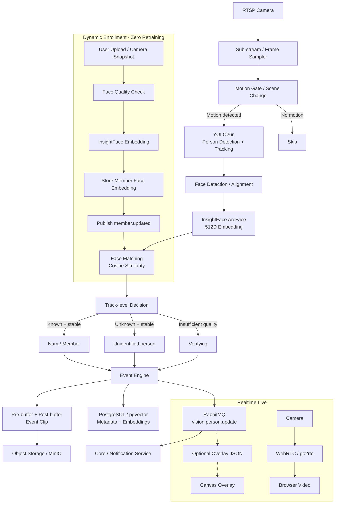

# InsightFace & YOLO26 Family Face Recognition Implementation Plan

> **Technical Implementation Plan**
> **Project**: CCTV AI Monitoring System
> **Goal**: Recognize family members and strangers in camera streams and generate metadata/events for event-driven NVR, with low compute cost and **no per-member model retraining**.

---

## 0. Important changes from the previous version

This implementation changes several assumptions to better match the product goals:

1. **Face recognition is not a classifier that needs retraining whenever a person is added.** When a user adds “Nam”, the system only extracts Nam's embedding and stores it in the vector store.
2. **Do not classify a person as “Stranger” from one frame.** Results must stabilize across a track and multiple observations.
3. **Do not hard-code one threshold for every camera.** `0.65` is only an initial test value; the production threshold must be benchmarked with system-specific data.
4. **The bounding box is not the primary UX.** Bounding box + name should be an optional/debug overlay. The primary UX is an event such as “Nam appeared” or “Unidentified person appeared”.
5. **AI should not depend on the livestream.** WebRTC/live playback and the vision pipeline must be separate; AI failures or latency must not block the live stream.
6. **The Event Recorder should use pre-buffer/post-buffer.** When a person is detected, the clip should include several seconds before detection instead of starting at the trigger frame.
7. **Use quality gates for enrollment and recognition.** Do not store embeddings from images that are too small, blurry, occluded, or have poor pose.

---

# 1. Architecture overview

The system uses a multi-stage pipeline:



### Principles

- **YOLO26n**: detect and track people.
- **InsightFace**: detect faces and create embeddings.
- **Face matching**: find the nearest member in the embedding store.
- **Track-level decision**: stabilize results across frames before creating an event.
- **Event Engine**: decide which moments are worth storing.
- **Object Storage**: store clips/thumbnails.
- **PostgreSQL**: store metadata and embeddings.
- **RabbitMQ**: transfer events between services.
- **WebRTC**: serve live video independently of AI.

---

# 2. Why use InsightFace/ArcFace instead of per-member fine-tuning?

## 2.1 Zero retraining

Adding a member does not require retraining YOLO or ArcFace.

Workflow:

```text
Nam's image
    ↓
Face quality check
    ↓
InsightFace
    ↓
512D embedding
    ↓
DB
```

When the camera sees a face:

```text
Camera face
    ↓
512D embedding
    ↓
Similarity search
    ↓
Nam / another member / Unknown
```

## 2.2 Do not advertise accuracy with a fixed number

Model-zoo benchmarks do not represent actual accuracy on the system's home cameras. For example, InsightFace publishes separate benchmarks for each model pack and dataset; `buffalo_s` and `buffalo_l` have materially different performance. Therefore, this system must benchmark against real camera data, especially in low light, profile views, long distances, and high-angle cameras.

**Do not use claims such as `99.8% accuracy` or `<8ms/face` as default SLAs.** These metrics must be measured on the actual hardware, camera, and resolution.

## 2.3 Licensing

InsightFace's model zoo states that pretrained models are provided for **non-commercial research purposes only**. If the product is commercialized, check the license of the selected model/model pack and replace it with an appropriately licensed model when necessary.

---

# 3. Face recognition design

## 3.1 Model recommendation

The MVP can start with:

```text
InsightFace
└── buffalo_s
    ├── SCRFD detector
    └── MBF recognition
```

`buffalo_s` is smaller than `buffalo_l`, but it still requires real-world benchmarking on the target device. Model size and benchmarks are published in the InsightFace model zoo.

If accuracy is insufficient for the real camera:

```text
buffalo_s
   ↓ benchmark
buffalo_m / buffalo_l
   ↓ benchmark
Select a model appropriate for latency/accuracy
```

Do not optimize for file size alone.

---

# 4. Database design

Use PostgreSQL + `pgvector` instead of plain `JSON/Float Array` embeddings if scale is expected to grow or direct similarity search in the database is desired.

## 4.1 `members` table

```text
members
-------------------------------
id              UUID PK
name            TEXT
role            ENUM
avatar_url      TEXT
is_active       BOOLEAN
created_at      TIMESTAMP
updated_at      TIMESTAMP
```

`role` may be:

```text
family    (Group 1 - Family -> Emerald #10b981)
guest     (Group 2 - Familiar guest -> Ocean blue #3b82f6)
neighbor  (Group 2 - Neighbor -> Ocean blue #3b82f6)
staff     (Group 2 - Staff/household help -> Ocean blue #3b82f6)
```

## 4.2 `member_faces` table

```text
member_faces
--------------------------------
id                  UUID PK
member_id           UUID FK
embedding           VECTOR(512)
sample_image_url    TEXT
quality_score       FLOAT
yaw                 FLOAT
pitch               FLOAT
blur_score          FLOAT
created_at          TIMESTAMP
is_active           BOOLEAN
```

### Why store multiple embeddings?

Do not store only one vector for “Nam”.

Example:

```text
Nam
├── face_01: frontal
├── face_02: left profile
├── face_03: right profile
├── face_04: low light
└── face_05: glasses
```

When matching:

```text
query embedding
      ↓
similarity against Nam's face samples
      ↓
best / aggregated score
```

This is better than forcing every condition into one vector.

---

# 5. Face Quality Gate

Do not create or update an embedding from every face.

## 5.1 Minimum conditions

Start with:

```text
face width >= X px
face height >= Y px
detector confidence >= threshold
blur score >= threshold
pose within acceptable limits
occlusion not too high
```

The values for `X`, `Y`, blur threshold, and pose threshold must be benchmarked in practice.

**Do not use `person bbox >= 60x60` as a direct face-recognition condition.**

A 100x150 person box does not guarantee that the face is large enough to recognize.

The correct sequence is:

```text
person bbox
    ↓
face detection
    ↓
face bbox
    ↓
face quality
    ↓
recognition
```

If the face is too small/blurry:

```text
status = UNKNOWN_TEMPORARY
```

not:

```text
status = STRANGER
```

---

# 6. Track-aware recognition

Do not recognize faces on every frame.

Pipeline:

```text
Frame
 ↓
YOLO26n
 ↓
Person track_id = 17
 ↓
Face available?
 ↓
Face quality good?
 ↓
Run InsightFace
 ↓
embedding
 ↓
Match
 ↓
Update track state
```

A track may have this state:

```text
UNKNOWN
VERIFYING
KNOWN
STRANGER
LOST
```

Example:

```text
track_id = 17

Frame 100 → similarity 0.58
Frame 105 → similarity 0.71
Frame 110 → similarity 0.76
Frame 115 → similarity 0.79
```

Do not immediately create a “Nam” event at frame 100.

Apply:

```text
N >= 2 or 3 good matches
+
stable score
+
track still exists
=> ACCEPT
```

Otherwise:

```text
low/fluctuating score or poor face quality
=> VERIFYING
```

---

# 7. Threshold strategy

## 7.1 Do not hard-code `0.65` as a production value

The previous document used:

```python
similarity_threshold = 0.65
```

Move this to configuration:

```text
FACE_MATCH_THRESHOLD=...
FACE_STRONG_MATCH_THRESHOLD=...
FACE_UNKNOWN_THRESHOLD=...
```

Then benchmark it.

## 7.2 Separate decision levels

Example:

```text
score >= strong_threshold
    → strong known

threshold <= score < strong_threshold
    → verifying / weak known

score < threshold
    → unknown candidate
```

This reduces false positives.

## 7.3 Important: Unknown does not mean confirmed Stranger

Someone may be a member but:

- face too far away
- profile view
- wearing a mask
- low light
- motion blur
- partially occluded face

Therefore, use at least:

```text
KNOWN
UNKNOWN
UNRESOLVED
```

`STRANGER` should become an event only after the system has enough evidence.

---

# 8. Face matching implementation

Normalize every embedding before storage:

```python
embedding = embedding / np.linalg.norm(embedding)
```

Khi match:

```python
score = np.dot(query_embedding, stored_embedding)
```

When the member count is small, a linear scan is sufficient:

```text
10 members
×
5 embeddings/member
=
50 vectors
```

No complex vector database is needed yet.

As scale increases, move to `pgvector` similarity search.

---

# 9. Enrollment flow

## 9.1 User upload

```text
User selects an image
    ↓
Face Detection
    ↓
Exactly one face?
    ↓
Quality Gate
    ↓
Embedding
    ↓
Preview
    ↓
User confirms "This is Nam"
    ↓
Save member_faces
```

## 9.2 One-click enrollment from live

Continue to support:

```text
Live
 ↓
click person/face
 ↓
freeze best frame
 ↓
quality check
 ↓
"Who is this?"
 ↓
Nam
 ↓
save embedding
```

Do not automatically save every frame to a member profile.

---

# 10. Dynamic learning

This is **not model training**.

Example:

```text
Day 1:
Nam = 3 embeddings

Day 7:
User confirms two additional good images

Nam = 5 embeddings
```

The model remains unchanged.

Only the **identity database** grows.

This is the most suitable mechanism for family CCTV.

---

# 11. Event-driven NVR integration

This is the most important change from traditional NVR.

Do not store 24/7 video solely to support AI.

Recommendation:

```text
RTSP
 ↓
Rolling Buffer 5–10s
 ↓
Motion Gate
 ↓
YOLO + Tracking
 ↓
Face Recognition
 ↓
Event Decision
 ↓
KEEP EVENT
 ↓
Post-buffer 10–20s
 ↓
Clip
 ↓
MinIO / Object Storage
```

Event example:

```text
18:31:14
Person appears

18:31:18
Stable recognition → Nam

18:31:35
Track ends

=> Clip:
18:31:09 → 18:31:45
```

The user can view the **full moment**, including several seconds before AI detection.

---

# 12. Event schema

Add a table such as:

```text
camera_events
--------------------------------
id              UUID PK
camera_id       UUID
event_type      TEXT
person_id       UUID NULL
track_id        TEXT NULL
started_at      TIMESTAMP
ended_at        TIMESTAMP
confidence      FLOAT NULL
thumbnail_url  TEXT
clip_url        TEXT NULL
created_at      TIMESTAMP
```

Example:

```text
event_type = PERSON_DETECTED
person_id  = Nam
```

or:

```text
event_type = UNKNOWN_PERSON
person_id  = NULL
```

---

# 13. RabbitMQ events

Do not send every frame through RabbitMQ.

RabbitMQ should receive only **semantic events** or important state changes:

```text
vision.person.detected
vision.person.identified
vision.person.unknown
vision.person.lost
vision.event.created
```

Example:

```json
{
  "event": "vision.person.identified",
  "camera_id": "living-room",
  "track_id": "17",
  "member_id": "uuid",
  "name": "Nam",
  "similarity": 0.81,
  "timestamp": "2026-08-22T18:31:18Z"
}
```

Do not send 10 JSON messages per frame just to draw a bounding box.

Use a separate channel such as WebSocket for realtime overlays.

---

# 14. Live UI / bounding boxes and camera AI status

## 14.1 Standard bounding-box color categories (4-Color Category System)

Bounding boxes and recognition labels on the Canvas Overlay (`LivePlayer.tsx`) use four high-contrast color categories:

| Group / state | HEX | Color name | Badge | Meaning and behavior |
| :--- | :--- | :--- | :--- | :--- |
| **Group 1: Family (`family`)** | `#10b981` | **Emerald** | `👤 [Name] • Family` | Immediate family member. Does not trigger a stranger alarm. |
| **Group 2: Familiar (`guest`/`neighbor`)** | `#3b82f6` | **Ocean Blue** | `👤 [Name] • Familiar` | Known friends, neighbors, household staff, or familiar couriers. |
| **Verifying (`verifying`/`unresolved`)** | `#64748b` | **Slate Gray** | `⏳ Verifying...` | Newly appeared (<2 frames) or blurry/profile/low-quality face. |
| **Stranger (`stranger`)** | `#ef4444` | **Crimson Red** | `⚠️ Stranger` | Stable track with no group match $\to$ save a clip and raise an alert. |

## 14.2 `[AI Integrated]` label and enable/disable permissions

1. **Assign the `[AI Integrated]` label**:
   - For every camera with `enable_ai === true`, automatically show the **`[AI Integrated]`** (or `✨ AI Integrated`) label/badge in:
     - The camera-selection dropdown in the Playback toolbar (`ArchiveSidebar.tsx`).
     - The header/player overlay (`LivePlayer.tsx`/`VideoPlayer.tsx`).
2. **Enable/disable permissions**:
   - **Playback screen (`/playback`)**: No AI toggle, preventing accidental changes or viewer intervention.
   - **Only Admin in Camera Configuration (`/devices`)**: Can enable/disable `enable_ai` per camera. A camera with AI disabled runs pure WebRTC without consuming vision resources.

## 14.3 UX & Canvas Rendering

- Use a client-side Canvas at 60 FPS over the native WebRTC `<video>`.
- Do not show a raw score such as `94%`, which users may mistake for an absolute probability; show the name and role clearly instead.
- Support **One-Click Enrollment**: click a person bounding box in the live view to open a quick face-assignment modal for the member list.

---

# 15. Backend API

## Member Management

```text
GET    /api/members
POST   /api/members
GET    /api/members/:id
DELETE /api/members/:id
```

## Face Samples

```text
POST   /api/members/:id/faces
GET    /api/members/:id/faces
DELETE /api/members/:id/faces/:faceId
```

## Enrollment

Optional endpoint:

```text
POST /api/members/:id/enroll-from-capture
```

## Sync

`/api/members/sync` is not required when using event-driven synchronization:

```text
Core Service
    ↓
RabbitMQ: member.updated
    ↓
Vision Service
    ↓
refresh in-memory cache
```

---

# 16. In-memory embedding cache

Vision service should keep this in memory:

```text
member_id
name
embedding(s)
version
updated_at
```

in RAM.

When the database changes:

```text
member.updated
    ↓
Vision Service
    ↓
reload member
```

Do not query PostgreSQL for every camera frame.

---

# 17. Livestream isolation

Keep the live architecture independent:

```text
Camera Main Stream
        ↓
    go2rtc/WebRTC
        ↓
      Browser
```

and:

```text
Camera Sub-stream
        ↓
vision-service
```

AI is not on the live-video path.

This ensures:

```text
AI crash
AI restart
YOLO overloaded
InsightFace unavailable
```

the livestream does not stop.

---

# 18. Resource strategy

## Main stream

Used for:

```text
Live viewing
```

## Sub-stream

Used for:

```text
Motion detection
YOLO
Tracking
Face recognition
```

Recommended starting point:

```text
360p / 5–10 FPS
```

and benchmark before increasing resolution/FPS.

Face recognition does not need to run at 30 FPS.

---

# 19. Failure handling

## Camera disconnected

```text
camera.offline
```

## Vision service unavailable

Live continues running.

## Face recognition unavailable

Person detection continues running.

## RabbitMQ unavailable

Vision service may keep a local buffer and retry events.

## DB unavailable

Do not crash the inference loop; use retry/backoff.

## Unknown face

Do not create a spam event for every frame.

Debounce:

```text
Unknown track 17
→ 1 event
→ update event
→ track lost
```

instead of:

```text
300 frames
→ 300 unknown events
```

---

# 20. Security and privacy

Embeddings are sensitive system data.

Recommendations:

- do not send embeddings to the browser;
- do not expose embeddings through the public API;
- encrypt storage/backups when possible;
- restrict access to member data;
- provide a function to delete a member and all face samples;
- audit-log enrollment/deletion;
- do not automatically enroll a person merely because the camera sees them.

---

# 21. Testing strategy

Do not test only with ideal portrait images.

Use an internal dataset:

```text
Known:
- frontal
- profile
- looking down
- bright light
- low light
- glasses
- near distance
- far distance

Unknown:
- similar-looking people
- ordinary strangers
- blurry images
- occluded faces
```

Evaluate:

```text
False Positive:
Unknown → Nam

False Negative:
Nam → Unknown

Unknown rate:
Insufficient quality → Unresolved

Latency:
RTSP → decision

CPU:
vision-service

Events/day:
average
```

---

# 22. Roadmap

| Phase | Work |
|---|---|
| **Phase 1** | `members` + `member_faces`, API CRUD, migration |
| **Phase 2** | InsightFace embedding + enrollment |
| **Phase 3** | YOLO26n person detection + tracking |
| **Phase 4** | Track-aware face recognition + quality gate |
| **Phase 5** | Threshold calibration using real camera data |
| **Phase 6** | Event Engine + debounce + pre/post-buffer |
| **Phase 7** | RabbitMQ semantic events + notification |
| **Phase 8** | Optional live overlay / debug mode |
| **Phase 9** | Performance benchmark + Docker deployment |
| **Phase 10** | Privacy, retention, failure handling |

---

# 23. Acceptance Criteria

The feature is complete only when:

### Identity

- Add a new member without retraining the model.
- Add multiple face samples for a member.
- Do not classify Unknown from one frame.
- Provide `UNRESOLVED` for insufficient-quality faces.

### Performance

- AI does not block the WebRTC/live pipeline.
- Face recognition does not run on every frame.
- Vision service is stable on the system's target CPU.
- Thresholds are benchmarked on real cameras.

### Event

- One person passing creates one event instead of dozens/hundreds.
- Event clips have pre-buffer and post-buffer.
- Clips are stored independently from the live stream.

### UX

- Normal users are not required to view bounding boxes.
- A timeline/event thumbnail is available.
- Clips can be opened directly from events.

---

# 24. Conclusion

The final proposed architecture is:

```text
                    ┌───────────────┐
                    │   RTSP Camera │
                    └───────┬───────┘
                            │
                 ┌──────────┴──────────┐
                 │                     │
                 ▼                     ▼
          Main Stream             Sub Stream
                 │                     │
                 ▼                     ▼
          WebRTC / Live          Motion Gate
                                       │
                                       ▼
                                  YOLO26n
                                       │
                                       ▼
                                  Tracking
                                       │
                                       ▼
                                Face Detection
                                       │
                                       ▼
                                  ArcFace
                                       │
                                       ▼
                                Embedding Match
                                       │
                            ┌──────────┼──────────┐
                            ▼          ▼          ▼
                         Known      Unknown   Unresolved
                            │          │          │
                            └──────────┼──────────┘
                                       ▼
                                  Event Engine
                                       │
                           ┌───────────┴───────────┐
                           ▼                       ▼
                      Event Metadata           Event Clip
                           │                       │
                           ▼                       ▼
                       PostgreSQL                MinIO
                           │
                           ▼
                       RabbitMQ
                           │
             ┌─────────────┼─────────────┐
             ▼             ▼             ▼
        Notification      API        Optional Overlay
```

**Core system philosophy:**

> YOLO answers **“is there a person?”**
> Tracking answers **“is it the same person?”**
> InsightFace answers **“who is that person?”**
> The Event Engine answers **“is this moment worth storing?”**
> NVR only needs to retain **moments worth viewing**.

---

## References

- InsightFace Model Zoo: model packs, benchmarks, and licensing: https://github.com/deepinsight/insightface/tree/master/model_zoo
- Ultralytics YOLO26 Tracking / ByteTrack: https://docs.ultralytics.com/modes/track/
