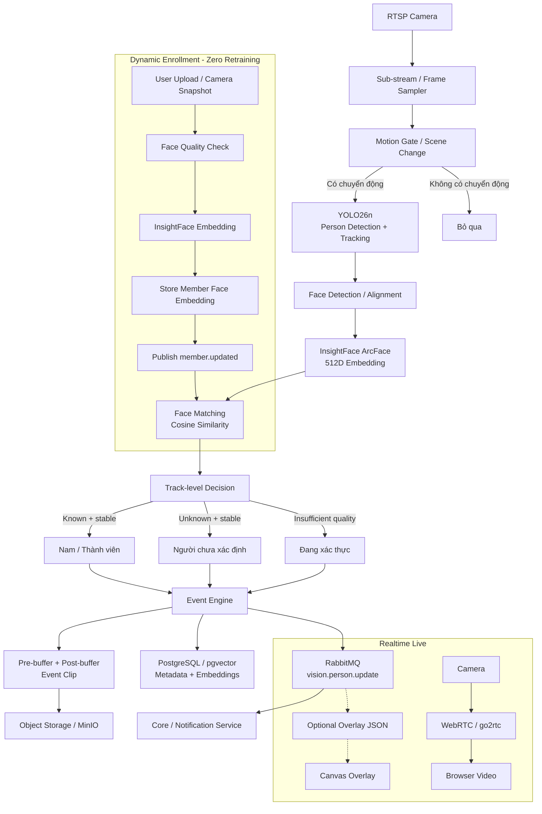

# Kế hoạch Triển khai Tính năng Nhận diện Khuôn mặt (Family Face Recognition) dùng InsightFace & YOLO26

> **Tài liệu Kế hoạch Kỹ thuật (Technical Implementation Plan)**  
> **Dự án**: CCTV AI Monitoring System  
> **Mục tiêu**: Nhận diện thành viên gia đình và người lạ trong luồng camera, tạo metadata/event phục vụ Event-driven NVR, với chi phí tính toán thấp và **không cần train lại model** cho từng thành viên.

---

## 0. Điều chỉnh quan trọng so với bản trước

Bản triển khai này thay đổi một số giả định để phù hợp hơn với mục tiêu sản phẩm:

1. **Face Recognition không phải là một classifier cần retrain mỗi khi thêm người.** Khi user thêm “Nam”, hệ thống chỉ cần trích xuất embedding của Nam và lưu vào kho vector.
2. **Không kết luận “Người lạ” từ một frame duy nhất.** Kết quả cần được ổn định theo track và nhiều lần quan sát.
3. **Threshold không hard-code bằng một con số chung cho mọi camera.** `0.65` chỉ là giá trị thử nghiệm ban đầu; ngưỡng thực tế phải được benchmark bằng dữ liệu của chính hệ thống.
4. **Bounding box không phải UX chính.** Bounding box + tên nên là lớp overlay tùy chọn/debug. UX chính là event như “Nam xuất hiện”, “Người chưa xác định xuất hiện”.
5. **AI không nên phụ thuộc vào livestream.** WebRTC/live playback và vision pipeline phải tách biệt; AI lỗi hoặc chậm không được làm nghẽn live stream.
6. **Event Recorder nên có pre-buffer/post-buffer.** Khi phát hiện người, clip phải bao gồm vài giây trước thời điểm phát hiện, thay vì bắt đầu đúng tại frame AI kích hoạt.
7. **Có quality gate cho enrollment và recognition.** Không lưu embedding từ ảnh quá nhỏ, mờ, mặt bị che hoặc pose quá xấu.

---

# 1. Tổng quan Kiến trúc

Hệ thống sử dụng pipeline nhiều tầng:



### Nguyên tắc

- **YOLO26n**: xác định và track người.
- **InsightFace**: xác định khuôn mặt và tạo embedding.
- **Face matching**: tìm thành viên gần nhất trong embedding store.
- **Track-level decision**: ổn định kết quả qua nhiều frame trước khi tạo event.
- **Event Engine**: quyết định khoảnh khắc nào đáng lưu.
- **Object Storage**: lưu clip/thumbnail.
- **PostgreSQL**: lưu metadata và embeddings.
- **RabbitMQ**: truyền event giữa các service.
- **WebRTC**: phục vụ live độc lập với AI.

---

# 2. Vì sao dùng InsightFace / ArcFace thay vì Fine-tune cho từng thành viên?

## 2.1 Zero Retraining

Thêm thành viên mới không cần train lại YOLO hay ArcFace.

Quy trình:

```text
Ảnh của Nam
    ↓
Face quality check
    ↓
InsightFace
    ↓
512D embedding
    ↓
DB
```

Khi camera gặp một khuôn mặt:

```text
Camera face
    ↓
512D embedding
    ↓
Similarity search
    ↓
Nam / thành viên khác / Unknown
```

## 2.2 Không nên quảng cáo độ chính xác bằng một con số cố định

Các benchmark của model zoo không thể được xem là độ chính xác thực tế trên camera nhà của hệ thống. Ví dụ, model zoo của InsightFace công bố kết quả benchmark riêng cho từng model pack và dataset; `buffalo_s` và `buffalo_l` có hiệu năng khác nhau đáng kể. Do đó, hệ thống này phải benchmark bằng dữ liệu thật của camera, đặc biệt trong điều kiện thiếu sáng, nghiêng mặt, khoảng cách xa và camera góc cao. 

**Không dùng các claim kiểu `99.8% accuracy` hoặc `<8ms/face` như SLA mặc định trong tài liệu.** Đây là các chỉ số cần đo trên hardware + camera + resolution thực tế.

## 2.3 Vấn đề license

Model zoo của InsightFace hiện ghi rõ các model pretrained được cung cấp cho **non-commercial research purposes only**. Nếu sản phẩm được thương mại hóa, cần kiểm tra license của model/model pack được chọn và thay bằng model đã được cấp phép phù hợp nếu cần. 

---

# 3. Thiết kế Face Recognition

## 3.1 Khuyến nghị model

MVP có thể bắt đầu với:

```text
InsightFace
└── buffalo_s
    ├── SCRFD detector
    └── MBF recognition
```

`buffalo_s` là model pack nhỏ hơn `buffalo_l`, nhưng vẫn cần benchmark thực tế trên thiết bị triển khai. Kích thước model và benchmark được công bố trong model zoo của InsightFace. 

Nếu accuracy không đủ cho camera thực tế:

```text
buffalo_s
   ↓ benchmark
buffalo_m / buffalo_l
   ↓ benchmark
Chọn model phù hợp latency / accuracy
```

Không nên tối ưu theo kích thước file đơn thuần.

---

# 4. Thiết kế Database

Khuyến nghị PostgreSQL + `pgvector` thay vì lưu embedding thuần `JSON/Float Array` nếu quy mô dự kiến tăng hoặc muốn similarity search trực tiếp trong DB.

## 4.1 Bảng `members`

```text
members
-------------------------------
id              UUID PK
name            TEXT
role            ENUM
avatar_url      TEXT
is_active       BOOLEAN
created_at      TIMESTAMP
updated_at      TIMESTAMP
```

`role` có thể:

```text
family    (Nhóm 1 - Gia đình -> Xanh lá #10b981)
guest     (Nhóm 2 - Khách quen -> Xanh dương #3b82f6)
neighbor  (Nhóm 2 - Hàng xóm -> Xanh dương #3b82f6)
staff     (Nhóm 2 - Nhân viên/Giúp việc -> Xanh dương #3b82f6)
```

## 4.2 Bảng `member_faces`

```text
member_faces
--------------------------------
id                  UUID PK
member_id           UUID FK
embedding           VECTOR(512)
sample_image_url    TEXT
quality_score       FLOAT
yaw                 FLOAT
pitch               FLOAT
blur_score          FLOAT
created_at          TIMESTAMP
is_active           BOOLEAN
```

### Tại sao lưu nhiều embedding?

Không nên chỉ lưu một vector cho “Nam”.

Ví dụ:

```text
Nam
├── face_01: chính diện
├── face_02: nghiêng trái
├── face_03: nghiêng phải
├── face_04: ánh sáng yếu
└── face_05: đeo kính
```

Khi match:

```text
query embedding
      ↓
similarity với các face samples của Nam
      ↓
best / aggregated score
```

Điều này tốt hơn việc cố ép mọi điều kiện thành một vector duy nhất.

---

# 5. Face Quality Gate

Không tạo hoặc cập nhật embedding từ mọi khuôn mặt.

## 5.1 Điều kiện tối thiểu

Có thể bắt đầu với:

```text
face width >= X px
face height >= Y px
detector confidence >= threshold
blur score >= threshold
pose trong giới hạn chấp nhận được
occlusion không quá cao
```

Các giá trị `X`, `Y`, blur threshold và pose threshold phải được benchmark thực tế.

**Không dùng `person bbox >= 60x60` như điều kiện trực tiếp cho face recognition.**

Một person box 100x150 chưa chắc mặt đủ lớn để nhận diện.

Điều kiện đúng hơn là:

```text
person bbox
    ↓
face detection
    ↓
face bbox
    ↓
face quality
    ↓
recognition
```

Nếu mặt quá nhỏ/mờ:

```text
status = UNKNOWN_TEMPORARY
```

không phải:

```text
status = STRANGER
```

---

# 6. Track-aware Recognition

Không nhận diện khuôn mặt ở mọi frame.

Pipeline:

```text
Frame
 ↓
YOLO26n
 ↓
Person track_id = 17
 ↓
Face available?
 ↓
Face quality good?
 ↓
Run InsightFace
 ↓
embedding
 ↓
Match
 ↓
Update track state
```

Một track có thể có state:

```text
UNKNOWN
VERIFYING
KNOWN
STRANGER
LOST
```

Ví dụ:

```text
track_id = 17

Frame 100 → similarity 0.58
Frame 105 → similarity 0.71
Frame 110 → similarity 0.76
Frame 115 → similarity 0.79
```

Không nên tạo ngay event “Nam” ở frame 100.

Có thể áp dụng:

```text
N >= 2 hoặc 3 lần match tốt
+
score ổn định
+
track còn tồn tại
=> ACCEPT
```

Ngược lại:

```text
score thấp / dao động / face quality kém
=> VERIFYING
```

---

# 7. Threshold Strategy

## 7.1 Không hard-code `0.65` làm giá trị production

Tài liệu cũ dùng:

```python
similarity_threshold = 0.65
```

Hãy chuyển thành configuration:

```text
FACE_MATCH_THRESHOLD=...
FACE_STRONG_MATCH_THRESHOLD=...
FACE_UNKNOWN_THRESHOLD=...
```

Sau đó benchmark.

## 7.2 Tách các mức quyết định

Ví dụ:

```text
score >= strong_threshold
    → strong known

threshold <= score < strong_threshold
    → verifying / weak known

score < threshold
    → unknown candidate
```

Điều này giúp giảm false positive.

## 7.3 Đặc biệt quan trọng: Unknown ≠ Stranger chắc chắn

Một người có thể là thành viên nhưng:

- mặt quá xa
- mặt nghiêng
- bị khẩu trang
- thiếu sáng
- motion blur
- một phần khuôn mặt bị che

Do đó nên có ít nhất:

```text
KNOWN
UNKNOWN
UNRESOLVED
```

`STRANGER` chỉ nên trở thành event sau khi hệ thống có đủ bằng chứng.

---

# 8. Face Matching Implementation

Tất cả embedding nên normalize trước khi lưu:

```python
embedding = embedding / np.linalg.norm(embedding)
```

Khi match:

```python
score = np.dot(query_embedding, stored_embedding)
```

Khi số lượng member còn nhỏ, linear scan hoàn toàn đủ:

```text
10 members
×
5 embeddings/member
=
50 vectors
```

Chưa cần vector database phức tạp.

Khi quy mô tăng, có thể chuyển sang `pgvector` similarity search.

---

# 9. Enrollment Flow

## 9.1 User upload

```text
User chọn ảnh
    ↓
Face Detection
    ↓
Có đúng 1 khuôn mặt?
    ↓
Quality Gate
    ↓
Embedding
    ↓
Preview
    ↓
User xác nhận "Đây là Nam"
    ↓
Save member_faces
```

## 9.2 One-click enrollment từ live

Vẫn nên hỗ trợ:

```text
Live
 ↓
click person/face
 ↓
freeze best frame
 ↓
quality check
 ↓
"Đây là ai?"
 ↓
Nam
 ↓
save embedding
```

Không nên tự động lưu mọi frame vào hồ sơ thành viên.

---

# 10. Dynamic Learning

Đây **không phải training model**.

Ví dụ:

```text
Ngày 1:
Nam = 3 embeddings

Ngày 7:
User xác nhận thêm 2 ảnh tốt

Nam = 5 embeddings
```

Model vẫn giữ nguyên.

Chỉ có **identity database** tăng lên.

Đây là cơ chế phù hợp nhất với CCTV gia đình.

---

# 11. Event-driven NVR Integration

Đây là thay đổi quan trọng nhất so với NVR truyền thống.

Không nên lưu video 24/7 chỉ để phục vụ AI.

Khuyến nghị:

```text
RTSP
 ↓
Rolling Buffer 5–10s
 ↓
Motion Gate
 ↓
YOLO + Tracking
 ↓
Face Recognition
 ↓
Event Decision
 ↓
KEEP EVENT
 ↓
Post-buffer 10–20s
 ↓
Clip
 ↓
MinIO / Object Storage
```

Ví dụ event:

```text
18:31:14
Người xuất hiện

18:31:18
Nhận diện ổn định → Nam

18:31:35
Track kết thúc

=> Clip:
18:31:09 → 18:31:45
```

User sẽ xem được **toàn bộ khoảnh khắc**, bao gồm cả vài giây trước lúc AI phát hiện.

---

# 12. Event Schema

Có thể bổ sung bảng:

```text
camera_events
--------------------------------
id              UUID PK
camera_id       UUID
event_type      TEXT
person_id       UUID NULL
track_id        TEXT NULL
started_at      TIMESTAMP
ended_at        TIMESTAMP
confidence      FLOAT NULL
thumbnail_url  TEXT
clip_url        TEXT NULL
created_at      TIMESTAMP
```

Ví dụ:

```text
event_type = PERSON_DETECTED
person_id  = Nam
```

hoặc:

```text
event_type = UNKNOWN_PERSON
person_id  = NULL
```

---

# 13. RabbitMQ Events

Không nên gửi mỗi frame qua RabbitMQ.

RabbitMQ chỉ nhận **semantic events** hoặc state changes quan trọng:

```text
vision.person.detected
vision.person.identified
vision.person.unknown
vision.person.lost
vision.event.created
```

Ví dụ:

```json
{
  "event": "vision.person.identified",
  "camera_id": "living-room",
  "track_id": "17",
  "member_id": "uuid",
  "name": "Nam",
  "similarity": 0.81,
  "timestamp": "2026-08-22T18:31:18Z"
}
```

Không gửi 10 JSON/frame chỉ để vẽ bounding box.

Overlay realtime nên dùng một channel riêng như WebSocket.

---

# 14. Live UI / Bounding Box & Camera AI Status

## 14.1 Phân loại Màu sắc Bounding Box Chuẩn (4-Color Category System)

Bounding box và nhãn nhận diện trên Canvas Overlay (`LivePlayer.tsx`) được chuẩn hóa theo 4 nhóm màu với độ tương phản cao:

| Nhóm / Trạng thái | Mã màu (HEX) | Tên màu | Hiển thị Badge | Ý nghĩa & Hành vi |
| :--- | :--- | :--- | :--- | :--- |
| **Nhóm 1: Gia đình (`family`)** | `#10b981` | **Xanh lá (Emerald)** | `👤 [Tên] • Gia đình` | Thành viên gia đình ruột thịt. Không kích hoạt còi/cảnh báo lạ. |
| **Nhóm 2: Người quen (`guest`/`neighbor`)** | `#3b82f6` | **Xanh dương (Ocean Blue)** | `👤 [Tên] • Khách quen` | Bạn bè, hàng xóm quen biết, người giúp việc, shipper quen. |
| **Đang theo dõi (`verifying`/`unresolved`)** | `#64748b` | **Xám (Slate Gray)** | `⏳ Đang xác thực...` | Mới xuất hiện (< 2 frame) hoặc mặt mờ/nghiêng/chất lượng thấp. |
| **Người lạ (`stranger`)** | `#ef4444` | **Đỏ (Crimson Red)** | `⚠️ Người lạ` | Đã theo dõi ổn định nhưng không khớp bất kỳ nhóm nào $\to$ Lưu clip & phát cảnh báo. |

## 14.2 Gán nhãn [AI Integrated] & Phân quyền Bật/Tắt

1. **Gán nhãn `[AI Integrated]`**:
   - Đối với tất cả camera có `enable_ai === true`, hệ thống tự động hiển thị nhãn/badge **`[AI Integrated]`** (hoặc `✨ AI Integrated`) trong:
     - Dropdown chọn camera tại thanh điều khiển Playback (`ArchiveSidebar.tsx`).
     - Header / Player Overlay (`LivePlayer.tsx` / `VideoPlayer.tsx`).
2. **Phân quyền Bật/Tắt**:
   - **Màn hình Playback (`/playback`)**: Không có nút bật/tắt AI để tránh thao tác nhầm hoặc viewer can thiệp.
   - **Chỉ Admin trong Cấu hình Camera (`/devices`)**: Mới có quyền bật/tắt `enable_ai` cho từng camera. Camera nào tắt AI sẽ chạy WebRTC thuần, không tiêu tốn tài nguyên vision.

## 14.3 UX & Canvas Rendering

- Sử dụng Client-Side Canvas 60 FPS vẽ đè lên `<video>` WebRTC gốc.
- Không dùng score raw như `94%` làm người dùng hiểu nhầm là xác suất tuyệt đối; thay vào đó hiển thị tên và vai trò rõ ràng.
- Hỗ trợ **One-Click Enrollment**: Click trực tiếp vào bounding box người trên live để mở nhanh modal gán khuôn mặt vào danh sách thành viên.

---

# 15. Backend API

## Member Management

```text
GET    /api/members
POST   /api/members
GET    /api/members/:id
DELETE /api/members/:id
```

## Face Samples

```text
POST   /api/members/:id/faces
GET    /api/members/:id/faces
DELETE /api/members/:id/faces/:faceId
```

## Enrollment

Có thể thêm endpoint:

```text
POST /api/members/:id/enroll-from-capture
```

## Sync

Không nhất thiết cần `/api/members/sync` nếu dùng event-driven sync:

```text
Core Service
    ↓
RabbitMQ: member.updated
    ↓
Vision Service
    ↓
refresh in-memory cache
```

---

# 16. In-memory Embedding Cache

Vision service nên giữ:

```text
member_id
name
embedding(s)
version
updated_at
```

trong RAM.

Khi DB thay đổi:

```text
member.updated
    ↓
Vision Service
    ↓
reload member
```

Không query PostgreSQL cho mỗi camera frame.

---

# 17. Livestream Isolation

Kiến trúc live nên giữ độc lập:

```text
Camera Main Stream
        ↓
    go2rtc/WebRTC
        ↓
      Browser
```

và:

```text
Camera Sub-stream
        ↓
vision-service
```

AI không nằm trên đường truyền video live.

Điều này đảm bảo:

```text
AI crash
AI restart
YOLO overloaded
InsightFace unavailable
```

không làm chết livestream.

---

# 18. Resource Strategy

## Main Stream

Dùng cho:

```text
Live viewing
```

## Sub-stream

Dùng cho:

```text
Motion detection
YOLO
Tracking
Face recognition
```

Khuyến nghị bắt đầu:

```text
360p / 5–10 FPS
```

và benchmark trước khi tăng resolution/FPS.

Face recognition không cần chạy ở 30 FPS.

---

# 19. Failure Handling

## Camera disconnected

```text
camera.offline
```

## Vision service unavailable

Live vẫn chạy.

## Face recognition unavailable

Person detection vẫn chạy.

## RabbitMQ unavailable

Vision service có thể giữ local buffer / retry event.

## DB unavailable

Không được làm crash inference loop; dùng retry/backoff.

## Unknown face

Không tạo spam event mỗi frame.

Cần debounce:

```text
Unknown track 17
→ 1 event
→ update event
→ track lost
```

thay vì:

```text
300 frames
→ 300 unknown events
```

---

# 20. Security & Privacy

Embeddings là dữ liệu nhạy cảm của hệ thống.

Khuyến nghị:

- không gửi embedding xuống browser;
- không expose embedding qua public API;
- encrypt storage/backups nếu khả thi;
- giới hạn quyền truy cập member data;
- có chức năng xoá member + toàn bộ face samples;
- log audit cho enrollment/deletion;
- không tự động enroll một người chỉ vì camera nhìn thấy họ.

---

# 21. Testing Strategy

Không chỉ test bằng ảnh chân dung đẹp.

Cần có dataset nội bộ:

```text
Known:
- chính diện
- nghiêng
- cúi đầu
- ánh sáng sáng
- ánh sáng yếu
- đeo kính
- khoảng cách gần
- khoảng cách xa

Unknown:
- người có khuôn mặt tương tự
- người lạ bình thường
- ảnh mờ
- mặt bị che
```

Đánh giá:

```text
False Positive:
Unknown → Nam

False Negative:
Nam → Unknown

Unknown rate:
Không đủ chất lượng → Unresolved

Latency:
RTSP → decision

CPU:
vision-service

Events/day:
average
```

---

# 22. Roadmap

| Giai đoạn | Nội dung |
|---|---|
| **Phase 1** | `members` + `member_faces`, API CRUD, migration |
| **Phase 2** | InsightFace embedding + enrollment |
| **Phase 3** | YOLO26n person detection + tracking |
| **Phase 4** | Track-aware face recognition + quality gate |
| **Phase 5** | Threshold calibration bằng dữ liệu camera thật |
| **Phase 6** | Event Engine + debounce + pre/post-buffer |
| **Phase 7** | RabbitMQ semantic events + notification |
| **Phase 8** | Optional live overlay / debug mode |
| **Phase 9** | Performance benchmark + Docker deployment |
| **Phase 10** | Privacy, retention, failure handling |

---

# 23. Acceptance Criteria

Feature chỉ được xem là hoàn thành khi:

### Identity

- Thêm member mới không cần retrain model.
- Có thể thêm nhiều face samples cho một member.
- Unknown không bị kết luận chỉ từ một frame.
- Có trạng thái `UNRESOLVED` cho khuôn mặt không đủ chất lượng.

### Performance

- AI không block WebRTC/live pipeline.
- Không chạy face recognition trên mọi frame.
- Vision service hoạt động ổn định trên CPU target của hệ thống.
- Threshold được benchmark trên camera thật.

### Event

- Một người đi qua tạo một event thay vì hàng chục/hàng trăm event.
- Event clip có pre-buffer và post-buffer.
- Clip được lưu độc lập với live stream.

### UX

- Normal user không bắt buộc phải xem bounding box.
- Có timeline/event thumbnail.
- Có thể mở clip trực tiếp từ event.

---

# 24. Kết luận

Kiến trúc đề xuất cuối cùng là:

```text
                    ┌───────────────┐
                    │   RTSP Camera │
                    └───────┬───────┘
                            │
                 ┌──────────┴──────────┐
                 │                     │
                 ▼                     ▼
          Main Stream             Sub Stream
                 │                     │
                 ▼                     ▼
          WebRTC / Live          Motion Gate
                                       │
                                       ▼
                                  YOLO26n
                                       │
                                       ▼
                                  Tracking
                                       │
                                       ▼
                                Face Detection
                                       │
                                       ▼
                                  ArcFace
                                       │
                                       ▼
                                Embedding Match
                                       │
                            ┌──────────┼──────────┐
                            ▼          ▼          ▼
                         Known      Unknown   Unresolved
                            │          │          │
                            └──────────┼──────────┘
                                       ▼
                                  Event Engine
                                       │
                           ┌───────────┴───────────┐
                           ▼                       ▼
                      Event Metadata           Event Clip
                           │                       │
                           ▼                       ▼
                       PostgreSQL                MinIO
                           │
                           ▼
                       RabbitMQ
                           │
             ┌─────────────┼─────────────┐
             ▼             ▼             ▼
        Notification      API        Optional Overlay
```

**Triết lý chính của hệ thống:**

> YOLO trả lời **“có người không?”**  
> Tracking trả lời **“đó có phải cùng một người không?”**  
> InsightFace trả lời **“người đó là ai?”**  
> Event Engine trả lời **“khoảnh khắc này có đáng lưu không?”**  
> NVR chỉ cần giữ **những khoảnh khắc đáng xem**.

---

## Tài liệu tham khảo

- InsightFace Model Zoo: model packs, benchmark và licensing: https://github.com/deepinsight/insightface/tree/master/model_zoo
- Ultralytics YOLO26 Tracking / ByteTrack: https://docs.ultralytics.com/modes/track/
