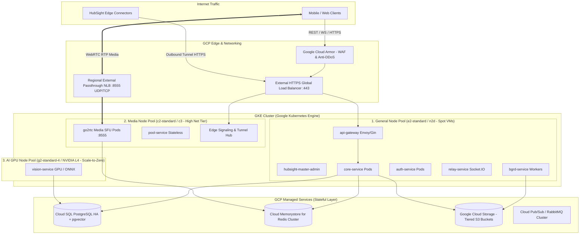
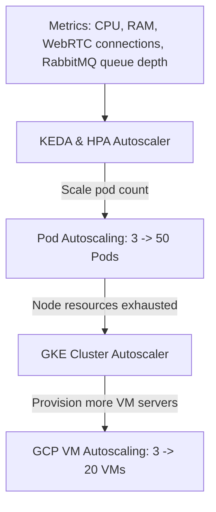

# HubSight CCTV - GCP & Kubernetes (GKE) Production Scaling Architecture
*(Deployment and Scaling Infrastructure Design on Google Cloud Platform with Google Kubernetes Engine)*

---

## 1. GCP infrastructure overview (High-Level Architecture)

To operate **HubSight SaaS** for thousands to millions of cameras on **Google Cloud Platform (GCP)**, the infrastructure follows these principles:
- **Separate stateless workloads and stateful data**: Move all databases, queues, and video storage to dedicated GCP managed services (Cloud SQL, Memorystore, GCS) for high availability (HA 99.99%) and zero manual operations.
- **Dedicated GKE node pools**: Split server groups (node pools) by resource profile: Web/API (general CPU), WebRTC media (very high network bandwidth), and AI workers (GPU acceleration).
- **Separate L7 ingress (HTTP/REST/WS) and L4 ingress (WebRTC media UDP/TCP)**: Eliminate the bottleneck in realtime video transport.



---

## 2. GKE node-pool segmentation

All services should not run on the same server type. The HubSight GKE cluster is divided into **three dedicated node pools** to optimize cost and performance:

| Node Pool | GCP instance type | Purpose | Autoscaling strategy | Cost optimization |
| :--- | :--- | :--- | :--- | :---: |
| **`general-pool`** | `n2d-standard-4` (4 vCPU, 16GB RAM) | Runs API Gateway, Core, Auth, Relay, Push, and Master Admin. | CPU/RPS-based HPA (min: 3 nodes, max: 20 nodes). | Use **GCP Spot VMs** (60–70% savings). |
| **`media-sfu-pool`** | `c2-standard-8` (8 vCPU, 32GB RAM, Compute-Optimized) | Runs `go2rtc` and `pool-service` pods. Requires high CPU clock speed for RTP remux/packetization and network bandwidth up to 32 Gbps. | KEDA autoscaler based on active WebRTC connections. | Long-term commitment (CUD - three-year Committed Use Discounts). |
| **`ai-gpu-pool`** | `g2-standard-4` (4 vCPU, 16GB RAM, 1x NVIDIA L4 GPU 24GB) | Runs `vision-service` (InsightFace face recognition and YOLOv8). | Event-driven KEDA based on RabbitMQ/PubSub queue depth. **Scale-to-zero** (turn off all GPUs when there are no events). | Automatically turn off nodes without events (reduce the GPU bill by 90%). |

---

## 3. GCP network and WebRTC load-balancing architecture

Unlike ordinary web applications (which use only HTTP/HTTPS), CCTV streaming requires specialized network routing:

### 3.1. HTTP/WebSocket load balancing (L7 HTTPS Load Balancer)
- Use the **GKE Gateway API** or **External Global HTTPS Load Balancer**:
  - Protocols: HTTP/2 and WebSocket.
  - Integrate **Cloud Armor**: protect against L3/L4/L7 DDoS, rate-limit requests, and block malicious IPs.
  - Automatically manage SSL certificates (Google-managed SSL certificates) for the primary domain `api.hubsight.io` and customer wildcard domain `*.hubsight.io`.

### 3.2. WebRTC RTP media load balancing (L4 Passthrough Network Load Balancer)
- WebRTC transports tens of thousands of UDP/TCP video packets through port `:8555`. Traditional HTTP ingress cannot handle this flow.
- **GCP solution**:
  - Use a **Regional External Passthrough Network Load Balancer (NLB)**.
  - Configure `go2rtc` pods to run in **`HostPort`** or **`HostNetwork`** mode on nodes in `media-sfu-pool`.
  - Preserve the user's original IP address (Client IP Preservation) so WebRTC ICE candidates can find the optimal P2P route.

```yaml
# manifest: media-nlb-service.yaml
apiVersion: v1
kind: Service
metadata:
  name: webrtc-media-lb
  namespace: hubsight-core
  annotations:
    cloud.google.com/load-balancer-type: "External"
spec:
  type: LoadBalancer
  externalTrafficPolicy: Local # Preserve Client IP; do not forward between Nodes
  ports:
    - name: webrtc-udp
      port: 8555
      targetPort: 8555
      protocol: UDP
    - name: webrtc-tcp
      port: 8555
      targetPort: 8555
      protocol: TCP
  selector:
    app: go2rtc-media
```

---

## 4. GCP managed services integration (Stateful Layer)

To meet the enterprise 99.99% SLA, **never install a database or Redis manually inside a Kubernetes pod**:

```
┌─────────────────────────────────────────────────────────────────────────────┐
│                           GCP MANAGED SERVICES                              │
├──────────────────────────────────────┬──────────────────────────────────────┤
│ 1. Cloud SQL for PostgreSQL 16       │ 2. Cloud Memorystore for Redis       │
│ • pgvector enabled for AI            │ • Distributed Redis Cluster           │
│ • Multi-Zone High Availability (HA)  │ • Media Routing Registry storage      │
│ • Automatic Backup & Point-in-Time   │ • Shared login session tokens         │
│ • Read Replicas for NVR queries      │ • Ultra-low latency < 1ms             │
├──────────────────────────────────────┼──────────────────────────────────────┤
│ 3. Google Cloud Storage (GCS)        │ 4. Google Cloud Armor & Cloud NAT    │
│ • 100% S3-compatible                 │ • WAF protecting the API Gateway     │
│ • Automatic storage tiering          │ • Port-scan and brute-force defense  │
│ • Standard -> Nearline -> Coldline   │ • NAT Gateway for outbound traffic   │
└──────────────────────────────────────┴──────────────────────────────────────┘
```

### 4.1. Google Cloud Storage (GCS) as the NVR storage layer
- GCP supports **GCS S3 interoperability**. HubSight's current code (`services/shared/pkg/storage`) uses an S3 client and can connect directly to GCS **without changing a line of code** by providing an HMAC key.
- **GCS lifecycle policy**:
  - **Days 1–7 (Hot)**: Store in `Standard Storage` (instant reads for immediate playback).
  - **Days 8–30 (Warm)**: Automatically move to `Nearline Storage` (50% lower storage cost).
  - **Days 31–90 (Cold)**: Move to `Coldline Storage` (very low cost for long-term storage plans).
  - **After 90 days (or per plan)**: Permanently delete automatically (expiration).

---

## 5. Autoscaling architecture

HubSight scales automatically at three levels:



### 5.1. Event-driven pod scaling (KEDA - Kubernetes Event-Driven Autoscaling)
- **For media pods (`go2rtc`)**:
  - Do not scale by CPU (video decoding CPU usage varies significantly).
  - Scale by the **total number of open WebRTC connections**: when each pod averages more than 100 connections, KEDA automatically creates another `go2rtc` pod.
- **For AI GPU pods (`vision-service`)**:
  - Scale by the RabbitMQ/PubSub **queue depth**:
    ```yaml
    # KEDA ScaledObject for AI Worker
    apiVersion: keda.sh/v1alpha1
    kind: ScaledObject
    metadata:
      name: vision-service-scaler
      namespace: hubsight-core
    spec:
      scaleTargetRef:
        name: vision-service
      minReplicaCount: 0  # SCALE TO ZERO WHEN IDLE
      maxReplicaCount: 10
      triggers:
        - type: rabbitmq
          metadata:
            queueName: face_recognition_queue
            queueLength: "5" # Start one GPU pod for every 5 queued images
    ```

### 5.2. Cluster scaling (GKE Cluster Autoscaler)
- When KEDA or HPA requests another pod but existing nodes are full on RAM/CPU:
- GKE Cluster Autoscaler automatically requests additional Compute Engine virtual machines from GCP within **60–90 seconds**.
- Combine this with **GCP Spot VMs** to minimize the cost of background workers.

---

## 6. Kubernetes multi-tenancy model (customer isolation)

HubSight implements hierarchical multi-tenancy with Kubernetes namespaces and network policies:

```
┌─────────────────────────────────────────────────────────────────────────────┐
│                           GKE CLUSTER TOPOLOGY                              │
├─────────────────────────────────────────────────────────────────────────────┤
│ 1. Namespace: `hubsight-master`                                             │
│    • System 1: HubSight Master Admin Platform (for the HubSight owner)       │
│    • Communicates only with Cloud SQL and Stripe/PayOS gateways              │
├─────────────────────────────────────────────────────────────────────────────┤
│ 2. Namespace: `hubsight-shared-core` (Model A: small/medium merchants)      │
│    • Shared HubSight Core cluster for thousands of small stores             │
│    • Data isolation through `tenant_id` and PostgreSQL RLS                   │
│    • LimitRange and ResourceQuota prevent CPU/RAM exhaustion                 │
├─────────────────────────────────────────────────────────────────────────────┤
│ 3. Namespace: `hubsight-ent-{merchant_slug}` (Model B: large enterprises)   │
│    • Dedicated HubSight Core cluster for banks or supermarket chains        │
│    • Dedicated pods and committed CPU/RAM, isolated from other tenants      │
└─────────────────────────────────────────────────────────────────────────────┘
```

- **Kubernetes NetworkPolicy**: Apply Zero Trust rules and completely prevent Merchant A pods from sending requests over the internal network to Merchant B pods.

---

## 7. GCP cost estimate and economic optimization (Cost Optimization)

The following table estimates GCP infrastructure costs for a cluster operating **1,000 online cameras** with **100 concurrent live viewers**:

| Infrastructure component | Recommended GCP configuration | Estimated cost/month | Optimization |
| :--- | :--- | :---: | :--- |
| **GKE Master Nodes** | GKE Standard cluster fee ($0.10/hour) | ~$73 | First cluster is free when using GKE Autopilot. |
| **General Node Pool** | 3x `n2d-standard-4` (Spot VMs) | ~$120 | Save 65% by using Spot VMs for stateless web workloads. |
| **Media SFU Node Pool**| 2x `c2-standard-8` (one-year commitment) | ~$280 | Use CUD for 37% savings. |
| **AI GPU Pool** | 1x `g2-standard-4` (NVIDIA L4) | ~$80 (scale-to-zero 80% of the time) | Run only when a person appears, not 24/7. |
| **Cloud SQL PostgreSQL**| `db-custom-4-16` (HA Multi-Zone, 200GB SSD)| ~$250 | Data safety and automatic backups. |
| **Cloud Memorystore** | Redis 5 GB Cluster | ~$50 | Session storage and media coordination. |
| **Google Cloud Storage**| 20 TB NVR video (tiered lifecycle) | ~$260 | GCS Nearline/Coldline is 50% cheaper than Standard. |
| **Network bandwidth (egress)**| 10 TB egress (live viewing and video downloads)| ~$300 | **Save 90% with WebRTC P2P direct streaming** through the Edge Connector. |
| **TOTAL** | **Infrastructure for 1,000 enterprise cameras** | **~$1,413 USD/month** | **Average cost only ~$1.4 USD/camera/month!** |

> 💡 **Economic efficiency**: At an average market price of **$5–$12 USD/camera/month**, the HubSight SaaS platform can achieve a gross margin above **75%–85%**.

---

## 8. GCP infrastructure rollout

1. **Step 1: Infrastructure as Code (IaC with Terraform)**:
   * Write Terraform scripts to automatically provision the VPC, Cloud NAT, Cloud SQL, GCS buckets, and GKE cluster.
2. **Step 2: Package standard Kubernetes Helm charts**:
   * Package all microservices (`gateway`, `core`, `pool`, `auth`, `relay`, `go2rtc`, `vision`) as standard Helm charts with explicit resource requests/limits.
3. **Step 3: Set up CI/CD with Google Cloud Build/GitHub Actions**:
   * Automatically build Docker images, push them to **Google Artifact Registry**, and deploy through GitOps with **ArgoCD**.
4. **Step 4: Install comprehensive monitoring (Prometheus & Grafana)**:
   * Monitor WebRTC connection counts, video FPS, SDP negotiation latency, packet-loss rate, and GPU temperature in realtime.
