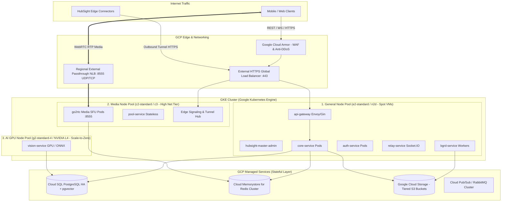
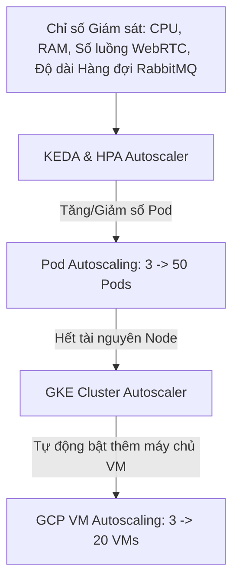

# HubSight CCTV - GCP & Kubernetes (GKE) Production Scaling Architecture
*(Thiết kế Hạ tầng Triển khai & Mở rộng Quy mô trên Google Cloud Platform bằng Google Kubernetes Engine)*

---

## 1. Tổng quan Kiến trúc Hạ tầng trên GCP (High-Level Architecture)

Để vận hành hệ thống **HubSight SaaS** phục vụ từ hàng ngàn đến hàng triệu camera trên **Google Cloud Platform (GCP)**, kiến trúc hạ tầng được thiết kế theo nguyên tắc:
- **Tách biệt Stateless Workload và Stateful Data**: Đưa toàn bộ cơ sở dữ liệu, hàng đợi và lưu trữ video ra các dịch vụ Managed Services chuyên dụng của GCP (Cloud SQL, Memorystore, GCS) để đạt độ sẵn sàng cao (High Availability - HA 99.99%) và không cần vận hành thủ công (Zero Ops).
- **Phân tách Node Pool chuyên biệt trên GKE**: Chia các nhóm máy chủ (Node Pools) theo đặc thù tài nguyên: Web/API (CPU thông thường), Media WebRTC (Băng thông mạng cực cao) và AI Worker (GPU tăng tốc).
- **Tách biệt Ingress L7 (HTTP/REST/WS) và Ingress L4 (WebRTC Media UDP/TCP)**: Giải quyết triệt để nút thắt cổ chai truyền tải video thời gian thực.



---

## 2. Thiết kế Phân vùng Node Pools trên GKE (Node Pool Segmentation)

Không thể chạy tất cả dịch vụ trên cùng một loại máy chủ. GKE Cluster của HubSight được chia làm **3 Node Pools chuyên biệt** để tối ưu hóa chi phí và hiệu năng:

| Node Pool | Loại Instance GCP | Mục đích Sử dụng | Chiến lược Co giãn (Autoscaling) | Tối ưu Chi phí |
| :--- | :--- | :--- | :--- | :---: |
| **`general-pool`** | `n2d-standard-4` (4 vCPU, 16GB RAM) | Chạy API Gateway, Core, Auth, Relay, Push, Master Admin. | HPA dựa trên CPU/RPS (Min: 3 nodes, Max: 20 nodes). | Sử dụng **GCP Spot VMs** (Tiết kiệm 60–70%). |
| **`media-sfu-pool`** | `c2-standard-8` (8 vCPU, 32GB RAM, Compute-Optimized) | Chạy các Pod `go2rtc` và `pool-service`. Yêu cầu xung nhịp CPU cao để remux/packetize RTP và băng thông mạng lên tới 32 Gbps. | KEDA Autoscaler dựa trên số lượng luồng xem trực tiếp (Active WebRTC Connections). | Cam kết sử dụng dài hạn (CUD - Committed Use Discounts 3 năm). |
| **`ai-gpu-pool`** | `g2-standard-4` (4 vCPU, 16GB RAM, 1x NVIDIA L4 GPU 24GB) | Chạy `vision-service` (Nhận diện khuôn mặt InsightFace & YOLOv8). | KEDA Event-driven dựa trên độ dài hàng đợi RabbitMQ / PubSub. **Scale-to-Zero** (tự động tắt hết GPU khi không có sự kiện). | Tự động tắt node khi không có sự kiện (Giảm 90% hóa đơn GPU). |

---

## 3. Kiến trúc Mạng & Cân bằng Tải WebRTC (GCP Ingress Architecture)

Khác với các ứng dụng Web thông thường (chỉ dùng HTTP/HTTPS), CCTV streaming đòi hỏi giải pháp định tuyến mạng đặc biệt:

### 3.1. Cân bằng Tải HTTP / WebSocket (L7 HTTPS Load Balancer)
- Sử dụng **GKE Gateway API** hoặc **External Global HTTPS Load Balancer**:
  - Giao thức: HTTP/2 và WebSocket.
  - Tích hợp **Cloud Armor**: Chống tấn công DDoS L3/L4/L7, giới hạn tần suất (Rate Limiting) và chặn IP độc hại.
  - Tự động quản lý chứng chỉ SSL (Google-Managed SSL Certificates) cho domain chính `api.hubsight.io` và wildcard domain của khách hàng `*.hubsight.io`.

### 3.2. Cân bằng Tải WebRTC Media RTP (L4 Passthrough Network Load Balancer)
- WebRTC truyền tải hàng chục ngàn gói tin video UDP/TCP qua cổng `:8555`. HTTP Ingress truyền thống không thể xử lý luồng này.
- **Giải pháp trên GCP**:
  - Sử dụng **Regional External Passthrough Network Load Balancer (NLB)**.
  - Cấu hình Pod `go2rtc` chạy ở chế độ **`HostPort`** hoặc **`HostNetwork`** trên các máy chủ thuộc `media-sfu-pool`.
  - Giữ nguyên địa chỉ IP gốc của người dùng (Client IP Preservation) để thuật toán ICE Candidate của WebRTC tìm đường truyền P2P tối ưu nhất.

```yaml
# manifest: media-nlb-service.yaml
apiVersion: v1
kind: Service
metadata:
  name: webrtc-media-lb
  namespace: hubsight-core
  annotations:
    cloud.google.com/load-balancer-type: "External"
spec:
  type: LoadBalancer
  externalTrafficPolicy: Local # Giữ nguyên Client IP, không forward qua lại giữa các Node
  ports:
    - name: webrtc-udp
      port: 8555
      targetPort: 8555
      protocol: UDP
    - name: webrtc-tcp
      port: 8555
      targetPort: 8555
      protocol: TCP
  selector:
    app: go2rtc-media
```

---

## 4. Tích hợp Dịch vụ GCP Managed Services (Stateful Layer)

Để đạt chuẩn SLA 99.99% của doanh nghiệp, **không bao giờ cài Database hoặc Redis thủ công bên trong Pod Kubernetes**:

```
┌─────────────────────────────────────────────────────────────────────────────┐
│                           GCP MANAGED SERVICES                              │
├──────────────────────────────────────┬──────────────────────────────────────┤
│ 1. Cloud SQL for PostgreSQL 16       │ 2. Cloud Memorystore for Redis       │
│ • Bật sẵn pgvector cho AI            │ • Cụm Redis Cluster phân tán         │
│ • Multi-Zone High Availability (HA)  │ • Lưu trữ Media Routing Registry     │
│ • Tự động Backup & Point-in-Time     │ • Chia sẻ Session Token đăng nhập    │
│ • Read Replicas phục vụ tra cứu NVR  │ • Độ trễ cực thấp < 1ms              │
├──────────────────────────────────────┼──────────────────────────────────────┤
│ 3. Google Cloud Storage (GCS)        │ 4. Google Cloud Armor & Cloud NAT    │
│ • Tương thích 100% chuẩn S3          │ • Tường lửa WAF bảo vệ API Gateway   │
│ • Phân tầng lưu trữ tự động          │ • Chống quét cổng, chống Brute-force │
│ • Standard -> Nearline -> Coldline   │ • NAT Gateway cho các luồng Outbound │
└──────────────────────────────────────┴──────────────────────────────────────┘
```

### 4.1. Google Cloud Storage (GCS) làm Kho Lưu trữ NVR
- GCP hỗ trợ giao thức **GCS S3-Interoperability**. Mã nguồn hiện tại của HubSight (`services/shared/pkg/storage`) đang dùng chuẩn S3 client, có thể kết nối thẳng vào GCS mà **không cần sửa một dòng code nào** bằng cách cấp khóa HMAC Key!
- **Quy tắc Vòng đời Lưu trữ (GCS Lifecycle Policy)**:
  - **Ngày 1 đến ngày 7 (Hot)**: Lưu tại `Standard Storage` (Tốc độ đọc tức thì, phục vụ xem lại ngay).
  - **Ngày 8 đến ngày 30 (Warm)**: Tự động chuyển xuống `Nearline Storage` (Chi phí lưu trữ giảm 50%).
  - **Ngày 31 đến ngày 90 (Cold)**: Chuyển xuống `Coldline Storage` (Chi phí siêu rẻ, dành cho gói cước lưu trữ dài hạn).
  - **Sau 90 ngày (hoặc theo gói cước)**: Tự động xóa vĩnh viễn (Expiration).

---

## 5. Chiến lược Co giãn Tự động (Autoscaling Architecture)

Hệ thống HubSight scale theo 3 cấp độ tự động:



### 5.1. Co giãn Pod theo Sự kiện (KEDA - Kubernetes Event-Driven Autoscaling)
- **Đối với Media Pod (`go2rtc`)**:
  - Không scale theo CPU (vì CPU giải mã video thường biến động mạnh).
  - Scale theo **Tổng số kết nối WebRTC đang mở**: Nếu trung bình mỗi pod vượt quá 100 kết nối, KEDA tự động tạo thêm pod `go2rtc` mới.
- **Đối với AI GPU Pod (`vision-service`)**:
  - Scale theo **Độ dài hàng đợi (Queue Depth)** của RabbitMQ / PubSub:
    ```yaml
    # KEDA ScaledObject cho AI Worker
    apiVersion: keda.sh/v1alpha1
    kind: ScaledObject
    metadata:
      name: vision-service-scaler
      namespace: hubsight-core
    spec:
      scaleTargetRef:
        name: vision-service
      minReplicaCount: 0  # SCALE TO ZERO KHI RẢNH
      maxReplicaCount: 10
      triggers:
        - type: rabbitmq
          metadata:
            queueName: face_recognition_queue
            queueLength: "5" # Cứ mỗi 5 ảnh chờ đối soát thì bật 1 pod GPU
    ```

### 5.2. Co giãn Cụm Máy chủ (GKE Cluster Autoscaler)
- Khi KEDA hoặc HPA yêu cầu thêm Pod nhưng Node hiện tại đã đầy RAM/CPU:
- GKE Cluster Autoscaler tự động yêu cầu GCP cấp phát thêm máy chủ ảo Compute Engine trong vòng **60–90 giây**.
- Kết hợp sử dụng **GCP Spot VMs** để giảm tối đa chi phí cho các worker ngầm.

---

## 6. Mô hình Multi-Tenancy trên Kubernetes (Tách biệt Khách hàng)

HubSight triển khai mô hình đa khách hàng phân cấp bằng Kubernetes Namespaces và Network Policies:

```
┌─────────────────────────────────────────────────────────────────────────────┐
│                           GKE CLUSTER TOPOLOGY                              │
├─────────────────────────────────────────────────────────────────────────────┤
│ 1. Namespace: `hubsight-master`                                             │
│    • Hệ thống 1: HubSight Master Admin Platform (Dành cho Chủ sàn HubSight) │
│    • Chỉ giao tiếp với Cloud SQL và Stripe/PayOS Gateways                   │
├─────────────────────────────────────────────────────────────────────────────┤
│ 2. Namespace: `hubsight-shared-core` (Mô hình A: Dành cho Merchant vừa/nhỏ) │
│    • Cụm HubSight Core dùng chung cho hàng ngàn cửa hàng nhỏ               │
│    • Phân tách dữ liệu bằng `tenant_id` và PostgreSQL RLS                   │
│    • Có LimitRange và ResourceQuota chặn chiếm dụng CPU/RAM                 │
├─────────────────────────────────────────────────────────────────────────────┤
│ 3. Namespace: `hubsight-ent-{merchant_slug}` (Mô hình B: Doanh nghiệp lớn)  │
│    • Cụm HubSight Core chuyên biệt độc lập cho Ngân hàng hoặc Chuỗi Siêu thị│
│    • Pod riêng, CPU/RAM cam kết riêng, không bị ảnh hưởng bởi bên ngoài     │
└─────────────────────────────────────────────────────────────────────────────┘
```

- **Kubernetes NetworkPolicy**: Áp dụng quy tắc Zero-Trust, cấm hoàn toàn Pod của Merchant A gửi request qua mạng nội bộ sang Pod của Merchant B.

---

## 7. Dự toán Chi phí & Tối ưu Hóa Kinh tế trên GCP (Cost Optimization)

Dưới đây là bảng dự toán chi phí hạ tầng GCP cho một cụm vận hành **1,000 Camera trực tuyến** với **100 luồng xem trực tiếp đồng thời (Concurrent Viewers)**:

| Hạng mục Hạ tầng | Cấu hình Đề xuất trên GCP | Chi phí Ước tính / Tháng | Giải pháp Tối ưu Hóa |
| :--- | :--- | :---: | :--- |
| **GKE Master Nodes** | GKE Standard Cluster Fee ($0.10/giờ) | ~$73 | Miễn phí 1 cluster đầu tiên nếu dùng GKE Autopilot. |
| **General Node Pool** | 3x `n2d-standard-4` (Spot VMs) | ~$120 | Tiết kiệm 65% nhờ dùng Spot VMs cho stateless web. |
| **Media SFU Node Pool**| 2x `c2-standard-8` (Committed 1 năm) | ~$280 | Dùng CUD tiết kiệm 37%. |
| **AI GPU Pool** | 1x `g2-standard-4` (NVIDIA L4) | ~$80 (Do scale-to-zero 80% thời gian) | Chỉ chạy khi có người xuất hiện, không chạy 24/7. |
| **Cloud SQL PostgreSQL**| `db-custom-4-16` (HA Multi-Zone, 200GB SSD)| ~$250 | Đảm bảo an toàn dữ liệu, tự động sao lưu. |
| **Cloud Memorystore** | Redis 5 GB Cluster | ~$50 | Lưu session và điều phối media. |
| **Google Cloud Storage**| 20 TB Video NVR (Tiered Lifecycle) | ~$260 | GCS Nearline/Coldline rẻ hơn 50% so với Standard. |
| **Băng thông Mạng (Egress)**| 10 TB Egress (Xem trực tiếp & tải video)| ~$300 | **Tiết kiệm 90% nhờ WebRTC P2P Direct Streaming** qua Edge Connector. |
| **TỔNG CỘNG** | **Hạ tầng phục vụ 1,000 Camera Doanh nghiệp** | **~$1,413 USD / Tháng** | **Chi phí trung bình chỉ ~$1.4 USD / Camera / Tháng!** |

> 💡 **Hiệu quả Kinh tế**: Với mức giá thu phí thị trường trung bình **$5 – $12 USD / Camera / Tháng**, biên lợi nhuận gộp (Gross Margin) của nền tảng HubSight SaaS đạt trên **75% – 85%**.

---

## 8. Lộ trình Triển khai Hạ tầng lên GCP (Infrastructure Rollout)

1. **Bước 1: Cơ sở Hạ tầng Dưới dạng Mã (IaC với Terraform)**:
   * Viết Terraform script tự động khởi tạo VPC, Cloud NAT, Cloud SQL, GCS Buckets và GKE Cluster.
2. **Bước 2: Đóng gói Helm Charts chuẩn Kubernetes**:
   * Đóng gói toàn bộ các microservices (`gateway`, `core`, `pool`, `auth`, `relay`, `go2rtc`, `vision`) thành các Helm Charts chuẩn với cấu hình Resource Requests / Limits rõ ràng.
3. **Bước 3: Thiết lập Pipeline CI/CD với Google Cloud Build / GitHub Actions**:
   * Tự động build Docker images, đẩy lên **Google Artifact Registry**, và triển khai GitOps qua **ArgoCD**.
4. **Bước 4: Cài đặt Giám sát Toàn diện (Prometheus & Grafana)**:
   * Giám sát số luồng WebRTC, FPS video, độ trễ đàm phán SDP, tỷ lệ rớt gói và nhiệt độ GPU theo thời gian thực.
