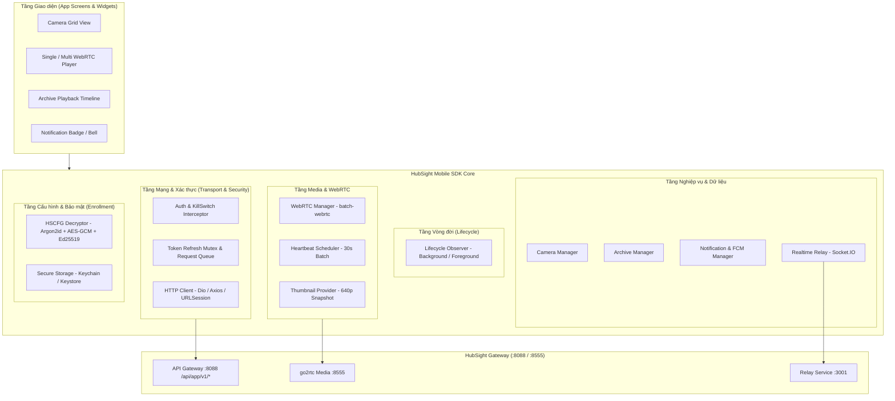
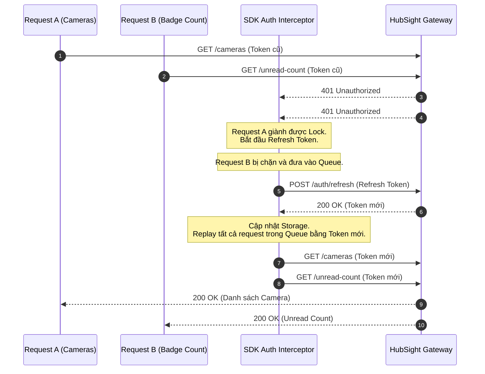

# HubSight CCTV - Mobile SDK Architecture & Best Practice Guidelines

Tài liệu hướng dẫn thiết kế, kiến trúc và các thực hành tốt nhất (Best Practices) dành cho các kỹ sư phát triển Client SDK trên nền tảng di động (**Flutter / Dart**, **React Native / TypeScript**, **iOS Swift**, **Android Kotlin**) tích hợp với hệ thống **HubSight CCTV** thông qua bộ **Mobile API (`/api/app/v1/*`)**.

---

## 1. Tổng quan & Sự khác biệt giữa Web SDK và Mobile SDK

Trong hệ sinh thái HubSight:
- **Web SDK (`@hubsight/sdk`)**: Dành riêng cho trình duyệt máy tính (React SPA), sử dụng trực tiếp các API nội bộ (`/api/*`), DOM `<video>` tag, và quản lý phiên dựa trên Cookie/Storage của trình duyệt.
- **Mobile SDK**: Được thiết kế riêng cho các đặc thù của thiết bị di động:
  1. **Zero-Config Enrollment**: Giải mã gói cấu hình bảo mật đa tầng `.hscfg` bằng mã PIN 6 số.
  2. **Bắt buộc Header & Query Xác thực**: `X-API-Key` (hoặc `?api_key=...`) và `Authorization: Bearer <token>`.
  3. **Xử lý Khẩn cấp Kill-Switch (HTTP 503)**: Xử lý mượt mà khi Quản trị viên kích hoạt chế độ bảo trì hệ thống.
  4. **Atomic Token Refresh (Chống Race Condition)**: Xử lý khóa Mutex/Queue khi hàng loạt request ngầm đồng thời bị `401 Unauthorized`.
  5. **Tối ưu Pin & Băng thông qua Batch API**: Đàm phán WebRTC hàng loạt (`batch-webrtc`) và gộp nhịp tim (`batch-heartbeat`) cho chế độ xem lưới 4/9/16 camera.
  6. **Ảnh thu nhỏ Thời gian thực (Real-time Thumbnails)**: Tích hợp trực tiếp luồng snapshot 640p 15FPS qua Image Widget mà không cần mở luồng WebRTC nặng nề.
  7. **Vòng đời Ứng dụng (App Lifecycle)**: Tự động ngắt WebRTC và dừng ping heartbeat khi ứng dụng chạy ngầm (Background) để chống cạn pin và tránh tràn Connection Pool.
  8. **Đồng bộ FCM Token & App Badge**: Đăng ký Push Token tự động khi login, hủy khi logout, và đồng bộ số đếm badge chưa đọc.

---

## 2. Mô hình Kiến trúc Phân tầng (Layered Architecture)

Một Mobile SDK chuẩn cho HubSight nên được chia thành 8 tầng chức năng độc lập:



---

## 3. Các Thực hành Tốt nhất (Core Best Practices)

### 3.1. Atomic Token Refresh Pattern (Giải quyết Race Condition 401)

#### Vấn đề:
Khi ứng dụng khởi động hoặc chuyển từ background lên foreground, hàng loạt tác vụ chạy đồng thời: lấy danh sách camera, lấy số thông báo chưa đọc, lấy thông tin profile... Nếu Access Token vừa hết hạn, tất cả các request này đồng loạt nhận HTTP 401. Nếu không có cơ chế khóa (Lock/Mutex), SDK sẽ gửi 5-10 request `POST /api/app/v1/auth/refresh` cùng lúc. Server sẽ vô hiệu hóa refresh token cũ ngay sau lần refresh đầu tiên, dẫn đến các request sau bị lỗi và người dùng bị "văng" ra màn hình đăng nhập vô lý.

#### Giải pháp Chuẩn:
Sử dụng **Mutex Lock & Request Queue Interceptor**:
1. Request đầu tiên gặp lỗi 401 sẽ kích hoạt trạng thái `isRefreshing = true`.
2. Request này thực hiện gọi `POST /api/app/v1/auth/refresh`.
3. Tất cả các request 401 tiếp theo trong lúc này được đưa vào một mảng hàng đợi (Queue) chờ đợi.
4. Khi refresh thành công:
   - Lưu `token` và `refresh_token` mới vào Secure Storage.
   - Duyệt qua hàng đợi, gắn Access Token mới vào header và thực thi lại (replay) tất cả các request đang chờ.
   - Đặt lại `isRefreshing = false`.
5. Nếu refresh thất bại (Refresh token hết hạn hoặc bị thu hồi):
   - Xóa token khỏi Secure Storage.
   - Hủy toàn bộ hàng đợi với lỗi `SessionExpiredException`.
   - Phát sự kiện `onSessionExpired` để đưa UI về màn hình Đăng nhập.



---

### 3.2. Real-time Camera Thumbnail Integration (Ảnh thu nhỏ Thời gian thực)

#### Nguyên tắc Thiết kế:
- HubSight duy trì một luồng nội bộ thường trực **640p 15FPS** (`cam_{id}_thumb`) cho mọi camera đang hoạt động (`is_active=true` và `!is_stopped`).
- Khi hiển thị danh sách camera (Camera Grid), **tuyệt đối không mở luồng WebRTC** cho từng ô vì sẽ gây quá tải CPU, cạn kiệt băng thông 4G/5G và chạm ngưỡng Connection Pool.
- Thay vào đó, hãy sử dụng endpoint ảnh thu nhỏ:
  ```http
  GET /api/app/v1/cameras/:id/thumbnail?api_key={apiKey}&token={userToken}
  ```

#### Quy tắc Triển khai trên Mobile:
1. **Query Param Authentication**: Các thư viện hiển thị ảnh di động phổ biến (`CachedNetworkImage` trên Flutter, `FastImage` hoặc `<Image />` trên React Native) thường quản lý cache độc lập và không dễ can thiệp header tùy biến trên từng frame. Do đó, hãy luôn truyền token qua query string: `?api_key=...&token=...`.
2. **Polling / Auto-refresh**:
   - Khi màn hình danh sách camera đang active, thiết lập timer tải lại ảnh mỗi **3-5 giây/lần** (kèm timestamp chống cache: `&_t=${DateTime.now().millisecondsSinceEpoch}`).
   - Khi rời khỏi màn hình hoặc app vào background, lập tức hủy timer.
3. **Xử lý Trạng thái Dừng (503 Service Unavailable)**:
   - Nếu camera bị dừng bởi quản trị viên (`is_stopped = true`), endpoint trả về `503`.
   - SDK / UI Widget cần bắt lỗi này và render placeholder: biểu tượng camera gạch chéo kèm nhãn *"Camera tạm dừng"*, tránh hiển thị icon lỗi mạng gây hoang mang.

---

### 3.3. Tối ưu Multi-View WebRTC & Heartbeat Batching

Khi người dùng mở màn hình giám sát trực tiếp đồng thời nhiều camera (chế độ 2x2, 3x3):

#### 1. Đàm phán SDP Hàng loạt (`batch-webrtc`):
- Thay vì gửi $N$ HTTP request riêng lẻ đến server để trao đổi SDP Offer, hãy gom tất cả các Offer vào **1 request duy nhất**:
  ```http
  POST /api/app/v1/cameras/live/batch-webrtc
  Content-Type: application/json

  {
    "requests": [
      { "camera_id": "cam_01", "sdp_offer": "v=0..." },
      { "camera_id": "cam_02", "sdp_offer": "v=0..." }
    ]
  }
  ```
- Server sẽ xử lý song song và trả về danh sách SDP Answer tương ứng. Điều này giúp giảm độ trễ khởi tạo từ vài giây xuống dưới 500ms.

#### 2. Gộp Nhịp tim (`batch-heartbeat`) chu kỳ 30 giây:
- go2rtc và pool-service yêu cầu duy trì kết nối xem trực tiếp bằng heartbeat.
- **Quy tắc**: Tạo một `Timer.periodic(Duration(seconds: 30))` duy nhất trên toàn SDK:
  ```http
  POST /api/app/v1/cameras/live/batch-heartbeat
  { "camera_ids": ["cam_01", "cam_02"] }
  ```
- Tránh việc mỗi camera widget tự tạo timer riêng, gây hiện tượng đánh thức sóng vô tuyến (radio wake-ups) liên tục làm hao pin nghiêm trọng trên điện thoại.

#### 3. Giải phóng Đồng loạt (`batch-release`):
- Khi người dùng bấm nút "Quay lại" hoặc thoát màn hình Multi-View:
  ```http
  POST /api/app/v1/cameras/live/batch-release
  { "camera_ids": ["cam_01", "cam_02"] }
  ```
- Đồng thời đóng tất cả các `RTCPeerConnection` và giải phóng MediaStreamTrack ở phía client.

---

### 3.4. Quản lý Vòng đời Ứng dụng (AppLifecycle Management)

Hệ điều hành di động (iOS/Android) kiểm soát rất chặt chẽ ứng dụng chạy nền. Nếu một ứng dụng tiếp tục kéo stream WebRTC hoặc chạy socket ngầm khi người dùng bấm Home/khóa màn hình:
- Hệ điều hành sẽ gắn cờ tốn pin và có thể "kill" tiến trình đột ngột.
- Connection Pool trên server bị chiếm giữ lãng phí cho đến khi timeout.

#### Quy tắc Vàng:
Lắng nghe sự kiện vòng đời (`WidgetsBindingObserver` trên Flutter, `AppState` trên React Native):
1. **Khi chuyển sang `paused` / `background`**:
   - Dừng ngay lập tức các timer Polling Thumbnail.
   - Giải phóng tất cả các luồng WebRTC (`batch-release`) và đóng PeerConnection.
   - Ngắt kết nối tạm thời Socket.IO Relay (nếu không cần nghe sự kiện nền).
2. **Khi chuyển sang `resumed` / `active`**:
   - Kiểm tra lại tính hợp lệ của token (`/api/app/v1/system/status`).
   - Khởi tạo lại luồng WebRTC hoặc làm mới Thumbnail cho màn hình hiện tại.
   - Cập nhật lại số đếm thông báo chưa đọc (`/api/app/v1/notifications/unread-count`).

---

### 3.5. Vòng đời FCM Push Token & App Icon Badge

1. **Đăng ký khi Đăng nhập Thành công**:
   - Sau khi login thành công, SDK lấy FCM Token từ Firebase SDK và gửi lên HubSight:
     ```http
     POST /api/app/v1/notifications/push-token
     {
       "token": "<fcm_device_token>",
       "platform": "mobile_android", // hoặc "mobile_ios"
       "device_name": "iPhone 15 Pro"
     }
     ```
2. **Hủy đăng ký khi Đăng xuất**:
   - Khi người dùng chủ động chọn "Đăng xuất", SDK **bắt buộc** phải gọi:
     ```http
     DELETE /api/app/v1/notifications/push-token
     ```
     trước khi xóa session khỏi máy. Điều này ngăn chặn việc tài khoản khác đăng nhập trên cùng thiết bị nhưng vẫn nhận được thông báo của người dùng cũ.
3. **Cập nhật App Badge**:
   - Gọi định kỳ hoặc khi nhận push data payload:
     ```http
     GET /api/app/v1/notifications/unread-count
     ```
   - Sử dụng các thư viện native (`flutter_app_badger` hoặc `react-native-push-notification`) để cập nhật con số đỏ trên icon ứng dụng ngoài màn hình chính.

---

### 3.6. Xử lý Chế độ Khẩn cấp Kill-Switch (HTTP 503)

Khi Quản trị viên tắt quyền truy cập Mobile App (`app_api_enabled = false`):
- Server trả về `503 Service Unavailable` kèm header `Retry-After: 300` và body JSON có `"maintenance": true`.
- **Hành vi SDK chuẩn**:
  - Không được coi đây là lỗi mạng thông thường (Network Error) hay lỗi Crash.
  - Bắt mã lỗi `APP_API_DISABLED` hoặc HTTP status `503`.
  - Phát sự kiện `onMaintenanceMode(message, retryAfterSeconds)`.
  - UI hiển thị một màn hình bảo trì toàn phần thân thiện, kèm đồng hồ đếm ngược và nút "Thử lại".

---

## 4. Cấu trúc Thư mục Mẫu cho Mobile SDK

Dưới đây là sơ đồ tổ chức mã nguồn khuyến nghị khi xây dựng HubSight Mobile SDK:

```
hubsight_mobile_sdk/
├── lib/ (hoặc src/)
│   ├── hubsight_sdk.dart              # Entrypoint chính của SDK
│   ├── config/
│   │   ├── app_config.dart            # Model cấu hình giải mã từ .hscfg
│   │   └── hscfg_decryptor.dart       # Module giải mã Argon2id + AES-GCM + Ed25519
│   ├── network/
│   │   ├── http_client.dart           # Wrapper xung quanh Dio / Axios
│   │   ├── auth_interceptor.dart      # Interceptor kèm Mutex Token Refresh
│   │   ├── endpoints.dart             # Hằng số URL (/api/app/v1/*)
│   │   └── exceptions.dart            # Hierarchy lỗi (ApiException, MaintenanceException...)
│   ├── auth/
│   │   ├── auth_manager.dart          # Login, 2FA, Logout, Session Storage
│   │   └── secure_storage.dart        # Trừu tượng hóa Keychain / Keystore
│   ├── cameras/
│   │   ├── camera_service.dart        # List, Detail, Status
│   │   └── camera_model.dart          # Entity CameraDTO (kèm thumbnail_url)
│   ├── media/
│   │   ├── webrtc_manager.dart        # Xử lý RTCPeerConnection, SDP offer/answer
│   │   ├── multi_view_session.dart    # batch-webrtc & batch-heartbeat scheduler
│   │   └── thumbnail_provider.dart    # Helper tạo URL authenticated thumbnail
│   ├── archive/
│   │   ├── archive_service.dart       # Calendar, Timeline, Playback URL
│   │   └── recording_model.dart       # Segment video & AI event flags
│   ├── notifications/
│   │   ├── fcm_manager.dart           # Đăng ký / Hủy FCM device token
│   │   └── notification_service.dart  # Lấy danh sách, unread count, mark read
│   ├── realtime/
│   │   └── relay_client.dart          # Socket.IO client cho AI events & status
│   └── widgets/ (hoặc components/)
│       ├── camera_thumbnail_view.dart # Widget hiển thị snapshot tự refresh
│       └── webrtc_video_view.dart     # Widget render video stream native
└── pubspec.yaml (hoặc package.json)
```

---

## 5. Mã Nguồn Mẫu Hoàn chỉnh (Reference Implementations)

### 5.1. Flutter / Dart SDK: Auth Interceptor & Atomic Token Refresh

```dart
import 'dart:async';
import 'package:dio/dio.dart';

class AuthInterceptor extends QueuedInterceptor {
  final Dio _dio;
  final SecureStorageService _storage;
  final String apiKey;
  final void Function()? onSessionExpired;
  final void Function(String message)? onMaintenance;

  bool _isRefreshing = false;
  final List<Completer<String?>> _refreshQueue = [];

  AuthInterceptor({
    required Dio dio,
    required SecureStorageService storage,
    required this.apiKey,
    this.onSessionExpired,
    this.onMaintenance,
  })  : _dio = dio,
        _storage = storage;

  @override
  Future<void> onRequest(
    RequestOptions options,
    RequestInterceptorHandler handler,
  ) async {
    options.headers['X-API-Key'] = apiKey;
    final token = await _storage.getAccessToken();
    if (token != null && !options.headers.containsKey('Authorization')) {
      options.headers['Authorization'] = 'Bearer $token';
    }
    return handler.next(options);
  }

  @override
  Future<void> onError(DioException err, ErrorInterceptorHandler handler) async {
    final response = err.response;

    // 1. Xử lý Kill-Switch bảo trì hệ thống
    if (response?.statusCode == 503 && response?.data?['maintenance'] == true) {
      final msg = response?.data?['message'] ?? 'Hệ thống đang bảo trì';
      onMaintenance?.call(msg);
      return handler.next(err);
    }

    // 2. Xử lý Token hết hạn (HTTP 401)
    if (response?.statusCode == 401 && !err.requestOptions.path.contains('/auth/')) {
      if (_isRefreshing) {
        // Có request khác đang refresh, xếp hàng chờ token mới
        final completer = Completer<String?>();
        _refreshQueue.add(completer);
        final newToken = await completer.future;

        if (newToken != null) {
          err.requestOptions.headers['Authorization'] = 'Bearer $newToken';
          final cloneReq = await _dio.fetch(err.requestOptions);
          return handler.resolve(cloneReq);
        } else {
          return handler.reject(err);
        }
      }

      _isRefreshing = true;
      try {
        final refreshToken = await _storage.getRefreshToken();
        if (refreshToken == null) {
          _triggerLogout();
          return handler.reject(err);
        }

        // Gọi API cấp lại token (dùng instance Dio riêng để tránh loop)
        final refreshDio = Dio(BaseOptions(baseUrl: _dio.options.baseUrl));
        final refreshRes = await refreshDio.post(
          '/api/app/v1/auth/refresh',
          headers: {'X-API-Key': apiKey},
          data: {'refresh_token': refreshToken},
        );

        if (refreshRes.statusCode == 200 && refreshRes.data['token'] != null) {
          final newAccessToken = refreshRes.data['token'] as String;
          final newRefreshToken = refreshRes.data['refresh_token'] as String?;

          await _storage.saveTokens(
            accessToken: newAccessToken,
            refreshToken: newRefreshToken ?? refreshToken,
          );

          // Giải tỏa hàng đợi
          for (final c in _refreshQueue) {
            c.complete(newAccessToken);
          }
          _refreshQueue.clear();
          _isRefreshing = false;

          // Replay request ban đầu
          err.requestOptions.headers['Authorization'] = 'Bearer $newAccessToken';
          final cloneReq = await _dio.fetch(err.requestOptions);
          return handler.resolve(cloneReq);
        } else {
          throw Exception('Refresh failed');
        }
      } catch (e) {
        for (final c in _refreshQueue) {
          c.complete(null);
        }
        _refreshQueue.clear();
        _isRefreshing = false;
        _triggerLogout();
        return handler.reject(err);
      }
    }

    return handler.next(err);
  }

  void _triggerLogout() {
    _storage.clearTokens();
    onSessionExpired?.call();
  }
}
```

---

### 5.2. Flutter / Dart SDK: Camera Thumbnail Widget với Auto-refresh

```dart
import 'dart:async';
import 'package:flutter/material.dart';

class HubSightCameraThumbnail extends StatefulWidget {
  final String gatewayUrl;
  final String thumbnailUrl; // e.g. "/api/app/v1/cameras/cam_01/thumbnail"
  final String apiKey;
  final String token;
  final bool isStopped;
  final Duration refreshInterval;

  const HubSightCameraThumbnail({
    Key? key,
    required this.gatewayUrl,
    required this.thumbnailUrl,
    required this.apiKey,
    required this.token,
    this.isStopped = false,
    this.refreshInterval = const Duration(seconds: 4),
  }) : super(key: key);

  @override
  State<HubSightCameraThumbnail> createState() => _HubSightCameraThumbnailState();
}

class _HubSightCameraThumbnailState extends State<HubSightCameraThumbnail> {
  Timer? _timer;
  int _timestamp = DateTime.now().millisecondsSinceEpoch;

  @override
  void initState() {
    super.initState();
    _startTimer();
  }

  void _startTimer() {
    if (widget.isStopped) return;
    _timer = Timer.periodic(widget.refreshInterval, (_) {
      if (mounted) {
        setState(() {
          _timestamp = DateTime.now().millisecondsSinceEpoch;
        });
      }
    });
  }

  @override
  void dispose() {
    _timer?.cancel();
    super.dispose();
  }

  @override
  Widget build(BuildContext context) {
    if (widget.isStopped) {
      return Container(
        color: Colors.black87,
        child: const Center(
          child: Column(
            mainAxisSize: MainAxisSize.min,
            children: [
              Icon(Icons.videocam_off, color: Colors.grey, size: 36),
              SizedBox(height: 8),
              Text('Camera tạm dừng', style: TextStyle(color: Colors.grey, fontSize: 12)),
            ],
          ),
        ),
      );
    }

    final fullUrl = '${widget.gatewayUrl}${widget.thumbnailUrl}'
        '?api_key=${widget.apiKey}&token=${widget.token}&_t=$_timestamp';

    return Image.network(
      fullUrl,
      fit: BoxFit.cover,
      gaplessPlayback: true, // Chống chớp màn hình khi nạp frame mới
      errorBuilder: (context, error, stackTrace) {
        return Container(
          color: Colors.black54,
          child: const Center(
            child: Icon(Icons.broken_image, color: Colors.white30, size: 32),
          ),
        );
      },
    );
  }
}
```

---

### 5.3. Flutter / Dart SDK: WebRTC Multi-View & Batch Heartbeat Scheduler

```dart
import 'dart:async';
import 'package:dio/dio.dart';
import 'package:flutter_webrtc/flutter_webrtc.dart';

class MultiViewStreamSession {
  final Dio _dio;
  final Map<String, RTCPeerConnection> _activeConnections = {};
  final Map<String, RTCVideoRenderer> _renderers = {};
  Timer? _heartbeatTimer;

  MultiViewStreamSession(this._dio);

  /// Bắt đầu xem đồng thời danh sách camera bằng batch-webrtc
  Future<void> startStreams(List<String> cameraIds) async {
    final batchRequests = <Map<String, dynamic>>[];

    // 1. Tạo đồng thời các RTCPeerConnection local
    for (final camId in cameraIds) {
      final pc = await createPeerConnection({
        'iceServers': [], // go2rtc local bypasses STUN/TURN if on same subnet/host
      });
      final renderer = RTCVideoRenderer();
      await renderer.initialize();

      pc.onTrack = (event) {
        if (event.track.kind == 'video') {
          renderer.srcObject = event.streams[0];
        }
      };

      // Thêm transceiver nhận video
      await pc.addTransceiver(
        kind: RTCRtpMediaType.RTCRtpMediaTypeVideo,
        init: RTCRtpTransceiverInit(direction: TransceiverDirection.RecvOnly),
      );

      final offer = await pc.createOffer();
      await pc.setLocalDescription(offer);

      _activeConnections[camId] = pc;
      _renderers[camId] = renderer;

      batchRequests.add({
        'camera_id': camId,
        'sdp_offer': offer.sdp,
      });
    }

    // 2. Gửi duy nhất 1 batch request lên server
    final response = await _dio.post(
      '/api/app/v1/cameras/live/batch-webrtc',
      data: {'requests': batchRequests},
    );

    final results = response.data['results'] as List<dynamic>;
    for (final item in results) {
      final camId = item['camera_id'] as String;
      final answerSdp = item['sdp_answer'] as String?;
      final success = item['success'] as bool? ?? false;

      if (success && answerSdp != null && _activeConnections.containsKey(camId)) {
        final pc = _activeConnections[camId]!;
        await pc.setRemoteDescription(RTCSessionDescription(answerSdp, 'answer'));
      }
    }

    // 3. Khởi động nhịp tim định kỳ 30s
    _startHeartbeat(cameraIds);
  }

  void _startHeartbeat(List<String> cameraIds) {
    _heartbeatTimer?.cancel();
    _heartbeatTimer = Timer.periodic(const Duration(seconds: 30), (_) async {
      try {
        await _dio.post(
          '/api/app/v1/cameras/live/batch-heartbeat',
          data: {'camera_ids': cameraIds},
        );
      } catch (_) {
        // Ghi log hoặc thử lại ở chu kỳ tiếp theo
      }
    });
  }

  /// Thoát màn hình và giải phóng tài nguyên
  Future<void> stopAll() async {
    _heartbeatTimer?.cancel();
    final camIds = _activeConnections.keys.toList();

    if (camIds.isNotEmpty) {
      try {
        await _dio.post(
          '/api/app/v1/cameras/live/batch-release',
          data: {'camera_ids': camIds},
        );
      } catch (_) {}
    }

    for (final pc in _activeConnections.values) {
      await pc.close();
    }
    for (final r in _renderers.values) {
      await r.dispose();
    }
    _activeConnections.clear();
    _renderers.clear();
  }

  RTCVideoRenderer? getRenderer(String cameraId) => _renderers[cameraId];
}
```

---

### 5.4. React Native / TypeScript: Axios Interceptor với Queueing

```typescript
import axios, { AxiosInstance, InternalAxiosRequestConfig } from 'axios';
import * as Keychain from 'react-native-keychain';

export function setupMobileApiClient(
  baseUrl: string,
  apiKey: string,
  onSessionExpired: () => void,
  onMaintenance: (message: string) => void
): AxiosInstance {
  const client = axios.create({
    baseURL: baseUrl,
    headers: { 'X-API-Key': apiKey },
  });

  let isRefreshing = false;
  let failedQueue: Array<{
    resolve: (token: string) => void;
    reject: (error: any) => void;
  }> = [];

  const processQueue = (error: any, token: string | null = null) => {
    failedQueue.forEach((prom) => {
      if (error) {
        prom.reject(error);
      } else {
        prom.resolve(token!);
      }
    });
    failedQueue = [];
  };

  client.interceptors.request.use(async (config: InternalAxiosRequestConfig) => {
    const creds = await Keychain.getGenericPassword({ service: 'hubsight_auth' });
    if (creds && !config.headers.Authorization) {
      const { accessToken } = JSON.parse(creds.password);
      config.headers.Authorization = `Bearer ${accessToken}`;
    }
    return config;
  });

  client.interceptors.response.use(
    (response) => response,
    async (error) => {
      const originalRequest = error.config;

      // 1. Xử lý Kill-Switch
      if (error.response?.status === 503 && error.response?.data?.maintenance) {
        onMaintenance(error.response.data.message || 'Hệ thống đang bảo trì');
        return Promise.reject(error);
      }

      // 2. Xử lý 401 và Refresh Token Queue
      if (error.response?.status === 401 && !originalRequest._retry && !originalRequest.url?.includes('/auth/')) {
        if (isRefreshing) {
          return new Promise((resolve, reject) => {
            failedQueue.push({ resolve, reject });
          })
            .then((token) => {
              originalRequest.headers.Authorization = `Bearer ${token}`;
              return client(originalRequest);
            })
            .catch((err) => Promise.reject(err));
        }

        originalRequest._retry = true;
        isRefreshing = true;

        try {
          const creds = await Keychain.getGenericPassword({ service: 'hubsight_auth' });
          if (!creds) throw new Error('No credentials');

          const { refreshToken } = JSON.parse(creds.password);
          const res = await axios.post(`${baseUrl}/api/app/v1/auth/refresh`, {
            refresh_token: refreshToken,
          }, {
            headers: { 'X-API-Key': apiKey }
          });

          const { token: newAccessToken, refresh_token: newRefreshToken } = res.data;
          await Keychain.setGenericPassword(
            'session',
            JSON.stringify({
              accessToken: newAccessToken,
              refreshToken: newRefreshToken || refreshToken,
            }),
            { service: 'hubsight_auth' }
          );

          processQueue(null, newAccessToken);
          originalRequest.headers.Authorization = `Bearer ${newAccessToken}`;
          return client(originalRequest);
        } catch (refreshErr) {
          processQueue(refreshErr, null);
          await Keychain.resetGenericPassword({ service: 'hubsight_auth' });
          onSessionExpired();
          return Promise.reject(refreshErr);
        } finally {
          isRefreshing = false;
        }
      }

      return Promise.reject(error);
    }
  );

  return client;
}
```

---

### 5.5. Flutter / Dart SDK: Camera PTZ D-Pad Controller Widget & Presets

```dart
import 'package:flutter/material.dart';
import 'package:dio/dio.dart';

class HubSightPtzPad extends StatelessWidget {
  final String gatewayUrl;
  final String cameraId;
  final Dio dio;

  const HubSightPtzPad({
    Key? key,
    required this.gatewayUrl,
    required this.cameraId,
    required this.dio,
  }) : super(key: key);

  Future<void> _sendPtzAction({
    required String action,
    double pan = 0.0,
    double tilt = 0.0,
    double zoom = 0.0,
  }) async {
    try {
      await dio.post(
        '$gatewayUrl/api/app/v1/cameras/$cameraId/ptz',
        data: {
          'action': action,
          'pan': pan,
          'tilt': tilt,
          'zoom': zoom,
          'timeout': 5,
        },
      );
    } catch (e) {
      debugPrint('PTZ command error: $e');
    }
  }

  Widget _buildDirectionBtn({
    required IconData icon,
    required double pan,
    required double tilt,
  }) {
    return GestureDetector(
      onTapDown: (_) => _sendPtzAction(action: 'continuous', pan: pan, tilt: tilt),
      onTapUp: (_) => _sendPtzAction(action: 'stop'),
      onTapCancel: () => _sendPtzAction(action: 'stop'),
      child: Container(
        width: 46,
        height: 46,
        decoration: BoxDecoration(
          color: Colors.white.withOpacity(0.12),
          borderRadius: BorderRadius.circular(12),
          border: Border.all(color: Colors.white24),
        ),
        child: Icon(icon, color: Colors.white, size: 24),
      ),
    );
  }

  @override
  Widget build(BuildContext context) {
    return Container(
      padding: const EdgeInsets.all(12),
      decoration: BoxDecoration(
        color: Colors.black.withOpacity(0.85),
        borderRadius: BorderRadius.circular(20),
        border: Border.all(color: Colors.white12),
      ),
      child: Column(
        mainAxisSize: MainAxisSize.min,
        children: [
          // D-Pad Grid (8 directions + Stop Center)
          Row(
            mainAxisSize: MainAxisSize.min,
            children: [
              _buildDirectionBtn(icon: Icons.north_west, pan: -0.5, tilt: 0.5),
              const SizedBox(width: 8),
              _buildDirectionBtn(icon: Icons.keyboard_arrow_up, pan: 0.0, tilt: 0.7),
              const SizedBox(width: 8),
              _buildDirectionBtn(icon: Icons.north_east, pan: 0.5, tilt: 0.5),
            ],
          ),
          const SizedBox(height: 8),
          Row(
            mainAxisSize: MainAxisSize.min,
            children: [
              _buildDirectionBtn(icon: Icons.keyboard_arrow_left, pan: -0.7, tilt: 0.0),
              const SizedBox(width: 8),
              GestureDetector(
                onTap: () => _sendPtzAction(action: 'stop'),
                child: Container(
                  width: 46,
                  height: 46,
                  decoration: BoxDecoration(
                    color: Colors.redAccent.withOpacity(0.25),
                    borderRadius: BorderRadius.circular(12),
                  ),
                  child: const Icon(Icons.stop, color: Colors.redAccent, size: 20),
                ),
              ),
              const SizedBox(width: 8),
              _buildDirectionBtn(icon: Icons.keyboard_arrow_right, pan: 0.7, tilt: 0.0),
            ],
          ),
          const SizedBox(height: 8),
          Row(
            mainAxisSize: MainAxisSize.min,
            children: [
              _buildDirectionBtn(icon: Icons.south_west, pan: -0.5, tilt: -0.5),
              const SizedBox(width: 8),
              _buildDirectionBtn(icon: Icons.keyboard_arrow_down, pan: 0.0, tilt: -0.7),
              const SizedBox(width: 8),
              _buildDirectionBtn(icon: Icons.south_east, pan: 0.5, tilt: -0.5),
            ],
          ),
          const SizedBox(height: 12),
          // Zoom In / Out
          Row(
            mainAxisSize: MainAxisSize.min,
            children: [
              GestureDetector(
                onTapDown: (_) => _sendPtzAction(action: 'zoom_in', zoom: 0.5),
                onTapUp: (_) => _sendPtzAction(action: 'stop'),
                onTapCancel: () => _sendPtzAction(action: 'stop'),
                child: Container(
                  padding: const EdgeInsets.symmetric(horizontal: 14, vertical: 8),
                  decoration: BoxDecoration(
                    color: Colors.white10,
                    borderRadius: BorderRadius.circular(8),
                  ),
                  child: const Row(
                    children: [
                      Icon(Icons.zoom_in, color: Colors.white, size: 16),
                      SizedBox(width: 4),
                      Text('Zoom +', style: TextStyle(color: Colors.white, fontSize: 11)),
                    ],
                  ),
                ),
              ),
              const SizedBox(width: 8),
              GestureDetector(
                onTapDown: (_) => _sendPtzAction(action: 'zoom_out', zoom: -0.5),
                onTapUp: (_) => _sendPtzAction(action: 'stop'),
                onTapCancel: () => _sendPtzAction(action: 'stop'),
                child: Container(
                  padding: const EdgeInsets.symmetric(horizontal: 14, vertical: 8),
                  decoration: BoxDecoration(
                    color: Colors.white10,
                    borderRadius: BorderRadius.circular(8),
                  ),
                  child: const Row(
                    children: [
                      Icon(Icons.zoom_out, color: Colors.white, size: 16),
                      SizedBox(width: 4),
                      Text('Zoom -', style: TextStyle(color: Colors.white, fontSize: 11)),
                    ],
                  ),
                ),
              ),
            ],
          ),
        ],
      ),
    );
  }
}
```

---

### 5.6. React Native / TypeScript SDK: Touch-sensitive PTZ HUD & Presets Modal

```tsx
import React, { useState, useEffect } from 'react';
import { View, Text, TouchableOpacity, StyleSheet } from 'react-native';
import type { AxiosInstance } from 'axios';

interface PTZPadProps {
  cameraId: string;
  client: AxiosInstance; // HubSight Mobile Client instance
  onClose?: () => void;
}

export const HubSightPTZPad: React.FC<PTZPadProps> = ({ cameraId, client, onClose }) => {
  const [presets, setPresets] = useState<Array<{ token: string; name: string }>>([]);

  const sendPtz = async (action: string, pan = 0, tilt = 0, zoom = 0) => {
    try {
      await client.post(`/api/app/v1/cameras/${cameraId}/ptz`, {
        action,
        pan,
        tilt,
        zoom,
        timeout: 5,
      });
    } catch (e) {
      console.warn('PTZ action failed', e);
    }
  };

  const fetchPresets = async () => {
    try {
      const res = await client.get(`/api/app/v1/cameras/${cameraId}/presets`);
      setPresets(res.data?.presets || []);
    } catch (e) {
      console.warn('Get presets failed', e);
    }
  };

  const gotoPreset = async (presetToken: string) => {
    await client.post(`/api/app/v1/cameras/${cameraId}/presets`, {
      action: 'goto',
      preset_token: presetToken,
    });
  };

  useEffect(() => {
    fetchPresets();
  }, [cameraId]);

  return (
    <View style={styles.hudOverlay}>
      <View style={styles.header}>
        <Text style={styles.title}>PTZ Controller</Text>
        {onClose && (
          <TouchableOpacity onPress={onClose}>
            <Text style={styles.closeBtn}>✕</Text>
          </TouchableOpacity>
        )}
      </View>

      {/* 4-way D-Pad */}
      <View style={styles.dpad}>
        <TouchableOpacity
          onPressIn={() => sendPtz('continuous', 0, 0.7)}
          onPressOut={() => sendPtz('stop')}
          style={styles.btn}
        >
          <Text style={styles.btnText}>▲</Text>
        </TouchableOpacity>

        <View style={styles.midRow}>
          <TouchableOpacity
            onPressIn={() => sendPtz('continuous', -0.7, 0)}
            onPressOut={() => sendPtz('stop')}
            style={styles.btn}
          >
            <Text style={styles.btnText}>◀</Text>
          </TouchableOpacity>
          <TouchableOpacity onPress={() => sendPtz('stop')} style={styles.stopBtn}>
            <Text style={styles.stopText}>■</Text>
          </TouchableOpacity>
          <TouchableOpacity
            onPressIn={() => sendPtz('continuous', 0.7, 0)}
            onPressOut={() => sendPtz('stop')}
            style={styles.btn}
          >
            <Text style={styles.btnText}>▶</Text>
          </TouchableOpacity>
        </View>

        <TouchableOpacity
          onPressIn={() => sendPtz('continuous', 0, -0.7)}
          onPressOut={() => sendPtz('stop')}
          style={styles.btn}
        >
          <Text style={styles.btnText}>▼</Text>
        </TouchableOpacity>
      </View>

      {/* Zoom Controls & Presets */}
      <View style={styles.zoomRow}>
        <TouchableOpacity
          onPressIn={() => sendPtz('zoom_in', 0, 0, 0.5)}
          onPressOut={() => sendPtz('stop')}
          style={styles.zoomBtn}
        >
          <Text style={styles.zoomText}>Zoom +</Text>
        </TouchableOpacity>
        <TouchableOpacity
          onPressIn={() => sendPtz('zoom_out', 0, 0, -0.5)}
          onPressOut={() => sendPtz('stop')}
          style={styles.zoomBtn}
        >
          <Text style={styles.zoomText}>Zoom -</Text>
        </TouchableOpacity>
      </View>
    </View>
  );
};

const styles = StyleSheet.create({
  hudOverlay: {
    backgroundColor: 'rgba(15, 23, 42, 0.85)',
    borderRadius: 16,
    padding: 12,
    alignItems: 'center',
  },
  header: { flexDirection: 'row', justifyContent: 'space-between', width: '100%', marginBottom: 8 },
  title: { color: '#f8fafc', fontWeight: 'bold', fontSize: 13 },
  closeBtn: { color: '#94a3b8', fontSize: 16 },
  dpad: { alignItems: 'center', marginVertical: 8 },
  midRow: { flexDirection: 'row', alignItems: 'center', marginVertical: 6, gap: 10 },
  btn: { width: 44, height: 44, backgroundColor: 'rgba(255,255,255,0.12)', borderRadius: 10, justifyContent: 'center', alignItems: 'center' },
  btnText: { color: '#fff', fontSize: 18 },
  stopBtn: { width: 44, height: 44, backgroundColor: 'rgba(239, 68, 68, 0.25)', borderRadius: 10, justifyContent: 'center', alignItems: 'center' },
  stopText: { color: '#ef4444', fontSize: 16 },
  zoomRow: { flexDirection: 'row', gap: 8, marginTop: 8 },
  zoomBtn: { paddingHorizontal: 12, paddingVertical: 6, backgroundColor: 'rgba(255,255,255,0.1)', borderRadius: 8 },
  zoomText: { color: '#f1f5f9', fontSize: 11, fontWeight: '600' },
});
```

---

## 6. Bảng Kiểm Tra Chất Lượng (Production Readiness Checklist)

Trước khi đóng gói phát hành ứng dụng hoặc phát hành SDK cho đối tác, hãy rà soát kỹ bảng kiểm tra sau:

| STT | Tiêu chí Kiểm tra | Yêu cầu Kỹ thuật | Trạng thái Đạt |
| :---: | :--- | :--- | :---: |
| 1 | **Bảo mật Khoá & Token** | Access/Refresh token và mã giải mã container `.hscfg` lưu trong Keychain (iOS) / Keystore (Android). Tuyệt đối không lưu plaintext trong SharedPreferences hoặc AsyncStorage. | [ ] |
| 2 | **Cổng Gateway Tập trung** | Toàn bộ các lượt gọi HTTP/WebSocket đều trỏ qua cổng Gateway `:8088` (hoặc domain chính thức). Không có request nào gọi thẳng vào internal services (`:8080`, `:8081`, `:3001`). | [ ] |
| 3 | **Chống Đột tử Token (Atomic 401)** | Thử nghiệm mô phỏng hết hạn token khi mở app với 10 request đồng thời. Kết quả: Chỉ phát 1 request refresh, 10 request ban đầu hoàn thành thành công, không văng đăng nhập. | [ ] |
| 4 | **Widget Thumbnail Hiệu năng cao** | Danh sách camera hiển thị ảnh chụp 640p 15FPS qua `thumbnail_url`. Bật `gaplessPlayback` để không bị nhấp nháy đen khi nạp frame mới. Tự hủy timer khi rời màn hình. | [ ] |
| 5 | **Multi-View Batching** | Màn hình xem lưới sử dụng `batch-webrtc` để kết nối và `batch-heartbeat` chu kỳ 30s. Sử dụng `batch-release` khi thoát màn hình. | [ ] |
| 6 | **Vòng đời Nền (Backgrounding)** | Khi ẩn ứng dụng xuống nền, tất cả các luồng WebRTC được đóng và timer bị hủy. Khi mở lại, khôi phục luồng mượt mà. Không để connection pool bị rò rỉ. | [ ] |
| 7 | **FCM Token Lifecycle** | Đăng ký push token ngay sau khi đăng nhập thành công. Gọi xóa push token khi đăng xuất để tránh gửi thông báo rác cho người dùng tiếp theo. | [ ] |
| 8 | **Xử lý Kill-Switch (HTTP 503)** | Khi quản trị viên tắt mobile app, ứng dụng hiển thị thông báo bảo trì thân thiện kèm thời gian thử lại, không bị văng app (crash). | [ ] |

---

## 7. Tài liệu Tham khảo Liên quan

- [Đặc tả Chi tiết API Ứng dụng Di động (`APP_API_SPECIFICATION.md`)](APP_API_SPECIFICATION.md)
- [Quy chuẩn Định dạng & Giải mã Container `.hscfg` (`APP_CONFIG_SPECIFICATION.md`)](APP_CONFIG_SPECIFICATION.md)
- [Nguyên tắc Vận hành Connection Pool (`AGENTS.md`)](../AGENTS.md)
- [Gói TypeScript SDK Web (`@hubsight/sdk`)](../webapp/packages/sdk/README.md)
