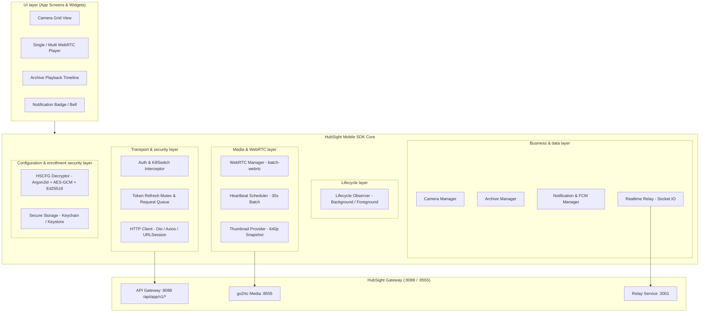
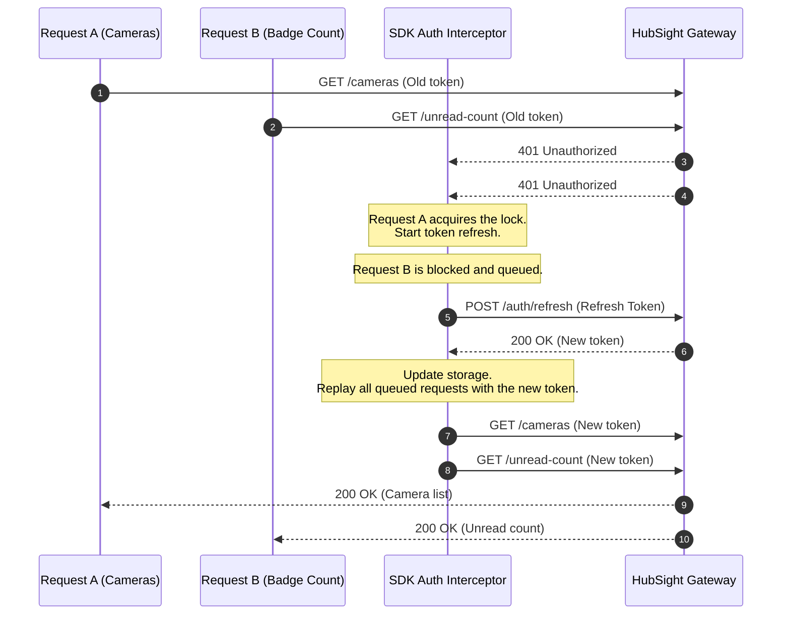

# HubSight CCTV - Mobile SDK Architecture & Best Practice Guidelines

Design, architecture, and best-practice guidance for engineers building Client SDKs on mobile platforms (**Flutter/Dart**, **React Native/TypeScript**, **iOS Swift**, **Android Kotlin**) that integrate with **HubSight CCTV** through the **Mobile API (`/api/app/v1/*`)**.

---

## 1. Overview and differences between the Web SDK and Mobile SDK

In the HubSight ecosystem:
- **Web SDK (`@hubsight/sdk`)**: Dedicated to desktop browsers (React SPA), uses internal APIs (`/api/*`), the DOM `<video>` tag, and browser Cookie/Storage sessions.
- **Mobile SDK**: Designed for mobile-specific requirements:
  1. **Zero-Config Enrollment**: Decrypt the multi-layer `.hscfg` security package with a six-digit PIN.
  2. **Required authentication headers and query**: `X-API-Key` (or `?api_key=...`) and `Authorization: Bearer <token>`.
  3. **Emergency kill switch (HTTP 503)**: Handle administrator-enabled maintenance smoothly.
  4. **Atomic token refresh (race-condition protection)**: Use a mutex/queue when background requests concurrently receive `401 Unauthorized`.
  5. **Batch API battery and bandwidth optimization**: Batch WebRTC negotiation (`batch-webrtc`) and heartbeat batching (`batch-heartbeat`) for 4/9/16-camera grids.
  6. **Realtime thumbnails**: Integrate persistent 640p/15FPS snapshots through an image widget without opening expensive WebRTC streams.
  7. **Application lifecycle**: Automatically disconnect WebRTC and stop heartbeat pings when the app enters the background to preserve battery and avoid connection-pool exhaustion.
  8. **FCM token and app-badge synchronization**: Register the push token after login, unregister it on logout, and synchronize the unread badge count.

---

## 2. Layered architecture

A standard HubSight Mobile SDK should be divided into eight independent functional layers:



---

## 3. Core best practices

### 3.1. Atomic token refresh pattern (solving the 401 race condition)

#### Problem:
When the app starts or moves from background to foreground, many tasks run concurrently: loading cameras, unread notification count, profile information, and so on. If the access token has just expired, all requests receive HTTP 401. Without a lock/mutex, the SDK sends 5–10 `POST /api/app/v1/auth/refresh` requests at once. The server invalidates the old refresh token after the first refresh, causing later requests to fail and unnecessarily sending the user to the login screen.

#### Standard solution:
Use a **mutex lock and request-queue interceptor**:
1. The first request receiving 401 sets `isRefreshing = true`.
2. That request calls `POST /api/app/v1/auth/refresh`.
3. Subsequent 401 requests are placed in a queue.
4. After a successful refresh:
   - Store the new `token` and `refresh_token` in Secure Storage.
   - Add the new access token to the queued requests and replay them.
   - Reset `isRefreshing = false`.
5. If refresh fails (the refresh token is expired or revoked):
   - Delete tokens from Secure Storage.
   - Reject the entire queue with `SessionExpiredException`.
   - Emit `onSessionExpired` to return the UI to the login screen.



---

### 3.2. Realtime camera thumbnail integration

#### Design principles:
- HubSight maintains a persistent **640p/15FPS** internal stream (`cam_{id}_thumb`) for every active camera (`is_active=true` and `!is_stopped`).
- When displaying the camera grid, **never open a WebRTC stream** for each tile; this overloads CPU, consumes 4G/5G bandwidth, and approaches the connection-pool limit.
- Instead, use the thumbnail endpoint:
  ```http
  GET /api/app/v1/cameras/:id/thumbnail?api_key={apiKey}&token={userToken}
  ```

#### Mobile implementation rules:
1. **Query-parameter authentication**: Common mobile image libraries (`CachedNetworkImage` in Flutter, `FastImage` or `<Image />` in React Native) manage their own caches and make per-frame custom headers difficult. Always pass the token in the query string: `?api_key=...&token=...`.
2. **Polling/auto-refresh**:
   - While the camera-list screen is active, reload images every **3–5 seconds** (with a cache-busting timestamp: `&_t=${DateTime.now().millisecondsSinceEpoch}`).
   - Cancel the timer immediately when leaving the screen or entering the background.
3. **Stopped state (503 Service Unavailable)**:
   - If an administrator stops the camera (`is_stopped = true`), the endpoint returns `503`.
   - The SDK/UI widget should catch this and render a placeholder: a crossed-out camera icon with *"Camera paused"*, rather than a confusing network-error icon.

---

### 3.3. Multi-view WebRTC and heartbeat batching

When the user opens multiple cameras simultaneously (2x2 or 3x3 mode):

#### 1. Batch SDP negotiation (`batch-webrtc`):
- Instead of sending $N$ separate HTTP requests to exchange SDP offers, put all offers into **one request**:
  ```http
  POST /api/app/v1/cameras/live/batch-webrtc
  Content-Type: application/json

  {
    "requests": [
      { "camera_id": "cam_01", "sdp_offer": "v=0..." },
      { "camera_id": "cam_02", "sdp_offer": "v=0..." }
    ]
  }
  ```
- The server processes them in parallel and returns the corresponding SDP answers. This reduces startup latency from several seconds to under 500ms.

#### 2. 30-second heartbeat batching (`batch-heartbeat`):
- go2rtc and pool-service require heartbeats to keep live-view connections alive.
- **Rule**: Create one `Timer.periodic(Duration(seconds: 30))` for the entire SDK:
  ```http
  POST /api/app/v1/cameras/live/batch-heartbeat
  { "camera_ids": ["cam_01", "cam_02"] }
  ```
- Avoid separate timers per camera widget; repeated radio wake-ups can seriously drain a phone battery.

#### 3. Batch release (`batch-release`):
- When the user taps "Back" or exits the multi-view screen:
  ```http
  POST /api/app/v1/cameras/live/batch-release
  { "camera_ids": ["cam_01", "cam_02"] }
  ```
- Also close all `RTCPeerConnection` instances and release client-side MediaStreamTracks.

---

### 3.4. Application lifecycle management

Mobile operating systems (iOS/Android) tightly control background apps. If an app continues pulling WebRTC streams or running a background socket after the user presses Home/locks the screen:
- The OS may flag high battery usage and kill the process.
- Server connection-pool resources remain occupied until timeout.

#### Golden rule:
Listen for lifecycle events (`WidgetsBindingObserver` in Flutter, `AppState` in React Native):
1. **When entering `paused`/`background`**:
   - Immediately stop thumbnail-polling timers.
   - Release all WebRTC streams (`batch-release`) and close peer connections.
   - Temporarily disconnect the Socket.IO Relay if background events are not required.
2. **When entering `resumed`/`active`**:
   - Revalidate the token (`/api/app/v1/system/status`).
   - Recreate WebRTC streams or refresh thumbnails for the current screen.
   - Refresh the unread notification count (`/api/app/v1/notifications/unread-count`).

---

### 3.5. FCM push-token and app-icon badge lifecycle

1. **Register after successful login**:
   - After login succeeds, the SDK gets the FCM token from the Firebase SDK and sends it to HubSight:
     ```http
     POST /api/app/v1/notifications/push-token
     {
       "token": "<fcm_device_token>",
       "platform": "mobile_android", // or "mobile_ios"
       "device_name": "iPhone 15 Pro"
     }
     ```
2. **Unregister on logout**:
   - When the user explicitly chooses "Log out", the SDK **must** call:
     ```http
     DELETE /api/app/v1/notifications/push-token
     ```
     before deleting the session from the device. This prevents another account on the same device from receiving the previous user's notifications.
3. **Update the app badge**:
   - Call periodically or when a push data payload arrives:
     ```http
     GET /api/app/v1/notifications/unread-count
     ```
   - Use native libraries (`flutter_app_badger` or `react-native-push-notification`) to update the badge number on the home-screen app icon.

---

### 3.6. Emergency kill-switch handling (HTTP 503)

When an administrator disables Mobile App access (`app_api_enabled = false`):
- The server returns `503 Service Unavailable` with `Retry-After: 300` and a JSON body containing `"maintenance": true`.
- **Standard SDK behavior**:
  - Do not treat it as an ordinary network error or crash.
  - Handle `APP_API_DISABLED` or HTTP status `503`.
  - Emit `onMaintenanceMode(message, retryAfterSeconds)`.
  - The UI displays a friendly full-screen maintenance view with a countdown and a "Retry" button.

---

## 4. Example Mobile SDK directory structure

The following is a recommended source layout for the HubSight Mobile SDK:

```
hubsight_mobile_sdk/
├── lib/ (or src/)
│   ├── hubsight_sdk.dart              # SDK entry point
│   ├── config/
│   │   ├── app_config.dart            # Configuration model decrypted from .hscfg
│   │   └── hscfg_decryptor.dart       # Argon2id + AES-GCM + Ed25519 decryption module
│   ├── network/
│   │   ├── http_client.dart           # Dio/Axios wrapper
│   │   ├── auth_interceptor.dart      # Mutex token-refresh interceptor
│   │   ├── endpoints.dart             # URL constants (/api/app/v1/*)
│   │   └── exceptions.dart            # Error hierarchy (ApiException, MaintenanceException...)
│   ├── auth/
│   │   ├── auth_manager.dart          # Login, 2FA, logout, session storage
│   │   └── secure_storage.dart        # Keychain/Keystore abstraction
│   ├── cameras/
│   │   ├── camera_service.dart        # List, detail, status
│   │   └── camera_model.dart          # CameraDTO entity (with thumbnail_url)
│   ├── media/
│   │   ├── webrtc_manager.dart        # RTCPeerConnection and SDP offer/answer handling
│   │   ├── multi_view_session.dart    # batch-webrtc & batch-heartbeat scheduler
│   │   └── thumbnail_provider.dart    # Authenticated-thumbnail URL helper
│   ├── archive/
│   │   ├── archive_service.dart       # Calendar, Timeline, Playback URL
│   │   └── recording_model.dart       # Segment video & AI event flags
│   ├── notifications/
│   │   ├── fcm_manager.dart           # Register/unregister FCM device token
│   │   └── notification_service.dart  # List, unread count, mark read
│   ├── realtime/
│   │   └── relay_client.dart          # Socket.IO client for AI events and status
│   └── widgets/ (or components/)
│       ├── camera_thumbnail_view.dart # Auto-refreshing snapshot widget
│       └── webrtc_video_view.dart     # Widget render video stream native
└── pubspec.yaml (or package.json)
```

---

## 5. Complete reference implementations

### 5.1. Flutter / Dart SDK: Auth Interceptor & Atomic Token Refresh

```dart
import 'dart:async';
import 'package:dio/dio.dart';

class AuthInterceptor extends QueuedInterceptor {
  final Dio _dio;
  final SecureStorageService _storage;
  final String apiKey;
  final void Function()? onSessionExpired;
  final void Function(String message)? onMaintenance;

  bool _isRefreshing = false;
  final List<Completer<String?>> _refreshQueue = [];

  AuthInterceptor({
    required Dio dio,
    required SecureStorageService storage,
    required this.apiKey,
    this.onSessionExpired,
    this.onMaintenance,
  })  : _dio = dio,
        _storage = storage;

  @override
  Future<void> onRequest(
    RequestOptions options,
    RequestInterceptorHandler handler,
  ) async {
    options.headers['X-API-Key'] = apiKey;
    final token = await _storage.getAccessToken();
    if (token != null && !options.headers.containsKey('Authorization')) {
      options.headers['Authorization'] = 'Bearer $token';
    }
    return handler.next(options);
  }

  @override
  Future<void> onError(DioException err, ErrorInterceptorHandler handler) async {
    final response = err.response;

    // 1. Handle the maintenance kill switch
    if (response?.statusCode == 503 && response?.data?['maintenance'] == true) {
      final msg = response?.data?['message'] ?? 'System is under maintenance';
      onMaintenance?.call(msg);
      return handler.next(err);
    }

    // 2. Handle expired token (HTTP 401)
    if (response?.statusCode == 401 && !err.requestOptions.path.contains('/auth/')) {
      if (_isRefreshing) {
        // Another request is refreshing; queue until the new token arrives
        final completer = Completer<String?>();
        _refreshQueue.add(completer);
        final newToken = await completer.future;

        if (newToken != null) {
          err.requestOptions.headers['Authorization'] = 'Bearer $newToken';
          final cloneReq = await _dio.fetch(err.requestOptions);
          return handler.resolve(cloneReq);
        } else {
          return handler.reject(err);
        }
      }

      _isRefreshing = true;
      try {
        final refreshToken = await _storage.getRefreshToken();
        if (refreshToken == null) {
          _triggerLogout();
          return handler.reject(err);
        }

        // Refresh the token (use a separate Dio instance to avoid a loop)
        final refreshDio = Dio(BaseOptions(baseUrl: _dio.options.baseUrl));
        final refreshRes = await refreshDio.post(
          '/api/app/v1/auth/refresh',
          headers: {'X-API-Key': apiKey},
          data: {'refresh_token': refreshToken},
        );

        if (refreshRes.statusCode == 200 && refreshRes.data['token'] != null) {
          final newAccessToken = refreshRes.data['token'] as String;
          final newRefreshToken = refreshRes.data['refresh_token'] as String?;

          await _storage.saveTokens(
            accessToken: newAccessToken,
            refreshToken: newRefreshToken ?? refreshToken,
          );

          // Release the queue
          for (final c in _refreshQueue) {
            c.complete(newAccessToken);
          }
          _refreshQueue.clear();
          _isRefreshing = false;

          // Replay the original request
          err.requestOptions.headers['Authorization'] = 'Bearer $newAccessToken';
          final cloneReq = await _dio.fetch(err.requestOptions);
          return handler.resolve(cloneReq);
        } else {
          throw Exception('Refresh failed');
        }
      } catch (e) {
        for (final c in _refreshQueue) {
          c.complete(null);
        }
        _refreshQueue.clear();
        _isRefreshing = false;
        _triggerLogout();
        return handler.reject(err);
      }
    }

    return handler.next(err);
  }

  void _triggerLogout() {
    _storage.clearTokens();
    onSessionExpired?.call();
  }
}
```

---

### 5.2. Flutter/Dart SDK: camera thumbnail widget with auto-refresh

```dart
import 'dart:async';
import 'package:flutter/material.dart';

class HubSightCameraThumbnail extends StatefulWidget {
  final String gatewayUrl;
  final String thumbnailUrl; // e.g. "/api/app/v1/cameras/cam_01/thumbnail"
  final String apiKey;
  final String token;
  final bool isStopped;
  final Duration refreshInterval;

  const HubSightCameraThumbnail({
    Key? key,
    required this.gatewayUrl,
    required this.thumbnailUrl,
    required this.apiKey,
    required this.token,
    this.isStopped = false,
    this.refreshInterval = const Duration(seconds: 4),
  }) : super(key: key);

  @override
  State<HubSightCameraThumbnail> createState() => _HubSightCameraThumbnailState();
}

class _HubSightCameraThumbnailState extends State<HubSightCameraThumbnail> {
  Timer? _timer;
  int _timestamp = DateTime.now().millisecondsSinceEpoch;

  @override
  void initState() {
    super.initState();
    _startTimer();
  }

  void _startTimer() {
    if (widget.isStopped) return;
    _timer = Timer.periodic(widget.refreshInterval, (_) {
      if (mounted) {
        setState(() {
          _timestamp = DateTime.now().millisecondsSinceEpoch;
        });
      }
    });
  }

  @override
  void dispose() {
    _timer?.cancel();
    super.dispose();
  }

  @override
  Widget build(BuildContext context) {
    if (widget.isStopped) {
      return Container(
        color: Colors.black87,
        child: const Center(
          child: Column(
            mainAxisSize: MainAxisSize.min,
            children: [
              Icon(Icons.videocam_off, color: Colors.grey, size: 36),
              SizedBox(height: 8),
              Text('Camera paused', style: TextStyle(color: Colors.grey, fontSize: 12)),
            ],
          ),
        ),
      );
    }

    final fullUrl = '${widget.gatewayUrl}${widget.thumbnailUrl}'
        '?api_key=${widget.apiKey}&token=${widget.token}&_t=$_timestamp';

    return Image.network(
      fullUrl,
      fit: BoxFit.cover,
      gaplessPlayback: true, // Prevent flicker while loading a new frame
      errorBuilder: (context, error, stackTrace) {
        return Container(
          color: Colors.black54,
          child: const Center(
            child: Icon(Icons.broken_image, color: Colors.white30, size: 32),
          ),
        );
      },
    );
  }
}
```

---

### 5.3. Flutter / Dart SDK: WebRTC Multi-View & Batch Heartbeat Scheduler

```dart
import 'dart:async';
import 'package:dio/dio.dart';
import 'package:flutter_webrtc/flutter_webrtc.dart';

class MultiViewStreamSession {
  final Dio _dio;
  final Map<String, RTCPeerConnection> _activeConnections = {};
  final Map<String, RTCVideoRenderer> _renderers = {};
  Timer? _heartbeatTimer;

  MultiViewStreamSession(this._dio);

  /// Start simultaneous viewing of camera IDs with batch-webrtc
  Future<void> startStreams(List<String> cameraIds) async {
    final batchRequests = <Map<String, dynamic>>[];

    // 1. Create local RTCPeerConnection instances concurrently
    for (final camId in cameraIds) {
      final pc = await createPeerConnection({
        'iceServers': [], // go2rtc local bypasses STUN/TURN if on same subnet/host
      });
      final renderer = RTCVideoRenderer();
      await renderer.initialize();

      pc.onTrack = (event) {
        if (event.track.kind == 'video') {
          renderer.srcObject = event.streams[0];
        }
      };

      // Add a video receive transceiver
      await pc.addTransceiver(
        kind: RTCRtpMediaType.RTCRtpMediaTypeVideo,
        init: RTCRtpTransceiverInit(direction: TransceiverDirection.RecvOnly),
      );

      final offer = await pc.createOffer();
      await pc.setLocalDescription(offer);

      _activeConnections[camId] = pc;
      _renderers[camId] = renderer;

      batchRequests.add({
        'camera_id': camId,
        'sdp_offer': offer.sdp,
      });
    }

    // 2. Send a single batch request to the server
    final response = await _dio.post(
      '/api/app/v1/cameras/live/batch-webrtc',
      data: {'requests': batchRequests},
    );

    final results = response.data['results'] as List<dynamic>;
    for (final item in results) {
      final camId = item['camera_id'] as String;
      final answerSdp = item['sdp_answer'] as String?;
      final success = item['success'] as bool? ?? false;

      if (success && answerSdp != null && _activeConnections.containsKey(camId)) {
        final pc = _activeConnections[camId]!;
        await pc.setRemoteDescription(RTCSessionDescription(answerSdp, 'answer'));
      }
    }

    // 3. Start the 30-second heartbeat
    _startHeartbeat(cameraIds);
  }

  void _startHeartbeat(List<String> cameraIds) {
    _heartbeatTimer?.cancel();
    _heartbeatTimer = Timer.periodic(const Duration(seconds: 30), (_) async {
      try {
        await _dio.post(
          '/api/app/v1/cameras/live/batch-heartbeat',
          data: {'camera_ids': cameraIds},
        );
      } catch (_) {
        // Log or retry on the next cycle
      }
    });
  }

  /// Exit the screen and release resources
  Future<void> stopAll() async {
    _heartbeatTimer?.cancel();
    final camIds = _activeConnections.keys.toList();

    if (camIds.isNotEmpty) {
      try {
        await _dio.post(
          '/api/app/v1/cameras/live/batch-release',
          data: {'camera_ids': camIds},
        );
      } catch (_) {}
    }

    for (final pc in _activeConnections.values) {
      await pc.close();
    }
    for (final r in _renderers.values) {
      await r.dispose();
    }
    _activeConnections.clear();
    _renderers.clear();
  }

  RTCVideoRenderer? getRenderer(String cameraId) => _renderers[cameraId];
}
```

---

### 5.4. React Native/TypeScript: Axios interceptor with queueing

```typescript
import axios, { AxiosInstance, InternalAxiosRequestConfig } from 'axios';
import * as Keychain from 'react-native-keychain';

export function setupMobileApiClient(
  baseUrl: string,
  apiKey: string,
  onSessionExpired: () => void,
  onMaintenance: (message: string) => void
): AxiosInstance {
  const client = axios.create({
    baseURL: baseUrl,
    headers: { 'X-API-Key': apiKey },
  });

  let isRefreshing = false;
  let failedQueue: Array<{
    resolve: (token: string) => void;
    reject: (error: any) => void;
  }> = [];

  const processQueue = (error: any, token: string | null = null) => {
    failedQueue.forEach((prom) => {
      if (error) {
        prom.reject(error);
      } else {
        prom.resolve(token!);
      }
    });
    failedQueue = [];
  };

  client.interceptors.request.use(async (config: InternalAxiosRequestConfig) => {
    const creds = await Keychain.getGenericPassword({ service: 'hubsight_auth' });
    if (creds && !config.headers.Authorization) {
      const { accessToken } = JSON.parse(creds.password);
      config.headers.Authorization = `Bearer ${accessToken}`;
    }
    return config;
  });

  client.interceptors.response.use(
    (response) => response,
    async (error) => {
      const originalRequest = error.config;

      // 1. Handle the kill switch
      if (error.response?.status === 503 && error.response?.data?.maintenance) {
        onMaintenance(error.response.data.message || 'System is under maintenance');
        return Promise.reject(error);
      }

      // 2. Handle 401 and the refresh-token queue
      if (error.response?.status === 401 && !originalRequest._retry && !originalRequest.url?.includes('/auth/')) {
        if (isRefreshing) {
          return new Promise((resolve, reject) => {
            failedQueue.push({ resolve, reject });
          })
            .then((token) => {
              originalRequest.headers.Authorization = `Bearer ${token}`;
              return client(originalRequest);
            })
            .catch((err) => Promise.reject(err));
        }

        originalRequest._retry = true;
        isRefreshing = true;

        try {
          const creds = await Keychain.getGenericPassword({ service: 'hubsight_auth' });
          if (!creds) throw new Error('No credentials');

          const { refreshToken } = JSON.parse(creds.password);
          const res = await axios.post(`${baseUrl}/api/app/v1/auth/refresh`, {
            refresh_token: refreshToken,
          }, {
            headers: { 'X-API-Key': apiKey }
          });

          const { token: newAccessToken, refresh_token: newRefreshToken } = res.data;
          await Keychain.setGenericPassword(
            'session',
            JSON.stringify({
              accessToken: newAccessToken,
              refreshToken: newRefreshToken || refreshToken,
            }),
            { service: 'hubsight_auth' }
          );

          processQueue(null, newAccessToken);
          originalRequest.headers.Authorization = `Bearer ${newAccessToken}`;
          return client(originalRequest);
        } catch (refreshErr) {
          processQueue(refreshErr, null);
          await Keychain.resetGenericPassword({ service: 'hubsight_auth' });
          onSessionExpired();
          return Promise.reject(refreshErr);
        } finally {
          isRefreshing = false;
        }
      }

      return Promise.reject(error);
    }
  );

  return client;
}
```

---

### 5.5. Flutter / Dart SDK: Camera PTZ D-Pad Controller Widget & Presets

```dart
import 'package:flutter/material.dart';
import 'package:dio/dio.dart';

class HubSightPtzPad extends StatelessWidget {
  final String gatewayUrl;
  final String cameraId;
  final Dio dio;

  const HubSightPtzPad({
    Key? key,
    required this.gatewayUrl,
    required this.cameraId,
    required this.dio,
  }) : super(key: key);

  Future<void> _sendPtzAction({
    required String action,
    double pan = 0.0,
    double tilt = 0.0,
    double zoom = 0.0,
  }) async {
    try {
      await dio.post(
        '$gatewayUrl/api/app/v1/cameras/$cameraId/ptz',
        data: {
          'action': action,
          'pan': pan,
          'tilt': tilt,
          'zoom': zoom,
          'timeout': 5,
        },
      );
    } catch (e) {
      debugPrint('PTZ command error: $e');
    }
  }

  Widget _buildDirectionBtn({
    required IconData icon,
    required double pan,
    required double tilt,
  }) {
    return GestureDetector(
      onTapDown: (_) => _sendPtzAction(action: 'continuous', pan: pan, tilt: tilt),
      onTapUp: (_) => _sendPtzAction(action: 'stop'),
      onTapCancel: () => _sendPtzAction(action: 'stop'),
      child: Container(
        width: 46,
        height: 46,
        decoration: BoxDecoration(
          color: Colors.white.withOpacity(0.12),
          borderRadius: BorderRadius.circular(12),
          border: Border.all(color: Colors.white24),
        ),
        child: Icon(icon, color: Colors.white, size: 24),
      ),
    );
  }

  @override
  Widget build(BuildContext context) {
    return Container(
      padding: const EdgeInsets.all(12),
      decoration: BoxDecoration(
        color: Colors.black.withOpacity(0.85),
        borderRadius: BorderRadius.circular(20),
        border: Border.all(color: Colors.white12),
      ),
      child: Column(
        mainAxisSize: MainAxisSize.min,
        children: [
          // D-Pad Grid (8 directions + Stop Center)
          Row(
            mainAxisSize: MainAxisSize.min,
            children: [
              _buildDirectionBtn(icon: Icons.north_west, pan: -0.5, tilt: 0.5),
              const SizedBox(width: 8),
              _buildDirectionBtn(icon: Icons.keyboard_arrow_up, pan: 0.0, tilt: 0.7),
              const SizedBox(width: 8),
              _buildDirectionBtn(icon: Icons.north_east, pan: 0.5, tilt: 0.5),
            ],
          ),
          const SizedBox(height: 8),
          Row(
            mainAxisSize: MainAxisSize.min,
            children: [
              _buildDirectionBtn(icon: Icons.keyboard_arrow_left, pan: -0.7, tilt: 0.0),
              const SizedBox(width: 8),
              GestureDetector(
                onTap: () => _sendPtzAction(action: 'stop'),
                child: Container(
                  width: 46,
                  height: 46,
                  decoration: BoxDecoration(
                    color: Colors.redAccent.withOpacity(0.25),
                    borderRadius: BorderRadius.circular(12),
                  ),
                  child: const Icon(Icons.stop, color: Colors.redAccent, size: 20),
                ),
              ),
              const SizedBox(width: 8),
              _buildDirectionBtn(icon: Icons.keyboard_arrow_right, pan: 0.7, tilt: 0.0),
            ],
          ),
          const SizedBox(height: 8),
          Row(
            mainAxisSize: MainAxisSize.min,
            children: [
              _buildDirectionBtn(icon: Icons.south_west, pan: -0.5, tilt: -0.5),
              const SizedBox(width: 8),
              _buildDirectionBtn(icon: Icons.keyboard_arrow_down, pan: 0.0, tilt: -0.7),
              const SizedBox(width: 8),
              _buildDirectionBtn(icon: Icons.south_east, pan: 0.5, tilt: -0.5),
            ],
          ),
          const SizedBox(height: 12),
          // Zoom In / Out
          Row(
            mainAxisSize: MainAxisSize.min,
            children: [
              GestureDetector(
                onTapDown: (_) => _sendPtzAction(action: 'zoom_in', zoom: 0.5),
                onTapUp: (_) => _sendPtzAction(action: 'stop'),
                onTapCancel: () => _sendPtzAction(action: 'stop'),
                child: Container(
                  padding: const EdgeInsets.symmetric(horizontal: 14, vertical: 8),
                  decoration: BoxDecoration(
                    color: Colors.white10,
                    borderRadius: BorderRadius.circular(8),
                  ),
                  child: const Row(
                    children: [
                      Icon(Icons.zoom_in, color: Colors.white, size: 16),
                      SizedBox(width: 4),
                      Text('Zoom +', style: TextStyle(color: Colors.white, fontSize: 11)),
                    ],
                  ),
                ),
              ),
              const SizedBox(width: 8),
              GestureDetector(
                onTapDown: (_) => _sendPtzAction(action: 'zoom_out', zoom: -0.5),
                onTapUp: (_) => _sendPtzAction(action: 'stop'),
                onTapCancel: () => _sendPtzAction(action: 'stop'),
                child: Container(
                  padding: const EdgeInsets.symmetric(horizontal: 14, vertical: 8),
                  decoration: BoxDecoration(
                    color: Colors.white10,
                    borderRadius: BorderRadius.circular(8),
                  ),
                  child: const Row(
                    children: [
                      Icon(Icons.zoom_out, color: Colors.white, size: 16),
                      SizedBox(width: 4),
                      Text('Zoom -', style: TextStyle(color: Colors.white, fontSize: 11)),
                    ],
                  ),
                ),
              ),
            ],
          ),
        ],
      ),
    );
  }
}
```

---

### 5.6. React Native / TypeScript SDK: Touch-sensitive PTZ HUD & Presets Modal

```tsx
import React, { useState, useEffect } from 'react';
import { View, Text, TouchableOpacity, StyleSheet } from 'react-native';
import type { AxiosInstance } from 'axios';

interface PTZPadProps {
  cameraId: string;
  client: AxiosInstance; // HubSight Mobile Client instance
  onClose?: () => void;
}

export const HubSightPTZPad: React.FC<PTZPadProps> = ({ cameraId, client, onClose }) => {
  const [presets, setPresets] = useState<Array<{ token: string; name: string }>>([]);

  const sendPtz = async (action: string, pan = 0, tilt = 0, zoom = 0) => {
    try {
      await client.post(`/api/app/v1/cameras/${cameraId}/ptz`, {
        action,
        pan,
        tilt,
        zoom,
        timeout: 5,
      });
    } catch (e) {
      console.warn('PTZ action failed', e);
    }
  };

  const fetchPresets = async () => {
    try {
      const res = await client.get(`/api/app/v1/cameras/${cameraId}/presets`);
      setPresets(res.data?.presets || []);
    } catch (e) {
      console.warn('Get presets failed', e);
    }
  };

  const gotoPreset = async (presetToken: string) => {
    await client.post(`/api/app/v1/cameras/${cameraId}/presets`, {
      action: 'goto',
      preset_token: presetToken,
    });
  };

  useEffect(() => {
    fetchPresets();
  }, [cameraId]);

  return (
    <View style={styles.hudOverlay}>
      <View style={styles.header}>
        <Text style={styles.title}>PTZ Controller</Text>
        {onClose && (
          <TouchableOpacity onPress={onClose}>
            <Text style={styles.closeBtn}>✕</Text>
          </TouchableOpacity>
        )}
      </View>

      {/* 4-way D-Pad */}
      <View style={styles.dpad}>
        <TouchableOpacity
          onPressIn={() => sendPtz('continuous', 0, 0.7)}
          onPressOut={() => sendPtz('stop')}
          style={styles.btn}
        >
          <Text style={styles.btnText}>▲</Text>
        </TouchableOpacity>

        <View style={styles.midRow}>
          <TouchableOpacity
            onPressIn={() => sendPtz('continuous', -0.7, 0)}
            onPressOut={() => sendPtz('stop')}
            style={styles.btn}
          >
            <Text style={styles.btnText}>◀</Text>
          </TouchableOpacity>
          <TouchableOpacity onPress={() => sendPtz('stop')} style={styles.stopBtn}>
            <Text style={styles.stopText}>■</Text>
          </TouchableOpacity>
          <TouchableOpacity
            onPressIn={() => sendPtz('continuous', 0.7, 0)}
            onPressOut={() => sendPtz('stop')}
            style={styles.btn}
          >
            <Text style={styles.btnText}>▶</Text>
          </TouchableOpacity>
        </View>

        <TouchableOpacity
          onPressIn={() => sendPtz('continuous', 0, -0.7)}
          onPressOut={() => sendPtz('stop')}
          style={styles.btn}
        >
          <Text style={styles.btnText}>▼</Text>
        </TouchableOpacity>
      </View>

      {/* Zoom Controls & Presets */}
      <View style={styles.zoomRow}>
        <TouchableOpacity
          onPressIn={() => sendPtz('zoom_in', 0, 0, 0.5)}
          onPressOut={() => sendPtz('stop')}
          style={styles.zoomBtn}
        >
          <Text style={styles.zoomText}>Zoom +</Text>
        </TouchableOpacity>
        <TouchableOpacity
          onPressIn={() => sendPtz('zoom_out', 0, 0, -0.5)}
          onPressOut={() => sendPtz('stop')}
          style={styles.zoomBtn}
        >
          <Text style={styles.zoomText}>Zoom -</Text>
        </TouchableOpacity>
      </View>
    </View>
  );
};

const styles = StyleSheet.create({
  hudOverlay: {
    backgroundColor: 'rgba(15, 23, 42, 0.85)',
    borderRadius: 16,
    padding: 12,
    alignItems: 'center',
  },
  header: { flexDirection: 'row', justifyContent: 'space-between', width: '100%', marginBottom: 8 },
  title: { color: '#f8fafc', fontWeight: 'bold', fontSize: 13 },
  closeBtn: { color: '#94a3b8', fontSize: 16 },
  dpad: { alignItems: 'center', marginVertical: 8 },
  midRow: { flexDirection: 'row', alignItems: 'center', marginVertical: 6, gap: 10 },
  btn: { width: 44, height: 44, backgroundColor: 'rgba(255,255,255,0.12)', borderRadius: 10, justifyContent: 'center', alignItems: 'center' },
  btnText: { color: '#fff', fontSize: 18 },
  stopBtn: { width: 44, height: 44, backgroundColor: 'rgba(239, 68, 68, 0.25)', borderRadius: 10, justifyContent: 'center', alignItems: 'center' },
  stopText: { color: '#ef4444', fontSize: 16 },
  zoomRow: { flexDirection: 'row', gap: 8, marginTop: 8 },
  zoomBtn: { paddingHorizontal: 12, paddingVertical: 6, backgroundColor: 'rgba(255,255,255,0.1)', borderRadius: 8 },
  zoomText: { color: '#f1f5f9', fontSize: 11, fontWeight: '600' },
});
```

---

## 6. Production readiness checklist

Before packaging the application or releasing the SDK to partners, review this checklist carefully:

| # | Check | Technical requirement | Pass |
| :---: | :--- | :--- | :---: |
| 1 | **Key and token security** | Store access/refresh tokens and the `.hscfg` decryption key in Keychain (iOS)/Keystore (Android). Never store plaintext in SharedPreferences or AsyncStorage. | [ ] |
| 2 | **Central Gateway** | All HTTP/WebSocket calls use Gateway `:8088` (or the official domain). No request calls internal services directly (`:8080`, `:8081`, `:3001`). | [ ] |
| 3 | **Atomic 401 protection** | Simulate token expiry with 10 concurrent requests. Result: only one refresh request; all 10 original requests succeed; no forced logout. | [ ] |
| 4 | **High-performance thumbnail widget** | The camera list displays 640p/15FPS snapshots through `thumbnail_url`. Enable `gaplessPlayback` to prevent black flicker and cancel the timer when leaving the screen. | [ ] |
| 5 | **Multi-view batching** | The grid uses `batch-webrtc` and a 30-second `batch-heartbeat`; use `batch-release` when leaving the screen. | [ ] |
| 6 | **Background lifecycle** | When backgrounded, close all WebRTC streams and cancel timers. Restore streams smoothly on resume. Do not leak connection-pool resources. | [ ] |
| 7 | **FCM token lifecycle** | Register the push token after successful login. Delete it on logout to avoid sending stale notifications to the next user. | [ ] |
| 8 | **Kill-switch handling (HTTP 503)** | When an administrator disables the mobile app, show a friendly maintenance message with retry timing; do not crash. | [ ] |

---

## 7. Related references

- [Mobile App API specification (`APP_API_SPECIFICATION.md`)](APP_API_SPECIFICATION.md)
- [`.hscfg` container format and decryption standard (`APP_CONFIG_SPECIFICATION.md`)](APP_CONFIG_SPECIFICATION.md)
- [Connection-pool operating principles (`AGENTS.md`)](../AGENTS.md)
- [Web TypeScript SDK package (`@hubsight/sdk`)](../webapp/packages/sdk/README.md)
