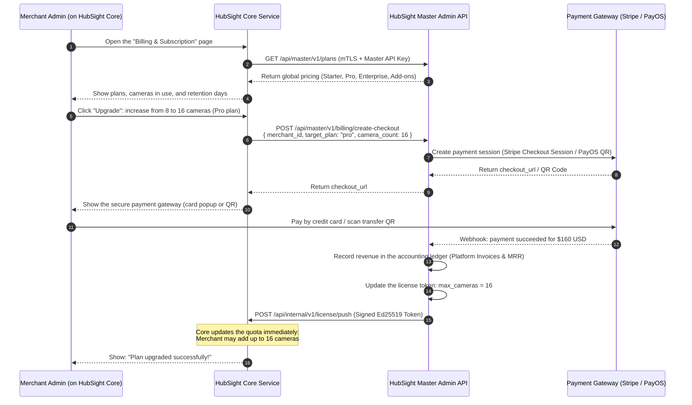
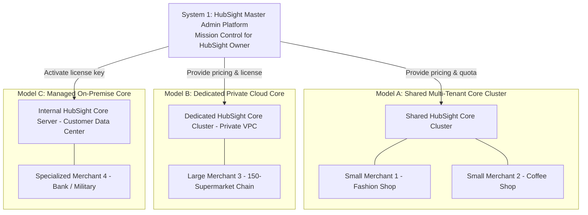

# HubSight CCTV - SaaS Architecture & System Design Transformation Roadmap
*(System migration study for a VSaaS model: Master Admin Platform vs HubSight Core)*

---

## 1. Executive summary and positioning of two independent systems (Core Principle)

Under a standard product-architecture strategy:
- **System 1: HubSight Master Admin Platform (for the HubSight Business Owner)**: The central "Mission Control" where the HubSight business owner manages **ALL CUSTOMERS** (all organizations/tenants/merchants), configures global plans, monitors revenue, and coordinates infrastructure.
- **System 2: HubSight Core Platform (for each merchant and its users)**: The "All-in-One Merchant Workspace" where each merchant **SELF-MANAGES** its organization (members, permissions, billing, payment methods, invoices) and **USES THE CORE SURVEILLANCE SERVICE** (live WebRTC, NVR, AI face recognition, camera management).

```
┌─────────────────────────────────────────────────────────────────────────────────┐
│               SYSTEM 1: HUBSIGHT MASTER ADMIN PLATFORM                         │
│             (Mission Control for the HubSight Business Owner)                   │
│                                                                                 │
│  • Manage ALL customers (all merchants/tenants/organizations)                  │
│  • Manage global plans, pricing, and feature add-ons                           │
│  • Configure primary payment gateways (Master Stripe/PayOS/VNPay)              │
│  • Monitor platform cash flow and finance (MRR, ARR, churn, revenue)            │
│  • Review, activate, or emergency-suspend merchants                            │
│  • Monitor global load and infrastructure (cameras, bandwidth, cloud storage)   │
└────────────────────────────────────────┬────────────────────────────────────────┘
                                         │
                   mTLS / Signed License │ Usage Telemetry (60s)
                   & Quota Provisioning  │ & Billing Checkout Requests
                                         ▼
┌─────────────────────────────────────────────────────────────────────────────────┐
│                     SYSTEM 2: HUBSIGHT CORE PLATFORM                            │
│          (All-in-One Merchant Workspace & Workload CCTV Platform)               │
│                                                                                 │
│  [A. MERCHANT SELF-SERVICE ADMINISTRATION]                                     │
│  • Self-manage members/users and internal RBAC                                  │
│  • Self-manage billing: upgrade/downgrade plans, add cameras, add retention    │
│  • Self-manage payments: credit cards and PayOS QR payments                    │
│  • View and download the organization's invoices and VAT receipts               │
│                                                                                 │
│  [B. CORE SURVEILLANCE SERVICE (Core CCTV Workload)]                           │
│  • Live camera viewing (WebRTC stream and persistent 640p/15FPS thumbnails)   │
│  • NVR recording and playback (segment timeline, calendar, MP4 playback)       │
│  • AI (YOLO person detection, pgvector face recognition)                       │
│  • Internal camera management and branch Edge Connector communication          │
└─────────────────────────────────────────────────────────────────────────────────┘
```

---

## 2. Responsibility matrix

| Criterion | System 1: HubSight Master Admin Platform | System 2: HubSight Core Platform |
| :--- | :--- | :--- |
| **Architecture role** | **Master Control Plane** (global business administration and operations) | **Merchant Workspace & Workload Plane** (self-administration and CCTV service use) |
| **Users** | **HubSight Business Owner & SuperAdmins**: leadership, operations, and HubSight platform accounting. | **Merchant & merchant users**: business/store owners, branch managers, and security staff. |
| **Access interface** | `admin.hubsight.io` (Master Admin Mission Control) | `app.hubsight.io` (or a merchant domain such as `cctv.merchantbrand.com`) and HubSight Mobile App |
| **Customer management** | Manage **ALL merchants** across the system (approve, license, suspend for violations). | A merchant can see and manage only **its own organization**. |
| **Member management** | Manage HubSight company staff (technical support staff and platform admins). | **Merchant self-manages internal members**: add/remove staff and assign Admin, Operator, Security, or Viewer roles by site/zone. |
| **Billing & payment** | • Define global prices (for example, Pro at $10/camera/month).<br>• Configure primary payment accounts (HubSight Stripe secret key and PayOS API key).<br>• Report total company MRR and ARR. | **Merchant self-manages its costs**:<br>• View the active plan and used/maximum cameras.<br>• Click "Upgrade plan" and purchase camera licenses.<br>• Add a credit card or scan a payment QR code.<br>• Download the company's invoices. |
| **Video & AI operations** | Does not store video or process live streams (absolute customer privacy). | Processes WebRTC streams, 640p snapshots, NVR recording, AI face recognition, and camera management. |
| **Storage databases** | `hubsight_master_db`: `merchants`, `master_plans`, `platform_invoices`, `licenses`, `clusters` tables. | `hubsight_core_db`: `members`, `cameras`, `recordings`, `member_faces`, `merchant_billing_info` tables. |

---

## 3. Interaction flows between Master Admin and HubSight Core

### 3.1. Merchant self-serve billing flow

When a store/business owner logs into **HubSight Core** and opens **`Settings > Billing & Subscription`**:



---

### 3.2. Merchant self-serve members and RBAC flow

Member management is **fully contained within HubSight Core**; Master Admin does not need to intervene:
1. Merchant Admin opens **`Members & Permissions`** in HubSight Core.
2. Click **"Add Member"**: enter the name, email, temporary password, or send an activation invitation.
3. Select a role:
   - **Org Admin**: Full camera administration, billing, and payment access.
   - **Store Manager**: View and configure cameras only at assigned branches (Site A).
   - **Security Guard**: View WebRTC live streams and receive alerts when a stranger enters; no access to sensitive NVR playback.
   - **Viewer**: View only shared camera streams.
4. HubSight Core stores the user in the merchant's internal `users` table with an Argon2id-hashed password.

---

### 3.3. Master Admin global governance flow

The HubSight business owner uses **Master Admin Platform** (`admin.hubsight.io`) for:
1. **Customer directory monitoring**:
   - Search and filter thousands of merchants by Trial, Active, Past Due, or Canceled status.
   - View each merchant's representative, phone number, camera count, and lifetime payments.
2. **Plan and promotion management**:
   - Add plans and raise/lower global prices.
   - Configure trials (14-day free trial, two free AI cameras).
3. **Financial analytics**:
   - Chart MRR (Monthly Recurring Revenue) and ARR.
   - Track automatic-renewal and churn rates.
4. **Emergency suspension (kill switch)**:
   - When a merchant abuses the service, violates the law, or remains delinquent:
   - The Business Owner clicks **"Suspend Merchant"**.
   - Master Admin sends a webhook to that merchant's HubSight Core, which immediately stops live streams and displays an account-lock message.

---

## 4. Three commercial infrastructure deployment models

This separation lets HubSight deploy flexibly:



1. **Model A (small and medium merchants)**: Shared Core cluster, with data isolation through `tenant_id` and PostgreSQL RLS. Merchants self-manage members and upgrade plans directly in the interface.
2. **Model B (large enterprise chains)**: Master Admin automatically provisions an independent HubSight Core cluster (dedicated VPC and database). Customers pay annually while self-managing permissions for thousands of employees in Core.
3. **Model C (banks and government)**: Customers install HubSight Core on their own servers (on-premise). HubSight Core calls Master Admin over the internet only to activate the license key and pay recurring service fees.

---

## 5. Separated database structure

### 5.1. Master Admin database (`hubsight_master_db`)
Used only for HubSight owner's business administration:
- **`merchants`**: Merchant ID, company name, representative email, status (Active/Suspended), join date.
- **`master_plans`**: Plans for sale (Starter, Pro, Enterprise), price/camera, default quota limits.
- **`subscriptions`**: Merchant subscriptions, renewal date, automatic-payment status.
- **`platform_invoices`**: Platform invoices, collected amount, payment-gateway fees, Stripe/PayOS transaction ID.
- **`licenses`**: License keys issued to each Core, Ed25519 signature, expiration.
- **`core_clusters`**: Running HubSight Core servers, endpoint, CPU/RAM/bandwidth load.

### 5.2. HubSight Core database (`hubsight_core_db`)
Used for all internal merchant operations:
- **`tenant_settings`**: Current plan and maximum limits (`max_cameras`, `retention_days`, `ai_face_enabled`).
- **`users` (Members)**: Company staff, Argon2id password hashes, RBAC roles (Admin, Manager, Guard, Viewer).
- **`merchant_payment_methods`**: Securely stored Stripe credit-card tokens and company VAT-invoice information.
- **`merchant_invoices`**: Invoices paid by the company for merchant accounting download.
- **`sites` & `cameras`**: Branches, cameras, RTSP parameters, 640p thumbnail snapshots.
- **`recordings`**: NVR video segments, S3 paths, AI-event flags.
- **`members` & `member_faces`**: Merchant employee/customer face data with 512-dimensional (`pgvector`) vectors.

---

## 6. Phased implementation roadmap

1. **Phase 1: Build System 1 (HubSight Master Admin Platform)**:
   * Build the independent `admin.hubsight.io` web interface for the HubSight business owner.
   * Build the merchant-catalog and pricing-plan backend and integrate primary payment gateways (Stripe/PayOS).
   * Add the Ed25519-signed License Token generator.
2. **Phase 2: Integrate Billing & Member Management into HubSight Core**:
   * Add **`Settings > Members`** so merchants can assign staff permissions by branch.
   * Add **`Settings > Billing`**: call Master Admin for pricing, show upgrade controls, and embed the payment gateway.
   * Automatically expand quotas after a successful payment signal.
3. **Phase 3: Develop the HubSight Edge Connector**:
   * Package branch software so cameras connect securely outbound to HubSight Core without opening ports.
   * Enable WebRTC P2P direct streaming to save 100% of cloud bandwidth.
4. **Phase 4: Full acceptance and commercialization**:
   * Test self-registration, card payments, staff permissions, and camera operations.
   * Hand over Master Admin to HubSight leadership for cash-flow monitoring and business development.
