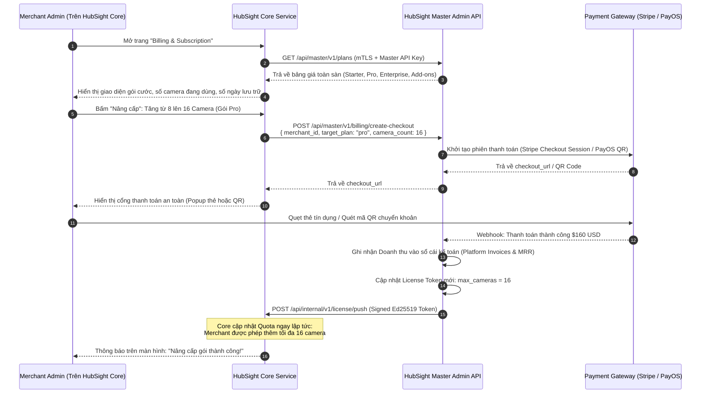
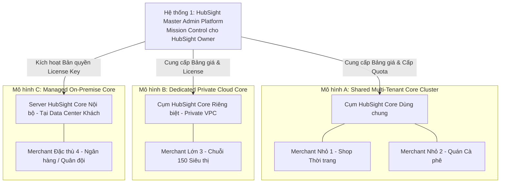

# HubSight CCTV - SaaS Architecture & System Design Transformation Roadmap
*(Báo cáo Nghiên cứu Chuyển dịch Hệ thống sang Mô hình VSaaS: Master Admin Platform vs HubSight Core)*

---

## 1. Tóm tắt Điều hành & Định vị Hai Hệ thống Độc lập (Core Principle)

Theo định hướng chiến lược kiến trúc sản phẩm chuẩn mực:
- **Hệ thống 1: HubSight Master Admin Platform (Dành cho HubSight Business Owner)**: Là "Mission Control" trung tâm, nơi người sở hữu doanh nghiệp HubSight quản lý **TẤT CẢ KHÁCH HÀNG** (tất cả các Organizations / Tenants / Merchants), cấu hình gói cước toàn sàn, theo dõi doanh thu dòng tiền và điều phối hạ tầng.
- **Hệ thống 2: HubSight Core Platform (Dành cho Từng Merchant & Người dùng của họ)**: Là "All-in-One Merchant Workspace", nơi mỗi Merchant **TỰ QUẢN LÝ** nội bộ tổ chức của mình (Members, Phân quyền, Billing, Phương thức thanh toán, Hóa đơn) và **SỬ DỤNG DỊCH VỤ GIÁM SÁT CHÍNH** (Live WebRTC, NVR, AI Face Recognition, Quản lý Camera).

```
┌─────────────────────────────────────────────────────────────────────────────────┐
│               HỆ THỐNG 1: HUBSIGHT MASTER ADMIN PLATFORM                        │
│             (Mission Control cho Chủ Doanh nghiệp HubSight)                     │
│                                                                                 │
│  • Quản lý TẤT CẢ Khách hàng (All Merchants / Tenants / Organizations)          │
│  • Quản trị Khung Gói Cước Toàn sàn (Global Plans, Pricing & Feature Add-ons)   │
│  • Cấu hình Cổng Thanh toán Gốc (Master Stripe / PayOS / VNPay Gateways)        │
│  • Theo dõi Dòng tiền & Tài chính Toàn sàn (Platform MRR, ARR, Churn, Revenue)  │
│  • Kiểm duyệt, Kích hoạt hoặc Khóa Khẩn cấp Merchant (Global Suspension)        │
│  • Giám sát Tải & Hạ tầng Tổng thể (Global Cameras, Bandwidth, Cloud Storage)   │
└────────────────────────────────────────┬────────────────────────────────────────┘
                                         │
                   mTLS / Signed License │ Usage Telemetry (60s)
                   & Quota Provisioning  │ & Billing Checkout Requests
                                         ▼
┌─────────────────────────────────────────────────────────────────────────────────┐
│                     HỆ THỐNG 2: HUBSIGHT CORE PLATFORM                          │
│          (All-in-One Merchant Workspace & Workload CCTV Platform)               │
│                                                                                 │
│  [A. KHÔNG GIAN TỰ QUẢN TRỊ CỦA MERCHANT (Self-Service Administration)]        │
│  • Tự Quản lý Thành viên (Members & Users) và Phân quyền nội bộ (RBAC)         │
│  • Tự Quản lý Gói cước (Billing): Nâng/hạ gói, Mua thêm camera, Thêm ngày lưu  │
│  • Tự Quản lý Thanh toán (Payment): Quẹt thẻ tín dụng, Quét mã QR PayOS         │
│  • Tự Xem & Tải Hóa đơn (Invoices, VAT Receipts) của tổ chức mình              │
│                                                                                 │
│  [B. KHÔNG GIAN SỬ DỤNG DỊCH VỤ GIÁM SÁT CHÍNH (Core CCTV Workload)]            │
│  • Xem Trực tiếp Camera (WebRTC Stream & Thumbnail 640p 15FPS thường trực)     │
│  • Ghi hình & Xem lại Video NVR (Segment Timeline, Calendar, MP4 Playback)     │
│  • Trí tuệ Nhân tạo AI (Phát hiện Người YOLO, Nhận diện Khuôn mặt pgvector)   │
│  • Quản lý Thiết bị Camera Nội bộ & Giao tiếp Edge Connectors tại Chi nhánh    │
└─────────────────────────────────────────────────────────────────────────────────┘
```

---

## 2. Ma trận Phân định Trách nhiệm (Responsibility Matrix)

| Tiêu chí | Hệ thống 1: HubSight Master Admin Platform | Hệ thống 2: HubSight Core Platform |
| :--- | :--- | :--- |
| **Bản chất Kiến trúc** | **Master Control Plane** (Quản trị & Điều hành Kinh doanh Toàn sàn) | **Merchant Workspace & Workload Plane** (Tự quản trị & Sử dụng dịch vụ CCTV) |
| **Đối tượng Sử dụng** | **HubSight Business Owner & SuperAdmins**: Ban lãnh đạo, Đội vận hành, Kế toán nền tảng HubSight. | **Merchant & Người dùng của Merchant**: Chủ doanh nghiệp/Cửa hàng, Quản lý chi nhánh, Nhân viên an ninh/bảo vệ. |
| **Giao diện Truy cập** | `admin.hubsight.io` (Master Admin Mission Control) | `app.hubsight.io` (hoặc domain riêng của Merchant: `cctv.merchantbrand.com`) & HubSight Mobile App |
| **Nhiệm vụ Quản lý Khách hàng** | Quản lý danh bạ **TẤT CẢ Merchant** trên toàn hệ thống (Duyệt, Cấp phép, Tạm khóa vi phạm). | Merchant chỉ nhìn thấy và quản lý duy nhất **Tổ chức của chính mình**. |
| **Quản lý Thành viên (Members)** | Quản lý danh sách nhân sự của công ty HubSight (nhân viên hỗ trợ kỹ thuật, admin sàn). | **Merchant TỰ quản lý Members nội bộ**: Thêm/xóa nhân viên, gán vai trò (Admin, Operator, Security, Viewer) theo từng Chi nhánh (Site/Zone). |
| **Quản lý Thuê bao & Thanh toán (Billing & Payment)** | • Định nghĩa giá bán toàn sàn (Ví dụ: Gói Pro $10/cam/tháng).<br>• Cấu hình tài khoản nhận tiền gốc (Stripe Secret Key, PayOS API Key của HubSight).<br>• Báo cáo tổng doanh thu MRR, ARR toàn công ty. | **Merchant TỰ quản lý chi phí của mình**:<br>• Xem gói đang dùng, số camera đã dùng / tối đa.<br>• Tự bấm "Nâng cấp gói", mua thêm camera license.<br>• Tự thêm thẻ tín dụng / quét mã QR thanh toán.<br>• Tự tải danh sách hóa đơn (Invoices) của công ty mình. |
| **Nghiệp vụ Video & AI** | Không lưu trữ video, không xử lý stream trực tiếp (Bảo vệ tính riêng tư tuyệt đối cho khách hàng). | Xử lý toàn bộ luồng WebRTC, snapshot 640p, ghi hình NVR, AI Face Recognition, quản lý camera. |
| **Cơ sở Dữ liệu Lưu trữ** | `hubsight_master_db`: Bảng `merchants`, `master_plans`, `platform_invoices`, `licenses`, `clusters`. | `hubsight_core_db`: Bảng `members`, `cameras`, `recordings`, `member_faces`, `merchant_billing_info`. |

---

## 3. Quy trình Tương tác Giữa Master Admin và HubSight Core

### 3.1. Luồng Merchant Tự Quản lý Gói cước & Thanh toán (Self-Serve Billing Flow)

Khi chủ cửa hàng / doanh nghiệp đăng nhập vào **HubSight Core** và truy cập menu **`Cài đặt > Gói cước & Thanh toán (Billing)`**:



---

### 3.2. Luồng Merchant Tự Quản lý Thành viên (Self-Serve Members & RBAC Flow)

Nghiệp vụ quản lý thành viên diễn ra **hoàn toàn khép kín trong HubSight Core**, Master Admin không cần can thiệp:
1. Merchant Admin vào mục **`Thành viên & Phân quyền (Members)`** trong HubSight Core.
2. Bấm **"Thêm Thành viên"**: Nhập Tên, Email, Mật khẩu tạm thời hoặc gửi link mời kích hoạt.
3. Chọn vai trò (Role):
   - **Org Admin**: Toàn quyền quản trị camera, xem billing, thanh toán cước.
   - **Store Manager (Quản lý chi nhánh)**: Chỉ có quyền xem và cấu hình camera tại Chi nhánh được gán (Site A).
   - **Security Guard (Bảo vệ)**: Chỉ xem trực tiếp WebRTC, nhận thông báo đẩy khi có người lạ đột nhập, không xem lại NVR nhạy cảm.
   - **Viewer**: Chỉ xem luồng camera được chia sẻ.
4. HubSight Core lưu trữ vào bảng `users` nội bộ của Merchant kèm mã hóa mật khẩu Argon2id.

---

### 3.3. Luồng Master Admin Quản trị Toàn sàn (Business Owner Governance Flow)

Chủ doanh nghiệp HubSight sử dụng **Master Admin Platform** (`admin.hubsight.io`) để thực hiện các nghiệp vụ:
1. **Theo dõi Danh bạ Khách hàng**:
   - Tìm kiếm, lọc danh sách hàng ngàn Merchant (theo trạng thái Trial, Active, Past Due, Canceled).
   - Xem chi tiết từng Merchant: ai là người đại diện, số điện thoại, đang dùng bao nhiêu camera, tổng tiền đã trả từ trước đến nay.
2. **Quản trị Bảng Giá & Khuyến mãi (Plan Management)**:
   - Thêm gói cước mới, tăng/giảm giá bán trên toàn sàn.
   - Thiết lập các chính sách dùng thử (Free Trial 14 ngày, tặng 2 camera AI miễn phí).
3. **Giám sát Sức khỏe Tài chính (Financial Analytics)**:
   - Thống kê biểu đồ MRR (Monthly Recurring Revenue - Doanh thu định kỳ hàng tháng), ARR (Hàng năm).
   - Tỷ lệ gia hạn tự động, tỷ lệ hủy dịch vụ (Churn Rate).
4. **Khóa Khẩn cấp (Kill-Switch / Suspension)**:
   - Khi phát hiện một Merchant có hành vi lạm dụng, vi phạm pháp luật hoặc cố tình nợ cước kéo dài:
   - Business Owner bấm **"Tạm ngưng dịch vụ (Suspend Merchant)"**.
   - Master Admin bắn Webhook sang HubSight Core của Merchant đó: Ngay lập tức ngắt các luồng xem trực tiếp và hiển thị màn hình thông báo khóa tài khoản.

---

## 4. Ba Mô hình Triển khai Hạ tầng Thương mại (Deployment Models)

Nhờ sự phân tách độc lập này, HubSight có thể triển khai linh hoạt:



1. **Mô hình A (Dành cho Merchant vừa & nhỏ)**: Cụm Core dùng chung, phân tách dữ liệu bằng `tenant_id` và PostgreSQL RLS. Merchant tự quản lý members và tự quẹt thẻ nâng gói trực tiếp trong giao diện.
2. **Mô hình B (Dành cho Chuỗi Doanh nghiệp Lớn)**: Master Admin tự động cấp phát một cụm HubSight Core độc lập (Dedicated VPC, DB riêng). Khách hàng trả tiền theo hợp đồng hàng năm nhưng vẫn tự quản lý phân quyền hàng ngàn nhân viên trong Core.
3. **Mô hình C (Dành cho Khối Ngân hàng, Nhà nước)**: Khách hàng tự cài đặt HubSight Core trên máy chủ riêng của họ (On-premise). HubSight Core chỉ gọi về Master Admin qua Internet để kích hoạt bản quyền (License Key) và thanh toán phí duy trì dịch vụ định kỳ.

---

## 5. Cấu trúc Cơ sở Dữ liệu Phân định

### 5.1. Cơ sở Dữ liệu của Master Admin (`hubsight_master_db`)
Chỉ phục vụ bài toán quản trị kinh doanh của chủ sàn HubSight:
- **`merchants`**: Mã định danh Merchant, Tên công ty, Email đại diện, Trạng thái (Active/Suspended), Ngày tham gia.
- **`master_plans`**: Danh sách gói bán ra (Starter, Pro, Enterprise), Đơn giá/camera, Giới hạn quota mặc định.
- **`subscriptions`**: Thông tin thuê bao của từng Merchant, Ngày gia hạn, Trạng thái thanh toán tự động.
- **`platform_invoices`**: Hóa đơn tổng thể của sàn, Số tiền thực thu, Phí cổng thanh toán, Mã giao dịch Stripe/PayOS.
- **`licenses`**: Khóa bản quyền cấp cho từng Core, Chữ ký số Ed25519, Hạn sử dụng.
- **`core_clusters`**: Danh sách các máy chủ HubSight Core đang chạy, Địa chỉ Endpoint, Tải trọng CPU/RAM/Băng thông.

### 5.2. Cơ sở Dữ liệu của HubSight Core (`hubsight_core_db`)
Phục vụ toàn bộ nghiệp vụ nội bộ của Merchant:
- **`tenant_settings`**: Gói cước hiện tại, Hạn mức tối đa (`max_cameras`, `retention_days`, `ai_face_enabled`).
- **`users` (Members)**: Danh sách nhân viên trong công ty, Mật khẩu băm Argon2id, Vai trò RBAC (Admin, Manager, Guard, Viewer).
- **`merchant_payment_methods`**: Token thẻ tín dụng đã lưu an toàn từ Stripe, Thông tin xuất hóa đơn VAT của công ty.
- **`merchant_invoices`**: Lịch sử hóa đơn mà công ty này đã thanh toán (để kế toán của Merchant tải về).
- **`sites` & `cameras`**: Danh sách chi nhánh, camera, thông số RTSP, snapshot 640p thumbnail.
- **`recordings`**: Danh sách các đoạn video NVR, đường dẫn S3, cờ sự kiện AI.
- **`members` & `member_faces`**: Dữ liệu khuôn mặt nhân viên/khách hàng của Merchant kèm vector 512 chiều (`pgvector`).

---

## 6. Lộ trình Triển khai Phân kỳ (Roadmap)

1. **Giai đoạn 1: Xây dựng Hệ thống 1 (HubSight Master Admin Platform)**:
   * Xây dựng giao diện web độc lập `admin.hubsight.io` cho chủ doanh nghiệp HubSight.
   * Xây dựng backend quản lý danh mục Merchant, cấu hình bảng giá (Pricing Plans) và tích hợp cổng thanh toán gốc (Stripe/PayOS).
   * Module sinh License Token ký số Ed25519.
2. **Giai đoạn 2: Tích hợp Module Billing & Member Management vào HubSight Core**:
   * Thêm trang **"Cài đặt > Thành viên (Members)"** trong HubSight Core để Merchant tự phân quyền nhân viên theo Chi nhánh.
   * Thêm trang **"Cài đặt > Gói cước & Thanh toán (Billing)"** trong HubSight Core: gọi API về Master Admin để lấy bảng giá, hiển thị nút nâng cấp và nhúng cổng thanh toán.
   * Tích hợp cơ chế tự động mở rộng Quota ngay khi nhận tín hiệu thanh toán thành công.
3. **Giai đoạn 3: Phát triển HubSight Edge Connector**:
   * Đóng gói phần mềm tại chi nhánh để camera kết nối Outbound an toàn về HubSight Core mà không cần mở port.
   * Kích hoạt WebRTC P2P Direct Streaming tiết kiệm 100% băng thông Cloud.
4. **Giai đoạn 4: Nghiệm thu Toàn diện & Thương mại hóa**:
   * Kiểm thử luồng tự đăng ký, tự quẹt thẻ thanh toán, tự phân quyền nhân viên và vận hành camera.
   * Bàn giao cổng Master Admin cho ban điều hành HubSight theo dõi dòng tiền và phát triển kinh doanh.
